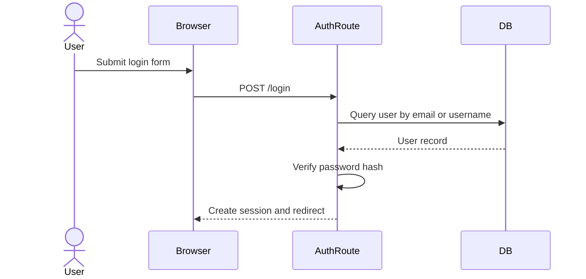
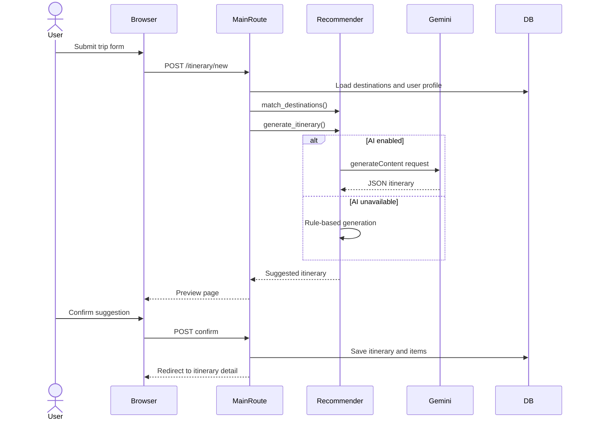
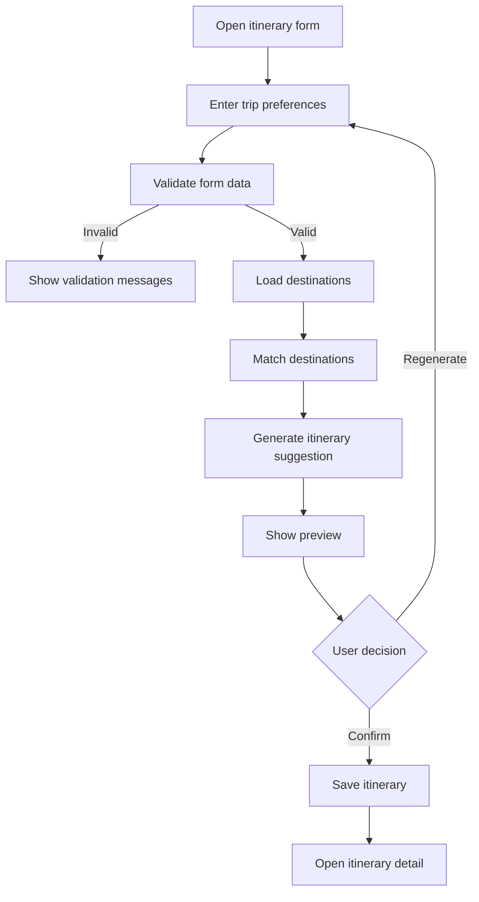
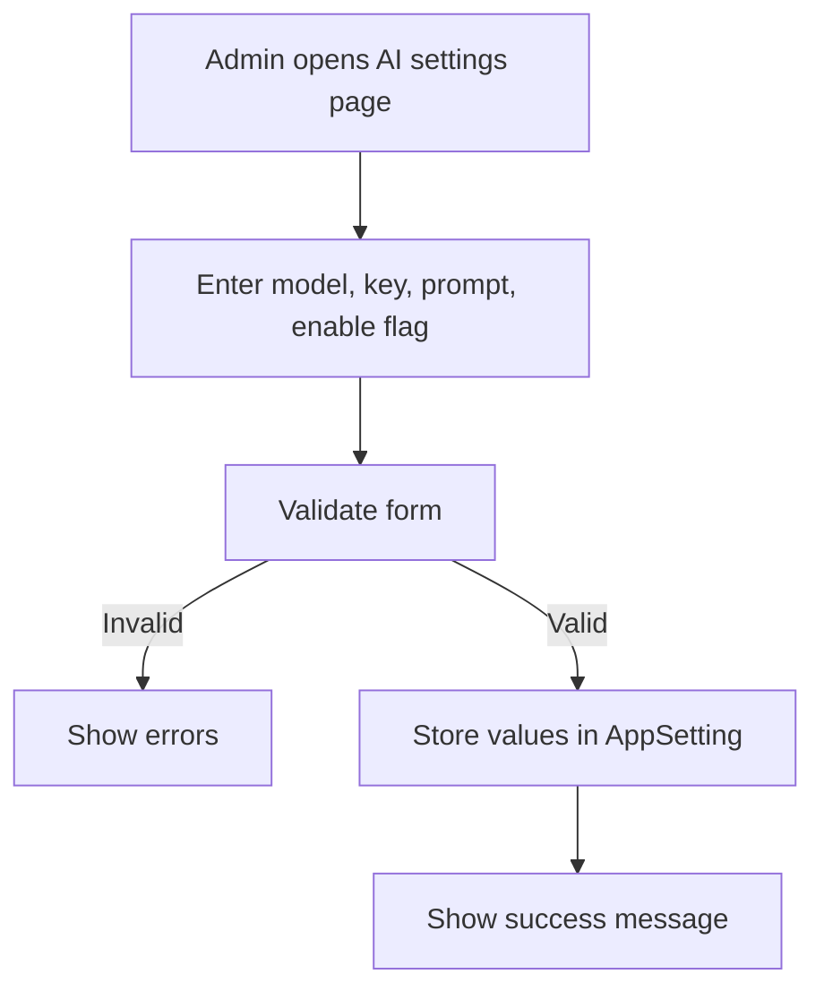

# UNIVERSITY PROJECT REPORT

## Cover Page

**University Name:** [University Name]  
**Department:** [Department Name]  
**Diploma Programme:** [Diploma Programme Name]  
**Project Title:** **Wajhati Saudiya: Smart Domestic Tourism Planning System**  
**Student Name:** [Student Name]  
**Student ID:** [Student ID]  
**Supervisor:** [Supervisor Name]  

---

## ABSTRACT

Wajhati Saudiya is a web-based tourism planning system developed to support domestic travel inside the Kingdom of Saudi Arabia. The implemented system is built using Flask, SQLAlchemy, Flask-Login, SQLite, Jinja templates, and supporting client-side libraries for styling and map interaction. The application allows visitors and registered users to browse local destinations, review destination details, save favorite places, submit reviews, maintain a personal preference profile, generate travel itineraries, and view saved trip plans. The latest implementation also includes an administrative control panel for destination and attraction management, user role management, and configuration of an AI-assisted itinerary generation service through Gemini.  

The project addresses the practical problem that travel information is often fragmented, unstructured, and difficult to personalize for local travelers. Instead of requiring users to manually compare multiple places and build a schedule from scratch, the system collects destination data into one interface and offers itinerary suggestions based on trip duration, budget, trip type, interests, and optional profile attributes. A two-step generation flow has been implemented so that the user must review the suggested plan before confirming and saving it.  

From a software engineering perspective, the project demonstrates a complete layered web application that includes authentication, relational data modeling, business logic, validation, bilingual interface support, JSON APIs, and automated testing. The system is suitable as an applied academic project because it shows how software engineering concepts can be transformed into a practical product with clear users, defined modules, and testable functionality.

## ACKNOWLEDGMENT

Praise be to Allah for granting the ability to complete this project. The preparation of this report and the implementation of the system would not have been possible without guidance, support, and continuous encouragement.  

Sincere appreciation is extended to the project supervisor for valuable advice, academic direction, and constructive comments throughout the development process. Appreciation is also extended to the faculty members of the department for the knowledge and technical foundation that supported the completion of this work.  

Finally, gratitude is expressed to family, colleagues, and everyone who provided moral and practical support during the development and documentation of the project.

## COMMITTEE REPORT

This applied project entitled **“Wajhati Saudiya: Smart Domestic Tourism Planning System”** has been prepared in partial fulfillment of the requirements of the diploma programme. The project has been reviewed with respect to software implementation, documentation, and suitability for academic submission.  

Committee Members:  
1. [Committee Member 1]  
2. [Committee Member 2]  
3. [Committee Member 3]  

Decision: [Accepted / Accepted with Modifications / Revisions Required]

## TABLE OF CONTENT

1. CHAPTER 1: INTRODUCTION  
1.1 Introduction  
1.2 Previous Work  
1.3 Problem Statement  
1.4 Scope  
1.5 Objectives  
1.6 Advantages  
1.7 Disadvantages  
1.8 Software Requirements  
1.9 Hardware Requirements  
1.10 Software Methodology  
1.11 Project Plan  

2. CHAPTER 2: LITERATURE REVIEW  
2.1 Introduction  
2.2 Related Work  
2.2.1 Similar Systems  

3. CHAPTER 3: SYSTEM ANALYSIS  
3.1 Introduction  
3.2 Data Collection  
3.3 Requirements Elicitation  
3.4 Requirements Specification  

4. CHAPTER 4: SYSTEM DESIGN  
4.1 Introduction  
4.2 Structural Models  
4.3 Dynamic Models  

5. CHAPTER 5: DATABASE  
5.1 Data Modeling  
5.2 Entities and Attributes  
5.3 Relationships  
5.4 Interfaces  

6. CHAPTER 6: DATABASE DESIGN  
6.1 Database Design Explanation  

7. CHAPTER 7: USER INTERFACE  

APPENDIX

---

# CHAPTER 1: INTRODUCTION

## 1.1 Introduction

Tourism and domestic mobility have become important parts of contemporary life, particularly in environments where digital services are expected to simplify planning and decision-making. In Saudi Arabia, travelers often require an easy way to browse destinations, compare travel possibilities, and prepare a trip plan that fits their time, interests, and financial constraints. The codebase analyzed in this project implements such a platform under the name **Wajhati Saudiya**.  

The system is a browser-based web application backed by a relational database. It provides user registration and login, destination browsing, reviews, favorite management, itinerary generation, interactive map browsing, saved trips, user preference profiling, and administration pages for system content and AI settings. The implementation also exposes selected features through a JSON API, which demonstrates service reuse beyond the web interface.  

This chapter introduces the project, clarifies the problem addressed by the system, defines the project scope and objectives, and summarizes the software and hardware environment required to develop and execute the application.

## 1.2 Previous Work

The current implementation reflects the type of functionality commonly found in tourism portals, itinerary builders, map-assisted destination browsers, and recommendation-oriented travel systems. In practical terms, the system combines four forms of prior software patterns: destination catalog systems, user account systems, review and favorite systems, and itinerary suggestion systems.  

Within the codebase, these ideas appear as modular components. The destination module supports structured browsing and filtering; the authentication module supports account creation and session-based access; the review and favorite logic supports personalization; and the recommendation service supports automatic trip planning. Therefore, the project can be regarded as a software engineering consolidation of several known travel-related interaction patterns into one integrated academic system.

## 1.3 Problem Statement

Domestic travelers may face difficulty when planning trips because available information is spread across many sources and is not always organized in a form that supports decision-making. A traveler must usually answer several questions at once: Which city should be visited? What destinations are suitable? How can time and budget be balanced? Which places match personal interests?  

The problem addressed by this project is the absence of a simple and localized tourism planning system that brings destination information, personalization, and trip recommendation into one unified platform. The implemented system attempts to solve this problem by storing local destination data in a database and generating itinerary suggestions using the user’s selected preferences and saved profile information.

## 1.4 Scope

The scope of the current project is limited to a working academic prototype implemented as a Flask monolithic web application. The implemented features include account registration and login, destination listing and filtering, destination details, map display, user reviews, favorites, profile preferences, itinerary suggestion generation, itinerary review before saving, saved itinerary management, an administrative dashboard, destination and attraction administration, user role management, and AI recommendation configuration.  

The project is intended for local development, demonstration, and academic evaluation. The current scope does not include production deployment hardening, advanced booking workflows, third-party tourism inventory, payment integration, live route optimization, or migration tooling for database schema evolution.

## 1.5 Objectives

The objectives of the implemented system are as follows:

1. To build a web-based tourism planning platform focused on Saudi domestic destinations.  
2. To provide secure user authentication and role-based access for administrators and regular users.  
3. To support destination discovery through filtering, detail pages, and map-based exploration.  
4. To collect and manage user-generated interaction in the form of favorites and reviews.  
5. To generate itinerary suggestions based on budget, duration, trip type, interests, and optional profile metadata.  
6. To allow users to review, confirm, and save generated itineraries.  
7. To provide administration features for managing content and AI recommendation settings.  
8. To expose selected system functions through REST-style JSON API endpoints.

## 1.6 Advantages

The implemented system has several clear advantages. First, it centralizes destination information in one place, which reduces fragmentation and improves usability. Second, it supports personalization through user profiles, favorites, reviews, and saved itinerary history. Third, it uses validation on both web and API layers to improve input quality. Fourth, its modular code organization makes it suitable for academic study and future enhancement. Fifth, the addition of AI configuration provides a flexible way to experiment with assisted itinerary generation while preserving a fallback rule-based mechanism.  

Another advantage is that the project demonstrates full-stack software engineering practice. It contains server-side routes, templates, a data model, business services, seeding logic, configuration handling, and tests. This makes it valuable not only as a user-facing application but also as a case study in practical system construction.

## 1.7 Disadvantages

Despite its strengths, the current implementation has limitations. The application depends on SQLite and `db.create_all()` for persistence, which is suitable for development but not ideal for long-term schema evolution. The AI integration relies on external service configuration and stores the configured API key in the database in plain text, which is acceptable only for a prototype. The recommendation strategy, while functional, remains heuristic or prompt-assisted rather than analytical or learned from behavior.  

In addition, some features are demonstrative in nature. The map page displays stored coordinates but is not connected to full route optimization. The destination dataset is relatively small and seeded for academic use. Therefore, the system should be evaluated as a complete prototype rather than a production tourism platform.

## 1.8 Software Requirements

| No. | Software Component | Purpose |
|---|---|---|
| 1 | Python 3.12 | Main programming language runtime |
| 2 | Flask 3.0.3 | Web application framework |
| 3 | Flask-SQLAlchemy 3.1.1 | ORM and database integration |
| 4 | Flask-Login 0.6.3 | Session-based authentication |
| 5 | Werkzeug 3.0.3 | Request handling and password utilities |
| 6 | SQLite | Local relational database engine |
| 7 | Jinja2 | Server-side HTML template rendering |
| 8 | Tailwind CSS via CDN | Front-end styling |
| 9 | Leaflet | Interactive map rendering in the browser |
| 10 | Pytest / unittest | Automated testing |
| 11 | Playwright | Browser-based end-to-end testing support |
| 12 | Gemini REST API | Optional AI-assisted itinerary generation |

## 1.9 Hardware Requirements

| No. | Hardware Component | Minimum Requirement |
|---|---|---|
| 1 | Processor | Dual-core CPU or higher |
| 2 | Memory | 4 GB RAM minimum |
| 3 | Storage | 1 GB free disk space for code, environment, and database |
| 4 | Display | Standard monitor capable of running a modern browser |
| 5 | Network | Internet connection required only for CDN assets and Gemini API integration |

## 1.10 Software Methodology

The codebase reflects an **iterative modular development methodology**. The system is organized into separable concerns such as authentication, browsing, profile management, itinerary generation, administration, and API services. This indicates that the project was developed incrementally, with features added as independent but connected modules.  

Evidence of this methodology is visible in the structure of the application factory, the separation into blueprints, the existence of a service layer for recommendation logic, the progressive addition of administrative features, and the accompanying automated tests that verify selected system behaviors. This methodology is appropriate for an applied project because it allows the system to grow gradually while preserving organization and maintainability.

## 1.11 Project Plan

The implemented system suggests the following project progression:

| Phase | Main Activities |
|---|---|
| Planning | Define problem, identify target users, choose Flask-based architecture |
| Analysis | Determine user needs, identify admin and user roles, define required data |
| Design | Create routes, templates, models, and supporting diagrams |
| Implementation | Develop authentication, browsing, itinerary, profile, map, and admin modules |
| Integration | Connect UI, business logic, database, API, and AI settings |
| Testing | Validate recommender logic, APIs, authentication, and browser flows |
| Documentation | Prepare diagrams, status documents, report, and final submission materials |

---

# CHAPTER 2: LITERATURE REVIEW

## 2.1 Introduction

The implemented project belongs to the broader class of tourism information and decision-support systems. Systems in this category typically combine destination presentation, user interaction, and travel-planning assistance. The codebase examined for this report demonstrates these characteristics in a localized Saudi tourism context.  

This chapter discusses the categories of related systems that are conceptually relevant to the implementation and identifies how the current project compares with them based on its existing code and features.

## 2.2 Related Work

Travel software commonly appears in several forms. One category is the **destination information portal**, which focuses on presenting attractions, cities, images, and descriptive content. Another category is the **trip planner**, which allows users to specify time, budget, and interests in order to receive a suggested plan. A third category is the **community interaction system**, where users save favorites and leave reviews. A fourth category is the **map-based tourism interface**, where destinations are explored spatially.  

The implemented Wajhati Saudiya system combines all four categories in a single application. The code supports structured destination records, user-generated reviews, saved favorites, itinerary generation, and an interactive map page that uses stored coordinates. In addition, the system introduces a configurable AI recommendation setting, which places it closer to a modern recommendation-assisted planning platform than a static information website.

## 2.2.1 Similar Systems

Similar systems can be described as follows:

1. **Tourism catalog systems** provide searchable destination data but often do not generate itineraries.  
2. **Trip planning systems** generate schedules but may not support reviews, favorites, and role-based administration in the same application.  
3. **Review-driven travel systems** focus heavily on user opinions but may not provide itinerary-building functionality.  
4. **Map-based exploration systems** emphasize geographic interaction but may not connect map browsing with saved plans and user profiles.  

Compared with these categories, the current project is notable for integrating multiple travel-related functions into one academic prototype. However, it remains smaller in scope than commercial platforms because it uses a limited local dataset, simple persistence, and a prototype-level AI integration.

---

# CHAPTER 3: SYSTEM ANALYSIS

## 3.1 Introduction

System analysis focuses on understanding users, identifying what the system must do, and describing the requirements that guide implementation. In this project, the codebase clearly indicates two major user classes: regular users and administrators. It also exposes a public visitor role for unauthenticated browsing.  

This chapter analyzes the data that the system collects, the functional and non-functional requirements derived from the implementation, and the use-case behaviors supported by the code.

## 3.2 Data Collection

The implemented system uses several forms of data collection. First, administrative users enter structured destination and attraction data through administration pages. Second, registered users enter account details during registration and provide profile metadata such as age range, gender, and favorite tags. Third, users submit itinerary preferences through the trip planning form, including city selection, duration, budget, trip type, and interests. Fourth, users provide review ratings and comments for destinations.  

The system also relies on seeded demonstration data inserted through application startup logic. This seed data includes example Saudi destinations and default local accounts for demonstration purposes. Therefore, the platform collects data from both system initialization and interactive user input.

## 3.3 Requirements Elicitation

The requirements can be inferred directly from the implemented routes, templates, data model, and tests.

### Functional Requirements

**Visitor Requirements**

1. The visitor shall be able to open the home page.  
2. The visitor shall be able to browse destinations.  
3. The visitor shall be able to filter destinations by city and category.  
4. The visitor shall be able to view destination details.  
5. The visitor shall be able to use the interactive map page.  
6. The visitor shall be able to register a new account.  
7. The visitor shall be able to log in using email or username and password.  

**Registered User Requirements**

1. The user shall be able to edit a personal preference profile.  
2. The user shall be able to save and remove favorite destinations.  
3. The user shall be able to submit destination reviews.  
4. The user shall be able to generate itinerary suggestions.  
5. The user shall be able to leave the city blank and still receive suggestions.  
6. The user shall be able to review an itinerary suggestion before confirming it.  
7. The user shall be able to regenerate a suggestion before saving it.  
8. The user shall be able to save a confirmed itinerary.  
9. The user shall be able to view saved itineraries.  
10. The user shall be able to delete owned itineraries.  

**Administrator Requirements**

1. The administrator shall be able to access the admin dashboard.  
2. The administrator shall be able to add destinations.  
3. The administrator shall be able to add attractions linked to destinations.  
4. The administrator shall be able to view users.  
5. The administrator shall be able to promote a user to administrator.  
6. The administrator shall be able to remove administrator rights under protected conditions.  
7. The administrator shall be able to configure AI recommendation settings, including provider, model, API key, system prompt, and enable/disable status.  

**API Requirements**

1. The system shall expose a health-check endpoint.  
2. The system shall expose a destination listing endpoint.  
3. The system shall expose an itinerary generation endpoint.  
4. The system shall expose a destination reviews endpoint.  

### Non-Functional Requirements

1. The system shall provide bilingual support in Arabic and English for major interface elements.  
2. The system shall validate user input on the server side for itinerary creation and administrative data entry.  
3. The system shall maintain user sessions using Flask-Login.  
4. The system shall use a relational database model with enforced foreign keys and constraints through SQLAlchemy design.  
5. The system shall provide a browser-accessible interface suitable for desktop and mobile layouts.  
6. The system shall maintain a modular internal structure to support maintainability and academic readability.  
7. The system shall provide at least starter-level automated testing for critical recommendation and API behavior.  
8. The system shall fall back to rule-based generation when Gemini AI configuration is unavailable or fails.

## 3.4 Requirements Specification

### Use Case Descriptions

**Use Case 1: Register Account**  
Actor: Visitor  
Precondition: Visitor is not authenticated.  
Main Flow: The visitor opens the register page, enters name, email, and password, and submits the form. The system validates the data, creates a user record, hashes the password, and redirects the user to the login page.  
Postcondition: A new user account exists in the database.

**Use Case 2: Login**  
Actor: Visitor / User  
Precondition: User account exists.  
Main Flow: The user enters email or username and password. The system verifies the credentials and creates an authenticated session.  
Postcondition: The user is logged in and redirected to the home page.

**Use Case 3: Browse Destinations**  
Actor: Visitor / User  
Precondition: Destination data exists.  
Main Flow: The actor opens the destinations page and optionally filters by city and category. The system queries matching destination records and renders them in the UI.  
Postcondition: A list of filtered destinations is displayed.

**Use Case 4: Submit Review**  
Actor: Registered User  
Precondition: User is logged in and opens a destination detail page.  
Main Flow: The user enters rating and comment. The system validates the values and stores a review linked to the user and destination.  
Postcondition: A new review record is saved.

**Use Case 5: Generate Itinerary Suggestion**  
Actor: Registered User  
Precondition: User is logged in.  
Main Flow: The user enters trip duration, budget, trip type, interests, and optionally city. The system validates the request, matches destinations, generates an itinerary suggestion through AI or fallback logic, and renders a preview.  
Postcondition: A preview suggestion is displayed but not yet saved.

**Use Case 6: Confirm Saved Itinerary**  
Actor: Registered User  
Precondition: A preview itinerary has been generated.  
Main Flow: The user confirms the suggestion. The system stores the itinerary and its itinerary items in the database.  
Postcondition: A saved itinerary record exists and can be viewed later.

**Use Case 7: Manage AI Settings**  
Actor: Administrator  
Precondition: User is authenticated as admin.  
Main Flow: The administrator opens the AI settings page, modifies the provider settings, model, API key, and system prompt, and saves the form.  
Postcondition: AI configuration is stored in `AppSetting` records.

---

# CHAPTER 4: SYSTEM DESIGN

## 4.1 Introduction

System design translates requirements into structures, modules, and interactions. The design of Wajhati Saudiya is based on a layered monolithic web application where the user interface, route handling, business logic, and data persistence are separated inside one Flask project.  

The design is suitable for an academic applied project because it remains simple to deploy and understand, while still demonstrating real engineering separation between modules.

## 4.2 Structural Models

### Class Diagram (Text Description)

The following class model is derived directly from the SQLAlchemy entities:

**Figure 4.1: Textual Class Diagram**

```text
User
- id
- name
- email
- password_hash
- is_admin
- preferred_language
- age_range
- gender
- favorite_tags
- created_at

Destination
- id
- name
- city
- category
- description
- estimated_cost
- latitude
- longitude
- season
- created_at

Attraction
- id
- destination_id
- name
- category
- description
- entry_cost
- duration_hours
- latitude
- longitude

Favorite
- id
- user_id
- destination_id
- created_at

Review
- id
- user_id
- destination_id
- rating
- comment
- created_at

Itinerary
- id
- user_id
- destination_city
- trip_type
- duration_days
- budget
- interests
- estimated_total_cost
- created_at

ItineraryItem
- id
- itinerary_id
- day_number
- title
- notes
- estimated_cost

AppSetting
- id
- key
- value
- updated_at

Relationships
User 1..* Itinerary
User 1..* Favorite
User 1..* Review
Destination 1..* Attraction
Destination 1..* Review
Itinerary 1..* ItineraryItem
Favorite links User and Destination
Review links User and Destination
```

## 4.3 Dynamic Models

### Sequence Diagrams

**Figure 4.2: Sequence Diagram for User Authentication**



**Figure 4.3: Sequence Diagram for Itinerary Suggestion**



### Activity Diagrams

**Figure 4.4: Activity Diagram for Itinerary Planning**



**Figure 4.5: Activity Diagram for Admin AI Configuration**



---

# CHAPTER 5: DATABASE

## 5.1 Data Modeling

The database is modeled as a relational schema implemented using SQLAlchemy models. The design supports user identity, destination content, user interaction, trip generation, and configuration. Each entity corresponds to a specific domain concept in the tourism planning workflow.  

The use of separate tables for users, destinations, reviews, favorites, itineraries, itinerary items, and application settings provides a normalized structure that reduces duplication and improves maintainability.

## 5.2 Entities and Attributes

| Entity | Main Attributes |
|---|---|
| User | id, name, email, password_hash, is_admin, preferred_language, age_range, gender, favorite_tags, created_at |
| Destination | id, name, city, category, description, estimated_cost, latitude, longitude, season, created_at |
| Attraction | id, destination_id, name, category, description, entry_cost, duration_hours, latitude, longitude |
| Favorite | id, user_id, destination_id, created_at |
| Review | id, user_id, destination_id, rating, comment, created_at |
| Itinerary | id, user_id, destination_city, trip_type, duration_days, budget, interests, estimated_total_cost, created_at |
| ItineraryItem | id, itinerary_id, day_number, title, notes, estimated_cost |
| AppSetting | id, key, value, updated_at |

## 5.3 Relationships

The database relationships can be summarized as follows:

1. One user can own many itineraries.  
2. One itinerary can contain many itinerary items.  
3. One user can create many favorites, and each favorite links one user with one destination.  
4. One user can create many reviews, and each review references one destination.  
5. One destination can have many attractions.  
6. One destination can have many reviews.  
7. The `AppSetting` table stores configurable key-value pairs used by the system, including AI recommendation configuration.

## 5.4 Interfaces

The database is accessed through SQLAlchemy inside the Flask application. Interfaces to the database appear in the following forms:

1. Route handlers querying and persisting model records.  
2. Service logic reading application settings and destination records.  
3. Startup logic creating tables and seeding default data.  
4. API routes serializing model data as JSON.  
5. Administrative interfaces that create and update destination and attraction records.  

Thus, the database is not only a storage component but also the operational center of the system’s browsing, recommendation, and administration behavior.

---

# CHAPTER 6: DATABASE DESIGN

## 6.1 Database Design Explanation

The database design is intentionally compact but broad enough to support the full application flow. The `User` table stores authentication and personalization data. The `Destination` table stores tourism records, including city, category, cost, and coordinates. The `Attraction` table allows multiple activities to be linked to a destination. `Favorite` and `Review` capture user interaction with destinations. `Itinerary` and `ItineraryItem` separate overall trip metadata from daily schedule entries, which is an appropriate design because a trip contains multiple generated items.  

The `AppSetting` table supports system configuration without hard-coding all values into source files. This is particularly important for AI integration, where model name, enablement flag, API key, and system prompt need to be editable by administrators.  

The current design uses SQLite and automatic table creation. This is practical for demonstration and academic development, although a future version should introduce explicit migration tooling and stronger secret management.

---

# CHAPTER 7: USER INTERFACE

The user interface is implemented through server-rendered Jinja templates and styled with Tailwind CSS classes. The codebase contains a complete set of pages for visitors, authenticated users, and administrators.  

The **home page** introduces the system, displays featured destinations, and summarizes recent user activity when a user is logged in. The **registration** and **login** pages provide branded authentication screens with bilingual labels and calls to action. The **destinations page** presents destination cards with filtering by city and category. The **destination detail page** shows a richer destination description, associated reviews, and favorite actions.  

The **profile page** allows the user to define age range, gender, and favorite tags so that itinerary generation can use profile context as an additional recommendation signal. The **trip planning page** is one of the central interfaces of the project. It collects destination city (optionally), trip duration, budget, trip type, and interests. After submission, it renders a preview of the generated suggestion and presents two explicit actions: confirm and save, or regenerate.  

The **itinerary detail page** displays the confirmed trip, grouped by day, with notes and estimated costs for each itinerary item. The **my itineraries page** lists all saved plans and allows deletion. The **map page** uses Leaflet to display destination markers and supports city-based filtering and geolocation assistance in the browser.  

For administrators, the **admin dashboard** provides system statistics and navigation to content-management pages. The **admin destinations page** allows creation of destinations; the **admin attractions page** allows attraction entry; the **admin users page** supports user role management; and the **admin AI settings page** allows configuration of the Gemini recommendation service.  

From a usability perspective, the interface is consistent, responsive, and bilingual. It also separates regular-user pages from administrative pages clearly, which is an important design decision in role-based systems.

---

# APPENDIX

## Appendix A: Important Code Snippets

### A.1 Application Factory

```python
from wajhati import create_app

app = create_app()

if __name__ == "__main__":
    app.run(debug=True)
```

### A.2 User Model and Password Hashing

```python
class User(UserMixin, db.Model):
    id = db.Column(db.Integer, primary_key=True)
    name = db.Column(db.String(120), nullable=False)
    email = db.Column(db.String(120), unique=True, nullable=False)
    password_hash = db.Column(db.String(255), nullable=False)

    def set_password(self, password):
        self.password_hash = generate_password_hash(password)

    def check_password(self, password):
        return check_password_hash(self.password_hash, password)
```

### A.3 AI Settings Retrieval

```python
def get_ai_settings():
    return {
        "enabled": AppSetting.get_value("ai_recommendations_enabled", "0") == "1",
        "provider": AppSetting.get_value("ai_recommendations_provider", AI_PROVIDER_GEMINI),
        "model": AppSetting.get_value("ai_recommendations_model", DEFAULT_GEMINI_MODEL),
        "api_key": AppSetting.get_value("ai_recommendations_api_key", "").strip(),
        "system_prompt": AppSetting.get_value("ai_recommendations_system_prompt", DEFAULT_AI_SYSTEM_PROMPT),
    }
```

### A.4 Destination Matching Logic

```python
def match_destinations(destinations, city, budget, interests, profile_context=None):
    normalized_city = city.strip().lower()
    normalized_interests = _normalize_text_list(interests)
    normalized_profile = _normalize_profile_context(profile_context)
    normalized_favorite_tags = _normalize_text_list(normalized_profile["favorite_tags"])
    matched = []

    for destination in destinations:
        if normalized_city and destination.city.lower() != normalized_city:
            continue
        score = 0
        score += 3
        if destination.estimated_cost <= budget:
            score += 2
        if destination.category.lower() in normalized_interests:
            score += 2
        if destination.category.lower() in normalized_favorite_tags:
            score += 2
        matched.append((score, destination))
```

### A.5 Itinerary Review Before Save

```python
if action == "confirm":
    generated = _parse_generated_itinerary(request.form.get("generated_itinerary"))
else:
    matched = match_destinations(...)
    generated = generate_itinerary(...)
    return render_template(
        "create_itinerary.html",
        preview_itinerary=generated,
        generated_itinerary_json=_serialize_generated_itinerary(generated),
    )
```

## Appendix B: Notes for Microsoft Word Formatting

1. Use **Heading 1** for chapter titles and **Heading 2 / Heading 3** for numbered subsections.  
2. Center the cover page content vertically and horizontally for final submission formatting.  
3. Convert markdown tables into Word tables after pasting.  
4. Keep chapter titles on separate pages if required by department rules.  
5. Mermaid diagrams may be converted into images manually if the department requires graphical figures instead of structured text.

## Conclusion

The current codebase demonstrates a complete applied web project in tourism planning. It combines structured data management, personalized interaction, AI-assisted and rule-based recommendation logic, administrative control, and user-centered interfaces. With appropriate formatting adjustments in Microsoft Word, this report is ready to serve as a submission draft for academic evaluation.
