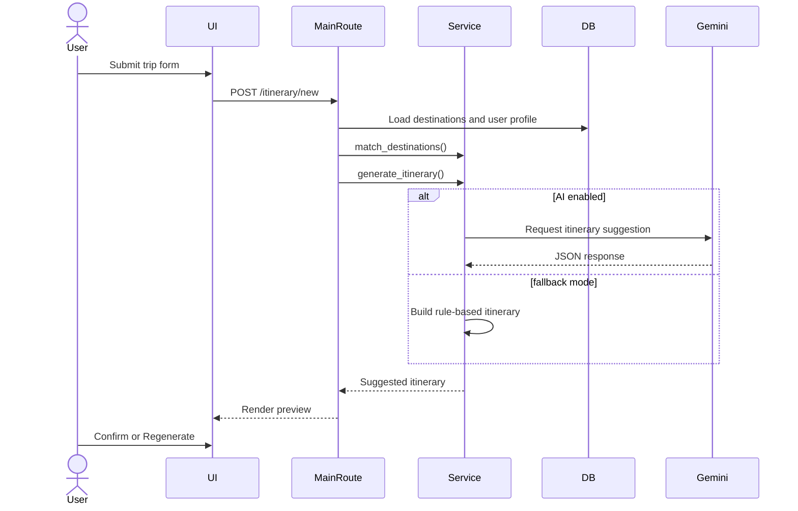
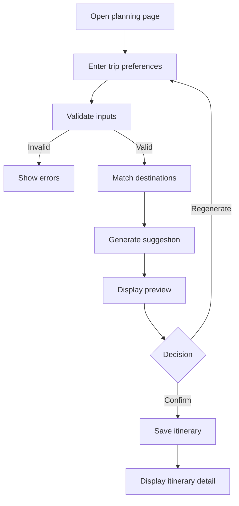

King Khalid University,  
Department of Information Systems, Applied College, Mahayil Asir  
Diploma Programme in Information Systems  
Applied Project  
**Wajhati Saudiya: Smart Domestic Tourism Planning System**  

Submitted By:  
[Student ID]  
[Student Name]  

Supervised By: [Supervisor Name]  

---------------------------------------------------------------------

## ABSTRACT

This system “Wajhati Saudiya” provides a unified platform for domestic tourism planning inside the Kingdom of Saudi Arabia. The proposed system is characterized by organized destination content, user account support, favorite management, destination reviews, interactive browsing, map-based exploration, and smart itinerary generation through both rule-based and optional AI-assisted recommendation logic. The system allows users to create and review a travel suggestion before confirming and saving it, which increases control and improves usability. The application also provides an administration panel for managing destinations, attractions, users, and AI recommendation settings. This project benefits from current technological development in web systems by offering a practical platform that simplifies trip planning and makes travel information easier to access and use.

## ACKNOWLEDGMENT

We want to thank everyone who made it possible for students like us to complete this project. We would like to express our deepest gratitude to Allah firstly, and then to our project supervisor for his valuable advice, guidance, patience, and continuous support throughout the development of the project and preparation of this report.  

We would also like to express our gratitude to our parents for their kind cooperation and encouragement, which helped us in finishing this project. A special thanks is extended to the faculty members in the college whom we met during our studies and from whom we gained the academic and technical knowledge that enabled us to reach this stage.

## COMMITTEE REPORT

We certify that we read this graduation project report as examining committee, examined the students’ project in its content and that in our opinion it is adequate as a report document for Diploma in Information Systems.  

Supervisor: …………………………, Signature ……………, Date: / /  
Examiner 1: ………………………, Signature ………………, Date: / /  
Examiner 2: ………………………, Signature ………………, Date: / /

## TABLE OF CONTENT

ABSTRACT  
ACKNOWLEDGMENT  
COMMITTEE REPORT  
TABLE OF CONTENT  

CHAPTER 1  
1.1 Introduction  
1.2 Previous Work  
1.3 Problem Statement  
1.4 Scope  
1.5 Objectives  
1.6 Advantages  
1.7 Disadvantages  
1.8 Software requirements  
1.9 HARDWARE REQUIREMENTS  
1.10 Software Methodology  
1.11 project plan  

CHAPTER 2  
2.1 Introduction  
2.2 Related work  
2.2.1 Similar Apps and websites  

CHAPTER 3  
3.1 Introduction  
3.2 Data Collection from Questionnaire  
3.3 REQUIREMENTS ELICITATION  
3.4 REQUIREMENTS SPECIFICATION  

CHAPTER 4  
4.1 Introduction  
4.2 Structural Static Models  
4.2.1 Class diagram  
4.3 Dynamic Models  
4.3.1 Sequence diagram  
4.3.2 Activity Diagram  

CHAPTER 5  
5.1 Data Modeling  
5.2 Database Entities and Attributes (Schema)  
5.3 Database Relationships Description  
5.4 Interfaces  

CHAPTER 6  
6.1 Database design  

CHAPTER 7  

APPENDIX (CODES)

---

# Chapter 1

## INTRODUCTION

### 1.1 Introduction

This system “Wajhati Saudiya” provides a unified platform for domestic tourism planning across destinations in Saudi Arabia. The proposed system is characterized by organized destination content, easy browsing, user accounts, review and favorite features, saved itineraries, map-based destination exploration, and itinerary generation through a smart recommendation process. The system helps the user discover destinations, review their details, and generate a practical travel plan based on budget, duration, trip type, interests, and optional profile information. The project saves time and effort through the management of destinations, activities, and trip planning in one web application. This comes as a result of the continuous technological developments that enrich society with digital tools and programs that simplify daily life and decision-making.

### 1.2 Previous Work

#### 1.2.1 Tourism destination platforms

Many tourism systems provide destination information, city guides, or attraction listings through websites and mobile applications. These systems are useful for presenting tourism information, but they do not always provide personalized itinerary generation, user review workflows, or integrated administration features in one platform.

#### 1.2.2 Route and planning systems

Some route and travel planning systems allow users to define preferences such as destination, time, and interest, then receive a suggested schedule. However, many of those systems depend on external services or large datasets and are not designed as lightweight academic web applications focused on local Saudi tourism content.

### 1.3 Problem Statement

Domestic tourism planning can be difficult because information about destinations is often fragmented and not presented in a structured, reusable, and personalized form. A traveler may need to search many pages or applications before deciding where to go, how much the trip will cost, and which places best match personal interests. If there is no organized and centralized planning system, the user wastes time and effort in manually comparing locations and building a schedule. The tourism planning service is therefore not working efficiently when destination information cannot be found easily, when user preferences are not considered, and when no clear travel suggestion can be produced from available data.

### 1.4 Scope

Because web applications have become widely used and accessible from different places and devices, this project was developed as a web-based system. This makes communication with the system easier, faster, and available from any location through an internet browser. The current project scope is limited to a Flask web application for local development and academic demonstration. The system supports browsing Saudi destinations, user authentication, favorites, reviews, saved itineraries, interactive map browsing, administration pages, and AI recommendation configuration. The scope does not include online booking, payment, commercial travel inventory, live routing optimization, or production deployment hardening.

### 1.5 Objectives

Enable the user to browse and search local Saudi tourism destinations.  
Allow users to create accounts and manage their travel activity.  
Generate itinerary suggestions based on budget, trip duration, trip type, interests, and profile information.  
Allow the user to review the suggested itinerary before confirming and saving it.  
Store saved itineraries and display them later when needed.  
Allow administrators to manage destination, attraction, user, and AI recommendation data.  
Provide selected system functions through API endpoints in addition to the normal web interface.

### 1.6 Advantages

The system is user-friendly because the graphical web interface allows the user to use the system easily. The application combines several features in one place, including browsing, favorites, reviews, map view, itinerary generation, and administration. It also supports both Arabic and English in major interface elements, which improves accessibility for different users. The system provides smart planning support while still allowing the user to confirm or regenerate the suggestion before it is stored.

### 1.7 Disadvantages

The system depends on the currently stored destination dataset, so the quality of suggestions is limited by available data. The AI service depends on external configuration and internet connectivity when enabled. The database design currently uses SQLite and automatic table creation, which is suitable for development but not ideal for large-scale deployment. The project is a prototype and not a commercial tourism platform.

### 1.8 Software requirements

The software programs and tools required to develop and run the system are described in Table (1-1).

**Table 1-1: Software requirements**

| Software Tool | Description |
|---|---|
| Python 3.12 | Main programming language used to develop the application |
| Flask | Web framework used for routing, request handling, and rendering pages |
| Flask-SQLAlchemy | Used to define models and communicate with the database |
| Flask-Login | Used for session-based authentication and access control |
| SQLite | Relational database used to store system data |
| Jinja2 | Used to render dynamic HTML templates |
| Tailwind CSS | Used to style the user interface |
| Leaflet | Used in the map page to display destination locations |
| Pytest / unittest | Used for automated testing |
| Gemini REST API | Optional external service for AI itinerary generation |

### 1.9 HARDWARE REQUIREMENTS

The hardware requirements of the system are explained in Table (1-2).

**Table 1-2: Hardware requirements**

| Hardware | Specifications |
|---|---|
| Processor | Intel Core i3 or equivalent processor |
| Random Access Memory | 4 GB RAM or more |
| Hard Disk | 1 GB free space for code, database, and dependencies |
| Display | Standard monitor with modern browser support |
| Network | Internet connection for CDN assets and optional AI service integration |

### 1.10 Software Methodology

Agile Methodology  

The project reflects an iterative development methodology similar to Agile. The system was developed in modules such as authentication, destination browsing, profile management, itinerary generation, administration, and API services. This methodology supports gradual improvement, easier testing, and frequent feature extension.  

The main phases visible from the implemented code are requirements identification, design of routes and models, coding, database integration, interface building, testing, and review. This methodology is appropriate because it supports continuous development and testing throughout the project lifecycle, rather than delaying all testing to the end.

### 1.11 project plan

The project plan can be summarized in the following stages:

1. Requirements and problem identification.  
2. Interface and database design.  
3. Development of authentication and destination modules.  
4. Development of itinerary generation and recommendation logic.  
5. Addition of administration and API modules.  
6. Testing and validation.  
7. Documentation and final report preparation.

---

# Chapter 2

## LITERATURE REVIEW

### 2.1 Introduction

In the previous chapter, we reviewed the project problem, aims and objectives, project scope, and methodology. In this chapter, we review work related to tourism platforms and itinerary planning systems. In addition, we look at apps and websites that are similar in concept to our project.

### 2.2 Related work

The purpose of this section is to highlight work done by others that is related to the current project. It may include systems that provide destination browsing, travel planning, review features, or recommendation-oriented user interaction. We discuss briefly digital systems that are technically related to the proposed work.

### 2.2.1 Similar Apps and websites

**Travel destination websites** provide destination information, attraction listings, and basic descriptive content. They are useful for exploration but may not generate personalized itineraries or preserve user preference data.  

**Trip planning applications** provide travel suggestion workflows based on selected criteria such as city, time, or budget. These are closer to the current project, but many are either general-purpose or built around broader commercial ecosystems.  

**Map-based travel platforms** allow the user to visualize places geographically. The Wajhati system includes this feature through its map page, but it combines it with additional modules such as reviews, favorites, saved itineraries, administration, and configurable AI integration.  

Therefore, the current project can be viewed as a combination of destination browsing, map-based exploration, trip planning, and account-based personalization in one web application.

---

# Chapter 3

## SYSTEM ANALYSIS

### 3.1 Introduction

System analysis is the stage in which the functions of the system, the users of the system, and the required data are identified. The codebase clearly shows three user contexts: the visitor, the registered user, and the administrator. The system also includes browser pages and API endpoints, which means that analysis must cover both human interaction and machine-readable services.

### 3.2 Data Collection from Questionnaire

No questionnaire processing module exists in the current source code. Therefore, in this project the data collection is implemented through direct system input forms and administrative data entry rather than through a formal questionnaire engine. User data is collected from registration forms, profile forms, review forms, and itinerary preference forms. Destination and attraction data are collected from admin pages. Additional demonstration data are inserted through startup seed logic.

### 3.3 REQUIREMENTS ELICITATION

#### Functional Requirements

**Visitor**

The visitor can open the home page.  
The visitor can browse destinations.  
The visitor can filter destinations by city and category.  
The visitor can view destination details.  
The visitor can use the interactive map page.  
The visitor can register a new account.  
The visitor can log in using email or username and password.

**User**

The user can update a preference profile.  
The user can add and remove favorites.  
The user can submit destination reviews.  
The user can generate itinerary suggestions.  
The user can receive recommendations even if no city is selected.  
The user can review the suggested itinerary before saving it.  
The user can confirm the suggestion or regenerate another one.  
The user can save confirmed itineraries.  
The user can display saved itineraries.  
The user can delete owned itineraries.

**Administrator**

The administrator can display the admin dashboard.  
The administrator can add destinations.  
The administrator can add attractions.  
The administrator can review users.  
The administrator can manage admin roles.  
The administrator can configure AI recommendation settings including model, API key, prompt, and enablement.

**API**

The system provides a health endpoint.  
The system provides a destinations endpoint.  
The system provides an itinerary generation endpoint.  
The system provides a destination reviews endpoint.

#### Non-Functional Requirements

The system should provide a bilingual interface in Arabic and English.  
The system should validate major inputs before processing them.  
The system should preserve data in a relational database.  
The system should restrict admin pages to administrative users only.  
The system should remain modular and maintainable.  
The system should provide automated tests for critical features.  
The system should fall back to rule-based itinerary generation when the AI service is not available.

### 3.4 REQUIREMENTS SPECIFICATION

**Use Case: Register**  
Actor: Visitor  
Description: The visitor enters name, email, and password. The system checks duplicate email, creates the user, and redirects to login.

**Use Case: Login**  
Actor: Visitor/User  
Description: The user enters email or username and password. The system validates the credentials and starts the user session.

**Use Case: Browse Destinations**  
Actor: Visitor/User  
Description: The actor opens the destinations page and optionally filters by city or category to view matching destinations.

**Use Case: Generate Itinerary**  
Actor: User  
Description: The user enters trip preferences. The system validates the input, matches destinations, generates a suggestion, and displays a preview.

**Use Case: Confirm Itinerary**  
Actor: User  
Description: The user confirms the generated suggestion. The system stores the itinerary and itinerary items in the database.

**Use Case: Manage AI Settings**  
Actor: Administrator  
Description: The admin updates AI provider settings and saves them for later use in itinerary generation.

---

# Chapter 4

## SYSTEM DESIGN

### 4.1 Introduction

The system design of Wajhati Saudiya is based on a layered Flask architecture. The main parts are the presentation layer using templates, the application layer using blueprints and route handlers, the service layer using recommendation logic, and the persistence layer using SQLAlchemy models with SQLite. This design makes the system easier to understand, test, and extend.

### 4.2 Structural Static Models

#### 4.2.1 Class diagram

**Figure 4.1 Class Diagram**

```text
User -> Itinerary
User -> Favorite
User -> Review
Destination -> Attraction
Destination -> Review
Itinerary -> ItineraryItem
Favorite -> User + Destination
Review -> User + Destination
AppSetting -> stores configurable system values
```

The `User` class stores account and personalization data. The `Destination` class stores tourism destination data. The `Attraction` class stores activities related to a destination. The `Favorite` and `Review` classes link the user with destinations. The `Itinerary` class stores the trip, while `ItineraryItem` stores each day-level suggestion. The `AppSetting` class stores configurable values, especially the AI settings.

### 4.3 Dynamic Models

#### 4.3.1 Sequence diagram

**Figure 4.2 Sequence Diagram for Itinerary Generation**



#### 4.3.2 Activity Diagram

**Figure 4.3 Activity Diagram for Itinerary Flow**



---

# Chapter 5

## DATABASE

### 5.1 Data Modeling

The project uses a relational database model implemented through SQLAlchemy classes. The data model supports users, destinations, attractions, reviews, favorites, itineraries, itinerary items, and configurable application settings. This model allows the system to connect content management, user interaction, and recommendation workflows through a structured database design.

### 5.2 Database Entities and Attributes (Schema)

| Entity | Attributes |
|---|---|
| User | id, name, email, password_hash, is_admin, preferred_language, age_range, gender, favorite_tags, created_at |
| Destination | id, name, city, category, description, estimated_cost, latitude, longitude, season, created_at |
| Attraction | id, destination_id, name, category, description, entry_cost, duration_hours, latitude, longitude |
| Favorite | id, user_id, destination_id, created_at |
| Review | id, user_id, destination_id, rating, comment, created_at |
| Itinerary | id, user_id, destination_city, trip_type, duration_days, budget, interests, estimated_total_cost, created_at |
| ItineraryItem | id, itinerary_id, day_number, title, notes, estimated_cost |
| AppSetting | id, key, value, updated_at |

### 5.3 Database Relationships Description

One user can have many itineraries.  
One user can have many favorites.  
One user can have many reviews.  
One destination can have many attractions.  
One destination can have many reviews.  
One itinerary can have many itinerary items.  
The favorite entity links a user and a destination.  
The review entity links a user and a destination.  
The application setting entity stores configurable system key-value pairs.

### 5.4 Interfaces

The database is accessed through the web pages, route handlers, recommendation service, seeding logic, and API endpoints. The main interfaces include the registration form, destination and attraction administration forms, review submission form, profile form, itinerary planning form, saved itinerary pages, and API serialization for destinations, reviews, and generated itineraries.

---

# Chapter 6

## DATABASE DESIGN

### 6.1 Database design

The database design is appropriate for the current system because it separates user identity, tourism content, user interaction, trip planning, and configuration into individual tables. This improves clarity and reduces duplication. For example, itinerary metadata are separated from itinerary items, which is better than storing all trip information in a single table. Similarly, favorites and reviews are separated because they represent different kinds of user interaction with destinations.  

The use of the `AppSetting` table is important because it allows the administrator to configure AI recommendation parameters through the interface instead of modifying source code directly. The current design is suitable for a diploma-level applied project, although a future version should include migration support and stronger handling of sensitive configuration values.

---

# Chapter 7

## USER INTERFACE

The system includes a complete user interface composed of a home page, login page, registration page, profile page, destinations page, destination detail page, itinerary planning page, itinerary detail page, saved itineraries page, map page, and administration pages.  

The home page introduces the platform and shows featured destinations and user-specific travel information when the user is logged in. The login and registration pages provide account access and creation. The destinations page provides browsing and filtering, while the destination detail page allows the user to read the description, view reviews, and add or remove favorites.  

The profile page allows the user to define metadata such as age range, gender, and favorite tags, which can later influence recommendation behavior. The itinerary planning page is one of the most important screens because it collects user preferences and shows the generated suggestion in preview mode. The preview screen includes buttons for confirmation and regeneration, which ensures that the user has control over the generated result before it is saved.  

The itinerary detail page displays the saved trip grouped by day, including item titles, notes, and estimated cost. The my itineraries page shows all trips previously saved by the user and allows deletion. The map page displays destination markers using Leaflet and supports city filtering.  

The administration interface contains dashboard statistics and links to manage destinations, attractions, users, and AI settings. These screens make the system suitable not only for end users but also for content and configuration administration.

---

# APPENDIX (CODES)

## Appendix A: Application Entry Point

```python
from wajhati import create_app

app = create_app()

if __name__ == "__main__":
    app.run(debug=True)
```

## Appendix B: Authentication Example

```python
@auth_bp.route("/login", methods=["GET", "POST"])
def login():
    if request.method == "POST":
        identifier = request.form.get("email", "").strip()
        password = request.form.get("password", "")
        normalized_identifier = identifier.lower()
        user = User.query.filter(
            or_(User.email == normalized_identifier, User.name == identifier)
        ).first()
```

## Appendix C: Itinerary Confirmation Flow

```python
if action == "confirm":
    generated = _parse_generated_itinerary(request.form.get("generated_itinerary"))
else:
    matched = match_destinations(...)
    generated = generate_itinerary(...)
    return render_template(
        "create_itinerary.html",
        preview_itinerary=generated,
        generated_itinerary_json=_serialize_generated_itinerary(generated),
    )
```

## Appendix D: AI Recommendation Settings

```python
def get_ai_settings():
    return {
        "enabled": AppSetting.get_value("ai_recommendations_enabled", "0") == "1",
        "provider": AppSetting.get_value("ai_recommendations_provider", AI_PROVIDER_GEMINI),
        "model": AppSetting.get_value("ai_recommendations_model", DEFAULT_GEMINI_MODEL),
        "api_key": AppSetting.get_value("ai_recommendations_api_key", "").strip(),
        "system_prompt": AppSetting.get_value("ai_recommendations_system_prompt", DEFAULT_AI_SYSTEM_PROMPT),
    }
```

---

# Extended Technical Documentation

## Chapter 7 Supplement: Detailed Screen-by-Screen Description

The home page acts as the landing environment of the system and combines branding, featured destinations, recent itinerary information, and quick access to major functions. When the user is authenticated, the page also summarizes itinerary count, favorites count, and reviews count. This means that the home page is not only an introduction page but also a lightweight personalized dashboard.

The registration and login pages are designed as entry points to account-based interaction. They are implemented as server-rendered forms with bilingual labels and simple validation behavior. The login route accepts either email or username as identifier, which improves usability in comparison with systems that force only one identifier type.

The profile screen is technically important because it extends the user model beyond authentication. The data collected in the profile page, including age range, gender, and favorite tags, are stored in the database and later reused by the itinerary recommendation logic. This creates a connection between user preference modeling and trip generation.

The destinations listing page provides the discovery function of the project. It filters data by city and category and presents destination cards. The destination detail page extends this by showing full descriptive data, review history, and favorite status. These pages together form the information browsing layer of the system.

The create itinerary screen is one of the most important user interface components in the project. It accepts destination city, duration, budget, trip type, and interest tags. The latest implementation allows the city field to remain optional so that the system can still produce a recommendation even when no city is selected. This is an example of resilient design because it reduces user dead ends. The preview-confirm-regenerate workflow further improves the interface because it gives the user control over the generated result before persistence.

The itinerary detail screen provides the final representation of a confirmed plan. It groups items by day, shows estimated costs, and keeps the user aware of the overall travel structure. The my itineraries screen complements this by acting as a personal archive of previously confirmed plans.

The map interface introduces a spatial dimension to the platform. It uses Leaflet and stored coordinates to present destination markers. The map does not perform route optimization, but it strengthens the exploratory value of the system and demonstrates integration between stored geolocation data and browser visualization.

The administration screens are important from a system engineering perspective because they separate operational data entry from end-user browsing. The admin dashboard aggregates counts and recent records, while the destination and attraction forms support content creation. The user administration screen enforces role management rules such as preventing the removal of the last administrator. The AI settings screen exposes provider configuration and system prompts through the database, which demonstrates a configurable integration approach rather than a hard-coded one.

## Additional Analysis of Recommendation Logic

The recommendation service combines deterministic ranking and optional AI assistance. First, candidate destinations are filtered and scored according to user-selected city, budget, category match, destination description overlap, and favorite tags. This provides explainable heuristic logic. Second, if the administrator has enabled Gemini and supplied the required credentials, the system builds a structured prompt containing an administrative system prompt, user profile context, form input context, and a list of candidate destinations. This prompt is sent to the Gemini REST endpoint to produce a JSON itinerary. If Gemini is unavailable or fails, the system logs the error and returns to the internal rule-based generator.

This design is useful for academic evaluation because it shows two distinct engineering ideas. The first is a transparent ranking-based recommendation baseline. The second is a configurable AI integration that remains bounded by system data and still has a local fallback path. This demonstrates defensive design because external service failure does not prevent the system from functioning.

## Additional Analysis of Security and Validation

The implemented system includes several important security and validation patterns. Passwords are not stored as plain text; instead, hashing is performed through Werkzeug utilities. Login redirection is guarded by a safe redirect checker that prevents unsafe redirect targets. Administrative pages call a dedicated authorization helper that aborts access for non-admin users. Form data is validated before model creation, and itinerary constraints such as budget and duration are checked in both web and API paths. These patterns do not make the system production-complete, but they reflect correct software engineering awareness in a diploma-level project.

## Additional Analysis of Testing

The repository contains both service-level and interaction-level tests. Recommendation tests verify destination matching and itinerary generation behavior. API tests verify JSON endpoint correctness. Authentication and feature tests written with Playwright verify realistic user journeys such as sign up, login, favorites, reviews, and itinerary flows. The presence of these tests strengthens the academic value of the project because it demonstrates that implementation is supported by executable verification rather than documentation alone.

## Appendix Expansion Strategy

To satisfy the requirement for a long submission document, the following appendices include full or near-full listings of the real source files used by the current application. This approach keeps the report grounded in the actual codebase and avoids invented material.

## Core Backend Source Code Listings

### Source Listing: `app.py`

This listing is included exactly because it is part of the implemented system. It contains 7 lines of source code and contributes directly to the documented functionality.

```py
from wajhati import create_app

app = create_app()


if __name__ == "__main__":
    app.run(debug=True)

```

### Source Listing: `config.py`

This listing is included exactly because it is part of the implemented system. It contains 7 lines of source code and contributes directly to the documented functionality.

```py
import os


class Config:
    SECRET_KEY = os.environ.get("SECRET_KEY", "dev-secret-change-me")
    SQLALCHEMY_DATABASE_URI = os.environ.get("DATABASE_URL", "sqlite:///wajhati.db")
    SQLALCHEMY_TRACK_MODIFICATIONS = False

```

### Source Listing: `wajhati/__init__.py`

This listing is included exactly because it is part of the implemented system. It contains 90 lines of source code and contributes directly to the documented functionality.

```py
import os

from flask import Flask
from flask_login import LoginManager
from flask_sqlalchemy import SQLAlchemy
from sqlalchemy import inspect, text

from config import Config
from wajhati.translations import tr_category, tr_city, tr_description, tr_destination, tr_interest_tag, tr_season

db = SQLAlchemy()
login_manager = LoginManager()
login_manager.login_view = "auth.login"
login_manager.login_message_category = "warning"


def create_app(config_class=Config):
    app = Flask(__name__)
    app.config.from_object(config_class)

    db.init_app(app)
    login_manager.init_app(app)
    app.jinja_env.globals.update(
        tr_city=tr_city,
        tr_description=tr_description,
        tr_destination=tr_destination,
        tr_interest_tag=tr_interest_tag,
        tr_category=tr_category,
        tr_season=tr_season,
    )

    from wajhati.routes.auth import auth_bp
    from wajhati.routes.main import main_bp
    from wajhati.routes.api import api_bp

    app.register_blueprint(auth_bp)
    app.register_blueprint(main_bp)
    app.register_blueprint(api_bp, url_prefix="/api")

    with app.app_context():
        from wajhati.seed import seed_default_users, seed_demo_destinations

        db.create_all()
        _ensure_user_profile_columns()
        seed_default_users()
        _ensure_admin_user()
        seed_demo_destinations()

    return app


def _ensure_user_profile_columns():
    inspector = inspect(db.engine)
    columns = {column["name"] for column in inspector.get_columns("user")}
    statements = []
    if "age_range" not in columns:
        statements.append("ALTER TABLE user ADD COLUMN age_range VARCHAR(40)")
    if "gender" not in columns:
        statements.append("ALTER TABLE user ADD COLUMN gender VARCHAR(40)")
    if "favorite_tags" not in columns:
        statements.append("ALTER TABLE user ADD COLUMN favorite_tags VARCHAR(255) NOT NULL DEFAULT ''")
    if "is_admin" not in columns:
        statements.append("ALTER TABLE user ADD COLUMN is_admin BOOLEAN NOT NULL DEFAULT 0")

    for statement in statements:
        db.session.execute(text(statement))
    if statements:
        db.session.commit()


def _ensure_admin_user():
    from wajhati.models import User

    admin_email = os.environ.get("ADMIN_EMAIL", "").strip().lower()
    updated = False

    if admin_email:
        admin_user = User.query.filter_by(email=admin_email).first()
        if admin_user and not admin_user.is_admin:
            admin_user.is_admin = True
            updated = True

    if User.query.count() and User.query.filter_by(is_admin=True).count() == 0:
        first_user = User.query.order_by(User.id.asc()).first()
        if first_user and not first_user.is_admin:
            first_user.is_admin = True
            updated = True

    if updated:
        db.session.commit()

```

### Source Listing: `wajhati/models.py`

This listing is included exactly because it is part of the implemented system. It contains 130 lines of source code and contributes directly to the documented functionality.

```py
from datetime import datetime

from flask_login import UserMixin
from werkzeug.security import check_password_hash, generate_password_hash

from wajhati import db, login_manager


class Favorite(db.Model):
    id = db.Column(db.Integer, primary_key=True)
    user_id = db.Column(db.Integer, db.ForeignKey("user.id"), nullable=False)
    destination_id = db.Column(db.Integer, db.ForeignKey("destination.id"), nullable=False)
    created_at = db.Column(db.DateTime, default=datetime.utcnow, nullable=False)

    __table_args__ = (db.UniqueConstraint("user_id", "destination_id", name="uq_favorite"),)


class AppSetting(db.Model):
    id = db.Column(db.Integer, primary_key=True)
    key = db.Column(db.String(120), unique=True, nullable=False)
    value = db.Column(db.Text, nullable=False, default="")
    updated_at = db.Column(db.DateTime, default=datetime.utcnow, onupdate=datetime.utcnow, nullable=False)

    @classmethod
    def get_value(cls, key, default=""):
        setting = cls.query.filter_by(key=key).first()
        if setting is None:
            return default
        return setting.value

    @classmethod
    def set_value(cls, key, value):
        setting = cls.query.filter_by(key=key).first()
        if setting is None:
            setting = cls(key=key, value=str(value))
            db.session.add(setting)
        else:
            setting.value = str(value)
        return setting


class User(UserMixin, db.Model):
    id = db.Column(db.Integer, primary_key=True)
    name = db.Column(db.String(120), nullable=False)
    email = db.Column(db.String(120), unique=True, nullable=False)
    password_hash = db.Column(db.String(255), nullable=False)
    is_admin = db.Column(db.Boolean, nullable=False, default=False)
    preferred_language = db.Column(db.String(20), default="ar", nullable=False)
    age_range = db.Column(db.String(40), nullable=True)
    gender = db.Column(db.String(40), nullable=True)
    favorite_tags = db.Column(db.String(255), nullable=False, default="")
    created_at = db.Column(db.DateTime, default=datetime.utcnow, nullable=False)

    itineraries = db.relationship("Itinerary", backref="user", lazy=True, cascade="all, delete-orphan")
    favorites = db.relationship("Favorite", backref="user", lazy=True, cascade="all, delete-orphan")
    reviews = db.relationship("Review", backref="user", lazy=True, cascade="all, delete-orphan")

    def set_password(self, password):
        self.password_hash = generate_password_hash(password)

    def check_password(self, password):
        return check_password_hash(self.password_hash, password)

    def favorite_tags_list(self):
        return [item.strip() for item in (self.favorite_tags or "").split(",") if item.strip()]


@login_manager.user_loader
def load_user(user_id):
    return User.query.get(int(user_id))


class Destination(db.Model):
    id = db.Column(db.Integer, primary_key=True)
    name = db.Column(db.String(120), nullable=False)
    city = db.Column(db.String(120), nullable=False)
    category = db.Column(db.String(80), nullable=False)
    description = db.Column(db.Text, nullable=False)
    estimated_cost = db.Column(db.Float, nullable=False, default=0.0)
    latitude = db.Column(db.Float, nullable=True)
    longitude = db.Column(db.Float, nullable=True)
    season = db.Column(db.String(50), nullable=True)
    created_at = db.Column(db.DateTime, default=datetime.utcnow, nullable=False)

    attractions = db.relationship("Attraction", backref="destination", lazy=True, cascade="all, delete-orphan")
    reviews = db.relationship("Review", backref="destination", lazy=True, cascade="all, delete-orphan")


class Attraction(db.Model):
    id = db.Column(db.Integer, primary_key=True)
    destination_id = db.Column(db.Integer, db.ForeignKey("destination.id"), nullable=False)
    name = db.Column(db.String(120), nullable=False)
    category = db.Column(db.String(80), nullable=False)
    description = db.Column(db.Text, nullable=False)
    entry_cost = db.Column(db.Float, nullable=False, default=0.0)
    duration_hours = db.Column(db.Float, nullable=False, default=2.0)
    latitude = db.Column(db.Float, nullable=True)
    longitude = db.Column(db.Float, nullable=True)


class Itinerary(db.Model):
    id = db.Column(db.Integer, primary_key=True)
    user_id = db.Column(db.Integer, db.ForeignKey("user.id"), nullable=False)
    destination_city = db.Column(db.String(120), nullable=False)
    trip_type = db.Column(db.String(80), nullable=False)
    duration_days = db.Column(db.Integer, nullable=False)
    budget = db.Column(db.Float, nullable=False)
    interests = db.Column(db.String(255), nullable=False)
    estimated_total_cost = db.Column(db.Float, nullable=False, default=0.0)
    created_at = db.Column(db.DateTime, default=datetime.utcnow, nullable=False)

    items = db.relationship("ItineraryItem", backref="itinerary", lazy=True, cascade="all, delete-orphan")


class ItineraryItem(db.Model):
    id = db.Column(db.Integer, primary_key=True)
    itinerary_id = db.Column(db.Integer, db.ForeignKey("itinerary.id"), nullable=False)
    day_number = db.Column(db.Integer, nullable=False)
    title = db.Column(db.String(255), nullable=False)
    notes = db.Column(db.Text, nullable=True)
    estimated_cost = db.Column(db.Float, nullable=False, default=0.0)


class Review(db.Model):
    id = db.Column(db.Integer, primary_key=True)
    user_id = db.Column(db.Integer, db.ForeignKey("user.id"), nullable=False)
    destination_id = db.Column(db.Integer, db.ForeignKey("destination.id"), nullable=False)
    rating = db.Column(db.Integer, nullable=False)
    comment = db.Column(db.Text, nullable=False)
    created_at = db.Column(db.DateTime, default=datetime.utcnow, nullable=False)

```

### Source Listing: `wajhati/seed.py`

This listing is included exactly because it is part of the implemented system. It contains 128 lines of source code and contributes directly to the documented functionality.

```py
from wajhati import db
from wajhati.models import Destination, User


SAMPLE_DESTINATIONS = [
    {
        "name": "Historic Diriyah",
        "city": "Riyadh",
        "category": "cultural",
        "description": "UNESCO heritage district with museums and traditional Najdi architecture.",
        "estimated_cost": 120,
        "latitude": 24.7376,
        "longitude": 46.5718,
        "season": "winter",
    },
    {
        "name": "Kingdom Centre Sky Bridge",
        "city": "Riyadh",
        "category": "leisure",
        "description": "Modern landmark with panoramic city views and shopping options.",
        "estimated_cost": 80,
        "latitude": 24.7116,
        "longitude": 46.6742,
        "season": "all",
    },
    {
        "name": "AlUla Old Town",
        "city": "AlUla",
        "category": "cultural",
        "description": "Ancient settlement and heritage attractions surrounded by stunning landscapes.",
        "estimated_cost": 250,
        "latitude": 26.6084,
        "longitude": 37.9232,
        "season": "winter",
    },
    {
        "name": "Edge of the World",
        "city": "Riyadh",
        "category": "adventure",
        "description": "A dramatic cliff formation for hiking and desert exploration.",
        "estimated_cost": 150,
        "latitude": 24.9472,
        "longitude": 45.6073,
        "season": "winter",
    },
    {
        "name": "Jeddah Corniche",
        "city": "Jeddah",
        "category": "leisure",
        "description": "Waterfront attractions, cafes, and family-friendly walking areas.",
        "estimated_cost": 60,
        "latitude": 21.6073,
        "longitude": 39.1043,
        "season": "all",
    },
    {
        "name": "Farasan Islands",
        "city": "Jazan",
        "category": "nature",
        "description": "Island destination with beaches, marine life, and boat tours.",
        "estimated_cost": 300,
        "latitude": 16.7149,
        "longitude": 42.1188,
        "season": "spring",
    },
]

DEFAULT_USERS = [
    {
        "name": "admin",
        "email": "admin@wajhati.local",
        "password": "admin",
        "is_admin": True,
    },
    {
        "name": "user",
        "email": "user@wajhati.local",
        "password": "user",
        "is_admin": False,
    },
]


def seed_demo_destinations():
    existing_names = {
        name
        for (name,) in db.session.query(Destination.name)
        .filter(Destination.name.isnot(None))
        .all()
    }

    pending = [
        Destination(**item)
        for item in SAMPLE_DESTINATIONS
        if item["name"] not in existing_names
    ]
    if not pending:
        return 0

    db.session.add_all(pending)
    db.session.commit()
    return len(pending)


def seed_default_users():
    created = False

    for account in DEFAULT_USERS:
        user = User.query.filter_by(email=account["email"]).first()
        if user:
            if account["is_admin"] and not user.is_admin:
                user.is_admin = True
                created = True
            continue

        user = User(
            name=account["name"],
            email=account["email"],
            is_admin=account["is_admin"],
        )
        user.set_password(account["password"])
        db.session.add(user)
        created = True

    if created:
        db.session.commit()

    return int(created)

```

### Source Listing: `wajhati/translations.py`

This listing is included exactly because it is part of the implemented system. It contains 197 lines of source code and contributes directly to the documented functionality.

```py
SAUDI_CITIES = (
    "Riyadh",
    "Jeddah",
    "Makkah",
    "Madinah",
    "Dammam",
    "Khobar",
    "Dhahran",
    "Taif",
    "Abha",
    "Khamis Mushait",
    "Tabuk",
    "Buraidah",
    "Unaizah",
    "Hail",
    "AlUla",
    "Yanbu",
    "Jubail",
    "Al Ahsa",
    "Hofuf",
    "Qatif",
    "Ras Tanura",
    "Jazan",
    "Najran",
    "Sakaka",
    "Arar",
    "Al Bahah",
    "Bishah",
    "Rabigh",
    "Diriyah",
    "Neom",
    "Sharurah",
    "Al Majmaah",
    "Al Kharj",
    "Al Qassim",
    "Sabya",
    "Muhayil Aseer",
    "Al Namas",
    "Dawadmi",
    "Wadi Al Dawasir",
    "Turubah",
    "Qurayyat",
    "Turaif",
)

CITY_TRANSLATIONS = {
    "Riyadh": {"ar": "الرياض", "en": "Riyadh"},
    "Jeddah": {"ar": "جدة", "en": "Jeddah"},
    "Jazan": {"ar": "جازان", "en": "Jazan"},
    "AlUla": {"ar": "العلا", "en": "AlUla"},
    "Makkah": {"ar": "مكة المكرمة", "en": "Makkah"},
    "Madinah": {"ar": "المدينة المنورة", "en": "Madinah"},
    "Dammam": {"ar": "الدمام", "en": "Dammam"},
    "Khobar": {"ar": "الخبر", "en": "Khobar"},
    "Dhahran": {"ar": "الظهران", "en": "Dhahran"},
    "Taif": {"ar": "الطائف", "en": "Taif"},
    "Abha": {"ar": "أبها", "en": "Abha"},
    "Khamis Mushait": {"ar": "خميس مشيط", "en": "Khamis Mushait"},
    "Tabuk": {"ar": "تبوك", "en": "Tabuk"},
    "Buraidah": {"ar": "بريدة", "en": "Buraidah"},
    "Unaizah": {"ar": "عنيزة", "en": "Unaizah"},
    "Hail": {"ar": "حائل", "en": "Hail"},
    "Yanbu": {"ar": "ينبع", "en": "Yanbu"},
    "Jubail": {"ar": "الجبيل", "en": "Jubail"},
    "Al Ahsa": {"ar": "الأحساء", "en": "Al Ahsa"},
    "Hofuf": {"ar": "الهفوف", "en": "Hofuf"},
    "Qatif": {"ar": "القطيف", "en": "Qatif"},
    "Ras Tanura": {"ar": "رأس تنورة", "en": "Ras Tanura"},
    "Najran": {"ar": "نجران", "en": "Najran"},
    "Sakaka": {"ar": "سكاكا", "en": "Sakaka"},
    "Arar": {"ar": "عرعر", "en": "Arar"},
    "Al Bahah": {"ar": "الباحة", "en": "Al Bahah"},
    "Bishah": {"ar": "بيشة", "en": "Bishah"},
    "Rabigh": {"ar": "رابغ", "en": "Rabigh"},
    "Diriyah": {"ar": "الدرعية", "en": "Diriyah"},
    "Neom": {"ar": "نيوم", "en": "Neom"},
    "Sharurah": {"ar": "شرورة", "en": "Sharurah"},
    "Al Majmaah": {"ar": "المجمعة", "en": "Al Majmaah"},
    "Al Kharj": {"ar": "الخرج", "en": "Al Kharj"},
    "Al Qassim": {"ar": "القصيم", "en": "Al Qassim"},
    "Sabya": {"ar": "صبيا", "en": "Sabya"},
    "Muhayil Aseer": {"ar": "محايل عسير", "en": "Muhayil Aseer"},
    "Al Namas": {"ar": "النماص", "en": "Al Namas"},
    "Dawadmi": {"ar": "الدوادمي", "en": "Dawadmi"},
    "Wadi Al Dawasir": {"ar": "وادي الدواسر", "en": "Wadi Al Dawasir"},
    "Turubah": {"ar": "تربة", "en": "Turubah"},
    "Qurayyat": {"ar": "القريات", "en": "Qurayyat"},
    "Turaif": {"ar": "طريف", "en": "Turaif"},
}

DESTINATION_TRANSLATIONS = {
    "Historic Diriyah": {"ar": "الدرعية التاريخية", "en": "Historic Diriyah"},
    "Kingdom Centre Sky Bridge": {"ar": "جسر سماء برج المملكة", "en": "Kingdom Centre Sky Bridge"},
    "AlUla Old Town": {"ar": "بلدة العلا القديمة", "en": "AlUla Old Town"},
    "Edge of the World": {"ar": "حافة العالم", "en": "Edge of the World"},
    "Jeddah Corniche": {"ar": "كورنيش جدة", "en": "Jeddah Corniche"},
    "Farasan Islands": {"ar": "جزر فرسان", "en": "Farasan Islands"},
}

DESCRIPTION_TRANSLATIONS = {
    "UNESCO heritage district with museums and traditional Najdi architecture.": {
        "ar": "حي تراثي مسجل في اليونسكو يضم متاحف وعمارة نجدية تقليدية.",
        "en": "UNESCO heritage district with museums and traditional Najdi architecture.",
    },
    "Modern landmark with panoramic city views and shopping options.": {
        "ar": "معلم حديث بإطلالات بانورامية على المدينة وخيارات متنوعة للتسوق.",
        "en": "Modern landmark with panoramic city views and shopping options.",
    },
    "Ancient settlement and heritage attractions surrounded by stunning landscapes.": {
        "ar": "موقع تاريخي ومعالم تراثية تحيط بها مناظر طبيعية مبهرة.",
        "en": "Ancient settlement and heritage attractions surrounded by stunning landscapes.",
    },
    "A dramatic cliff formation for hiking and desert exploration.": {
        "ar": "تكوين صخري مهيب مناسب للمشي الجبلي واستكشاف الصحراء.",
        "en": "A dramatic cliff formation for hiking and desert exploration.",
    },
    "Waterfront attractions, cafes, and family-friendly walking areas.": {
        "ar": "واجهة بحرية تضم معالم ومقاهي ومسارات مناسبة للعائلات.",
        "en": "Waterfront attractions, cafes, and family-friendly walking areas.",
    },
    "Island destination with beaches, marine life, and boat tours.": {
        "ar": "وجهة جزرية بشواطئ وحياة بحرية ورحلات بالقوارب.",
        "en": "Island destination with beaches, marine life, and boat tours.",
    },
}

CATEGORY_TRANSLATIONS = {
    "cultural": {"ar": "ثقافية", "en": "Cultural"},
    "leisure": {"ar": "استجمام", "en": "Leisure"},
    "adventure": {"ar": "مغامرة", "en": "Adventure"},
    "nature": {"ar": "طبيعة", "en": "Nature"},
}

INTEREST_TAG_TRANSLATIONS = {
    "cultural": {"ar": "ثقافية", "en": "Cultural"},
    "leisure": {"ar": "استجمام", "en": "Leisure"},
    "adventure": {"ar": "مغامرة", "en": "Adventure"},
    "nature": {"ar": "طبيعة", "en": "Nature"},
    "shopping": {"ar": "تسوق", "en": "Shopping"},
    "food": {"ar": "طعام", "en": "Food"},
    "family": {"ar": "عائلية", "en": "Family"},
    "history": {"ar": "تاريخ", "en": "History"},
    "museums": {"ar": "متاحف", "en": "Museums"},
    "art": {"ar": "فن", "en": "Art"},
    "nightlife": {"ar": "حياة ليلية", "en": "Nightlife"},
    "beaches": {"ar": "شواطئ", "en": "Beaches"},
    "wellness": {"ar": "استرخاء وعافية", "en": "Wellness"},
    "photography": {"ar": "تصوير", "en": "Photography"},
    "luxury": {"ar": "فخامة", "en": "Luxury"},
    "budget": {"ar": "اقتصادية", "en": "Budget"},
    "road_trips": {"ar": "رحلات برية", "en": "Road Trips"},
    "camping": {"ar": "تخييم", "en": "Camping"},
    "wildlife": {"ar": "حياة برية", "en": "Wildlife"},
    "romantic": {"ar": "رومانسية", "en": "Romantic"},
}

SEASON_TRANSLATIONS = {
    "winter": {"ar": "الشتاء", "en": "Winter"},
    "spring": {"ar": "الربيع", "en": "Spring"},
    "summer": {"ar": "الصيف", "en": "Summer"},
    "autumn": {"ar": "الخريف", "en": "Autumn"},
    "all": {"ar": "كل المواسم", "en": "All seasons"},
}


def _translate(mapping, value, ui_lang):
    text = str(value or "").strip()
    if not text:
        return text
    entry = mapping.get(text)
    if not entry:
        return text
    return entry["ar"] if ui_lang == "ar" else entry["en"]


def tr_city(value, ui_lang="ar"):
    return _translate(CITY_TRANSLATIONS, value, ui_lang)


def tr_destination(value, ui_lang="ar"):
    return _translate(DESTINATION_TRANSLATIONS, value, ui_lang)


def tr_category(value, ui_lang="ar"):
    return _translate(CATEGORY_TRANSLATIONS, value, ui_lang)


def tr_season(value, ui_lang="ar"):
    return _translate(SEASON_TRANSLATIONS, value, ui_lang)


def tr_description(value, ui_lang="ar"):
    return _translate(DESCRIPTION_TRANSLATIONS, value, ui_lang)


def tr_interest_tag(value, ui_lang="ar"):
    return _translate(INTEREST_TAG_TRANSLATIONS, value, ui_lang)

```

### Source Listing: `wajhati/routes/auth.py`

This listing is included exactly because it is part of the implemented system. It contains 100 lines of source code and contributes directly to the documented functionality.

```py
import os
from urllib.parse import parse_qs, urljoin, urlparse

from flask import Blueprint, flash, redirect, render_template, request, url_for
from sqlalchemy import or_
from flask_login import current_user, login_required, login_user, logout_user

from wajhati import db
from wajhati.models import User

auth_bp = Blueprint("auth", __name__)


def _get_ui_lang():
    lang = request.args.get("lang") or request.form.get("lang")
    if not lang and request.referrer:
        lang = parse_qs(urlparse(request.referrer).query).get("lang", [None])[0]
    lang = lang or "ar"
    return lang if lang in ("ar", "en") else "ar"


def _is_safe_redirect_url(target):
    if not target:
        return False
    host_url = urlparse(request.host_url)
    redirect_url = urlparse(urljoin(request.host_url, target))
    return redirect_url.scheme in ("http", "https") and host_url.netloc == redirect_url.netloc


@auth_bp.route("/register", methods=["GET", "POST"])
def register():
    if current_user.is_authenticated:
        return redirect(url_for("main.index"))

    lang = _get_ui_lang()

    if request.method == "POST":
        name = request.form.get("name", "").strip()
        email = request.form.get("email", "").strip().lower()
        password = request.form.get("password", "")

        if not name or not email or not password:
            flash("جميع الحقول مطلوبة.", "danger")
            return render_template("register.html")

        if User.query.filter_by(email=email).first():
            flash("البريد الإلكتروني مسجل مسبقًا.", "warning")
            return render_template("register.html")

        admin_email = os.environ.get("ADMIN_EMAIL", "").strip().lower()
        is_first_user = User.query.count() == 0
        user = User(name=name, email=email, is_admin=is_first_user or (admin_email and email == admin_email))
        user.set_password(password)
        db.session.add(user)
        db.session.commit()

        flash("تم إنشاء الحساب بنجاح. يرجى تسجيل الدخول.", "success")
        return redirect(url_for("auth.login", lang=lang))

    return render_template("register.html")


@auth_bp.route("/login", methods=["GET", "POST"])
def login():
    next_url = request.args.get("next")
    lang = _get_ui_lang()

    if current_user.is_authenticated:
        if _is_safe_redirect_url(next_url):
            return redirect(next_url)
        return redirect(url_for("main.index"))

    if request.method == "POST":
        identifier = request.form.get("email", "").strip()
        password = request.form.get("password", "")
        normalized_identifier = identifier.lower()
        user = User.query.filter(
            or_(User.email == normalized_identifier, User.name == identifier)
        ).first()

        if user and user.check_password(password):
            login_user(user)
            flash("مرحبًا بعودتك.", "success")
            if _is_safe_redirect_url(next_url):
                return redirect(next_url)
            if lang in ("ar", "en"):
                return redirect(url_for("main.index", lang=lang))
            return redirect(url_for("main.index"))

        flash("بيانات الدخول غير صحيحة.", "danger")

    return render_template("login.html")


@auth_bp.route("/logout")
@login_required
def logout():
    logout_user()
    flash("تم تسجيل الخروج بنجاح.", "info")
    return redirect(url_for("main.index"))

```

### Source Listing: `wajhati/routes/main.py`

This listing is included exactly because it is part of the implemented system. It contains 964 lines of source code and contributes directly to the documented functionality.

```py
import json
from urllib.parse import parse_qs, urlparse

from flask import Blueprint, abort, flash, redirect, render_template, request, url_for
from flask_login import current_user, login_required

from wajhati import db
from wajhati.models import AppSetting, Attraction, Destination, Favorite, Itinerary, ItineraryItem, Review, User
from wajhati.services.recommender import (
    AI_PROVIDER_GEMINI,
    DEFAULT_AI_SYSTEM_PROMPT,
    DEFAULT_GEMINI_MODEL,
    ai_recommendations_available,
    generate_itinerary,
    get_ai_settings,
    match_destinations,
)
from wajhati.translations import SAUDI_CITIES, tr_category, tr_city, tr_destination, tr_season

main_bp = Blueprint("main", __name__)

TRIP_TYPES = ("family", "adventure", "cultural", "leisure")
AGE_RANGE_OPTIONS = ("under_18", "18_24", "25_34", "35_44", "45_54", "55_plus")
GENDER_OPTIONS = ("male", "female")
PROFILE_TAG_OPTIONS = (
    "cultural",
    "history",
    "museums",
    "art",
    "food",
    "shopping",
    "nature",
    "adventure",
    "family",
    "beaches",
    "nightlife",
    "wellness",
    "photography",
    "luxury",
    "budget",
    "road_trips",
    "camping",
    "wildlife",
    "romantic",
    "leisure",
)
DESTINATION_SEASONS = ("all", "winter", "spring", "summer", "autumn")


def _get_ui_lang():
    lang = request.args.get("lang") or request.form.get("lang")
    if not lang and request.referrer:
        lang = parse_qs(urlparse(request.referrer).query).get("lang", [None])[0]
    lang = lang or "ar"
    return lang if lang in ("ar", "en") else "ar"


def _parse_interests(raw_value):
    return [item.strip() for item in str(raw_value).split(",") if item.strip()]


def _ui_text(ar, en, lang=None):
    lang = lang or _get_ui_lang()
    return ar if lang == "ar" else en


def _require_admin():
    if not current_user.is_authenticated:
        abort(401)
    if not getattr(current_user, "is_admin", False):
        abort(403)


def _parse_profile_tags(raw_values, manual_value=""):
    tags = []
    seen = set()
    for raw in list(raw_values or []) + _parse_interests(manual_value):
        normalized = raw.strip().lower()
        if not normalized or normalized in seen:
            continue
        seen.add(normalized)
        tags.append(normalized)
    return tags


def _build_profile_form_data(form=None, user=None):
    form = form or {}
    if form:
        selected_tags = _parse_profile_tags(form.getlist("favorite_tags"), form.get("favorite_tags_custom", ""))
        age_range = str(form.get("age_range", "")).strip()
        gender = str(form.get("gender", "")).strip()
    else:
        selected_tags = user.favorite_tags_list() if user else []
        age_range = (user.age_range or "") if user else ""
        gender = (user.gender or "") if user else ""

    custom_tags = [tag for tag in selected_tags if tag not in PROFILE_TAG_OPTIONS]
    return {
        "age_range": age_range,
        "gender": gender,
        "favorite_tags": selected_tags,
        "favorite_tags_custom": ", ".join(custom_tags),
    }


def _validate_profile_form(form_data):
    errors = []
    age_range = form_data["age_range"]
    gender = form_data["gender"]

    if age_range and age_range not in AGE_RANGE_OPTIONS:
        errors.append(("يرجى اختيار فئة عمرية صحيحة.", "Please choose a valid age range."))
    if gender and gender not in GENDER_OPTIONS:
        errors.append(("يرجى اختيار نوع صحيح.", "Please choose a valid gender option."))
    return {
        "age_range": age_range,
        "gender": gender,
        "favorite_tags": form_data["favorite_tags"],
        "errors": errors,
    }


def _user_profile_context(user):
    if not user or not getattr(user, "is_authenticated", False):
        return {"age_range": "", "gender": "", "favorite_tags": []}
    return {
        "age_range": user.age_range or "",
        "gender": user.gender or "",
        "favorite_tags": user.favorite_tags_list(),
    }


def _build_itinerary_form_data(form=None):
    form = form or {}
    return {
        "destination_city": str(form.get("destination_city", "")).strip(),
        "duration_days": str(form.get("duration_days", "3")).strip() or "3",
        "budget": str(form.get("budget", "2500")).strip() or "2500",
        "trip_type": str(form.get("trip_type", "leisure")).strip().lower() or "leisure",
        "interests": str(form.get("interests", "")).strip(),
    }


def _serialize_generated_itinerary(generated):
    return json.dumps(
        {
            "items": generated.get("items", []),
            "estimated_total_cost": generated.get("estimated_total_cost", 0.0),
        },
        ensure_ascii=False,
    )


def _parse_generated_itinerary(raw_value):
    try:
        payload = json.loads(raw_value or "{}")
    except (TypeError, ValueError, json.JSONDecodeError):
        return {"items": [], "estimated_total_cost": 0.0}

    items = []
    for item in payload.get("items", []):
        try:
            day_number = int(item.get("day_number", 1))
        except (TypeError, ValueError):
            day_number = 1
        try:
            estimated_cost = float(item.get("estimated_cost", 0.0))
        except (TypeError, ValueError):
            estimated_cost = 0.0
        title = str(item.get("title", "")).strip()
        if not title:
            continue
        items.append(
            {
                "day_number": day_number,
                "title": title,
                "notes": str(item.get("notes", "")).strip(),
                "estimated_cost": round(max(estimated_cost, 0.0), 2),
            }
        )

    try:
        estimated_total_cost = float(payload.get("estimated_total_cost", 0.0))
    except (TypeError, ValueError):
        estimated_total_cost = sum(item["estimated_cost"] for item in items)

    return {
        "items": items,
        "estimated_total_cost": round(max(estimated_total_cost, 0.0), 2),
    }


def _build_destination_form_data(form=None):
    form = form or {}
    return {
        "name": str(form.get("name", "")).strip(),
        "city": str(form.get("city", "")).strip(),
        "category": str(form.get("category", "")).strip().lower(),
        "description": str(form.get("description", "")).strip(),
        "estimated_cost": str(form.get("estimated_cost", "")).strip(),
        "latitude": str(form.get("latitude", "")).strip(),
        "longitude": str(form.get("longitude", "")).strip(),
        "season": str(form.get("season", "all")).strip().lower() or "all",
    }


def _build_attraction_form_data(form=None):
    form = form or {}
    return {
        "destination_id": str(form.get("destination_id", "")).strip(),
        "name": str(form.get("name", "")).strip(),
        "category": str(form.get("category", "")).strip().lower(),
        "description": str(form.get("description", "")).strip(),
        "entry_cost": str(form.get("entry_cost", "")).strip(),
        "duration_hours": str(form.get("duration_hours", "")).strip(),
        "latitude": str(form.get("latitude", "")).strip(),
        "longitude": str(form.get("longitude", "")).strip(),
    }


def _build_ai_settings_form_data(form=None):
    settings = get_ai_settings()
    form = form or {}
    if form:
        enabled_value = str(form.get("enabled", "")).strip().lower()
        return {
            "enabled": enabled_value in {"1", "true", "on", "yes"},
            "provider": AI_PROVIDER_GEMINI,
            "model": str(form.get("model", settings["model"])).strip() or DEFAULT_GEMINI_MODEL,
            "api_key": str(form.get("api_key", settings["api_key"])).strip(),
            "system_prompt": str(form.get("system_prompt", settings["system_prompt"])).strip() or DEFAULT_AI_SYSTEM_PROMPT,
        }
    return settings


def _validate_ai_settings_form(form_data):
    errors = []
    if not form_data["model"]:
        errors.append(("يرجى إدخال اسم نموذج Gemini.", "Please enter a Gemini model name."))
    if form_data["enabled"] and not form_data["api_key"]:
        errors.append(("أدخل مفتاح Gemini API قبل تفعيل الميزة.", "Enter a Gemini API key before enabling the feature."))
    if not form_data["system_prompt"]:
        errors.append(("يرجى إدخال تعليمات النظام.", "Please enter a system prompt."))
    return errors


def _validate_destination_form(form_data, available_cities):
    errors = []

    if not form_data["name"]:
        errors.append(("يرجى إدخال اسم الوجهة.", "Please enter a destination name."))

    city = form_data["city"]
    if not city:
        errors.append(("يرجى اختيار مدينة.", "Please choose a city."))
    elif city not in available_cities:
        errors.append(("يرجى اختيار مدينة من القائمة المتاحة.", "Please choose a city from the available list."))

    category = form_data["category"]
    if category not in {"cultural", "leisure", "adventure", "nature"}:
        errors.append(("يرجى اختيار فئة صحيحة.", "Please choose a valid category."))

    if not form_data["description"]:
        errors.append(("يرجى إدخال وصف الوجهة.", "Please enter a destination description."))

    try:
        estimated_cost = float(form_data["estimated_cost"])
        if estimated_cost < 0:
            errors.append(("يجب أن تكون التكلفة التقديرية 0 أو أكثر.", "Estimated cost must be 0 or greater."))
    except ValueError:
        estimated_cost = 0.0
        errors.append(("يرجى إدخال تكلفة تقديرية صالحة.", "Please enter a valid estimated cost."))

    latitude = None
    if form_data["latitude"]:
        try:
            latitude = float(form_data["latitude"])
        except ValueError:
            errors.append(("يرجى إدخال خط عرض صالح.", "Please enter a valid latitude."))

    longitude = None
    if form_data["longitude"]:
        try:
            longitude = float(form_data["longitude"])
        except ValueError:
            errors.append(("يرجى إدخال خط طول صالح.", "Please enter a valid longitude."))

    season = form_data["season"]
    if season not in DESTINATION_SEASONS:
        errors.append(("يرجى اختيار موسم صالح.", "Please choose a valid season."))

    return {
        "name": form_data["name"],
        "city": city,
        "category": category,
        "description": form_data["description"],
        "estimated_cost": estimated_cost,
        "latitude": latitude,
        "longitude": longitude,
        "season": season,
        "errors": errors,
    }


def _validate_attraction_form(form_data, destinations):
    errors = []
    destination_ids = {str(destination.id): destination for destination in destinations}

    if form_data["destination_id"] not in destination_ids:
        errors.append(("يرجى اختيار وجهة صالحة.", "Please choose a valid destination."))
    if not form_data["name"]:
        errors.append(("يرجى إدخال اسم النشاط أو المعلم.", "Please enter an attraction name."))
    if not form_data["category"]:
        errors.append(("يرجى إدخال فئة النشاط.", "Please enter an attraction category."))
    if not form_data["description"]:
        errors.append(("يرجى إدخال وصف النشاط.", "Please enter an attraction description."))

    try:
        entry_cost = float(form_data["entry_cost"] or 0)
        if entry_cost < 0:
            errors.append(("يجب أن تكون تكلفة الدخول 0 أو أكثر.", "Entry cost must be 0 or greater."))
    except ValueError:
        entry_cost = 0.0
        errors.append(("يرجى إدخال تكلفة دخول صالحة.", "Please enter a valid entry cost."))

    try:
        duration_hours = float(form_data["duration_hours"] or 2)
        if duration_hours <= 0:
            errors.append(("يجب أن تكون مدة النشاط أكبر من 0.", "Duration must be greater than 0."))
    except ValueError:
        duration_hours = 2.0
        errors.append(("يرجى إدخال مدة صالحة.", "Please enter a valid duration."))

    latitude = None
    if form_data["latitude"]:
        try:
            latitude = float(form_data["latitude"])
        except ValueError:
            errors.append(("يرجى إدخال خط عرض صالح.", "Please enter a valid latitude."))

    longitude = None
    if form_data["longitude"]:
        try:
            longitude = float(form_data["longitude"])
        except ValueError:
            errors.append(("يرجى إدخال خط طول صالح.", "Please enter a valid longitude."))

    return {
        "destination_id": int(form_data["destination_id"]) if form_data["destination_id"] in destination_ids else None,
        "name": form_data["name"],
        "category": form_data["category"],
        "description": form_data["description"],
        "entry_cost": entry_cost,
        "duration_hours": duration_hours,
        "latitude": latitude,
        "longitude": longitude,
        "errors": errors,
    }


def _available_cities():
    db_cities = [
        row[0]
        for row in db.session.query(Destination.city)
        .filter(Destination.city.isnot(None))
        .distinct()
        .order_by(Destination.city.asc())
        .all()
    ]
    return sorted(dict.fromkeys([*SAUDI_CITIES, *db_cities]))


def _validate_itinerary_form(form_data, available_cities):
    errors = []

    city = form_data["destination_city"]
    if city and city not in available_cities:
        errors.append(("يرجى اختيار مدينة وجهة من القائمة المتاحة.", "Please choose a destination city from the available list."))

    try:
        duration_days = int(form_data["duration_days"])
        if duration_days < 1 or duration_days > 7:
            errors.append(("يجب أن تكون مدة الرحلة بين يوم واحد و7 أيام.", "Trip duration must be between 1 and 7 days."))
    except ValueError:
        duration_days = 3
        errors.append(("يجب أن تكون مدة الرحلة رقمًا صالحًا.", "Trip duration must be a valid number."))

    try:
        budget = float(form_data["budget"])
        if budget <= 0:
            errors.append(("يجب أن تكون الميزانية أكبر من 0.", "Budget must be greater than 0."))
    except ValueError:
        budget = 0
        errors.append(("يجب أن تكون الميزانية رقمًا صالحًا.", "Budget must be a valid number."))

    trip_type = form_data["trip_type"]
    if trip_type not in TRIP_TYPES:
        errors.append(("نوع الرحلة غير صالح.", "Trip type is invalid."))

    interests = _parse_interests(form_data["interests"])

    return {
        "city": city,
        "duration_days": duration_days,
        "budget": budget,
        "trip_type": trip_type,
        "interests": interests,
        "errors": errors,
    }


@main_bp.route("/profile", methods=["GET", "POST"])
@login_required
def profile():
    lang = _get_ui_lang()
    form_data = _build_profile_form_data(request.form if request.method == "POST" else None, current_user)

    if request.method == "POST":
        parsed = _validate_profile_form(form_data)
        for error in parsed["errors"]:
            flash(_ui_text(error[0], error[1], lang), "danger")
        if parsed["errors"]:
            return render_template(
                "profile.html",
                form_data=form_data,
                age_range_options=AGE_RANGE_OPTIONS,
                gender_options=GENDER_OPTIONS,
                profile_tag_options=PROFILE_TAG_OPTIONS,
            )

        current_user.age_range = parsed["age_range"] or None
        current_user.gender = parsed["gender"] or None
        current_user.favorite_tags = ", ".join(parsed["favorite_tags"])
        db.session.commit()
        flash(_ui_text("تم تحديث الملف الشخصي بنجاح.", "Profile updated successfully.", lang), "success")
        return redirect(url_for("main.profile", lang=lang))

    return render_template(
        "profile.html",
        form_data=form_data,
        age_range_options=AGE_RANGE_OPTIONS,
        gender_options=GENDER_OPTIONS,
        profile_tag_options=PROFILE_TAG_OPTIONS,
    )


@main_bp.route("/admin/destinations", methods=["GET", "POST"])
@login_required
def admin_destinations():
    _require_admin()
    lang = _get_ui_lang()
    cities = _available_cities()
    form_data = _build_destination_form_data(request.form if request.method == "POST" else None)

    if request.method == "POST":
        parsed = _validate_destination_form(form_data, cities)
        for error in parsed["errors"]:
            flash(_ui_text(error[0], error[1], lang), "danger")
        if not parsed["errors"]:
            destination = Destination(
                name=parsed["name"],
                city=parsed["city"],
                category=parsed["category"],
                description=parsed["description"],
                estimated_cost=parsed["estimated_cost"],
                latitude=parsed["latitude"],
                longitude=parsed["longitude"],
                season=parsed["season"],
            )
            db.session.add(destination)
            db.session.commit()
            flash(_ui_text("تمت إضافة الوجهة بنجاح.", "Destination added successfully.", lang), "success")
            return redirect(url_for("main.admin_destinations", lang=lang))

    destinations = Destination.query.order_by(Destination.created_at.desc()).all()
    return render_template(
        "admin_destinations.html",
        destinations=destinations,
        form_data=form_data,
        cities=cities,
        seasons=DESTINATION_SEASONS,
        dashboard_stats={
            "destinations": Destination.query.count(),
            "attractions": Attraction.query.count(),
            "users": User.query.count(),
            "reviews": Review.query.count(),
        },
    )


@main_bp.route("/admin", methods=["GET"])
@login_required
def admin_dashboard():
    _require_admin()
    lang = _get_ui_lang()
    return render_template(
        "admin_dashboard.html",
        dashboard_stats={
            "destinations": Destination.query.count(),
            "attractions": Attraction.query.count(),
            "users": User.query.count(),
            "reviews": Review.query.count(),
            "itineraries": Itinerary.query.count(),
        },
        latest_destinations=Destination.query.order_by(Destination.created_at.desc()).limit(5).all(),
        latest_attractions=Attraction.query.order_by(Attraction.id.desc()).limit(5).all(),
        latest_users=User.query.order_by(User.created_at.desc()).limit(5).all(),
    )


@main_bp.route("/admin/attractions", methods=["GET", "POST"])
@login_required
def admin_attractions():
    _require_admin()
    lang = _get_ui_lang()
    destinations = Destination.query.order_by(Destination.name.asc()).all()
    form_data = _build_attraction_form_data(request.form if request.method == "POST" else None)

    if request.method == "POST":
        parsed = _validate_attraction_form(form_data, destinations)
        for error in parsed["errors"]:
            flash(_ui_text(error[0], error[1], lang), "danger")
        if not parsed["errors"]:
            attraction = Attraction(
                destination_id=parsed["destination_id"],
                name=parsed["name"],
                category=parsed["category"],
                description=parsed["description"],
                entry_cost=parsed["entry_cost"],
                duration_hours=parsed["duration_hours"],
                latitude=parsed["latitude"],
                longitude=parsed["longitude"],
            )
            db.session.add(attraction)
            db.session.commit()
            flash(_ui_text("تمت إضافة النشاط بنجاح.", "Attraction added successfully.", lang), "success")
            return redirect(url_for("main.admin_attractions", lang=lang))

    attractions = Attraction.query.order_by(Attraction.id.desc()).all()
    return render_template(
        "admin_attractions.html",
        attractions=attractions,
        destinations=destinations,
        form_data=form_data,
    )


@main_bp.route("/admin/users", methods=["GET", "POST"])
@login_required
def admin_users():
    _require_admin()
    lang = _get_ui_lang()

    if request.method == "POST":
        action = str(request.form.get("action", "")).strip().lower()
        try:
            user_id = int(request.form.get("user_id", "0"))
        except ValueError:
            user_id = 0

        managed_user = User.query.get(user_id) if user_id else None
        if not managed_user:
            flash(_ui_text("تعذر العثور على المستخدم المطلوب.", "The requested user could not be found.", lang), "danger")
            return redirect(url_for("main.admin_users", lang=lang))

        if action == "make_admin":
            if managed_user.is_admin:
                flash(_ui_text("المستخدم مشرف بالفعل.", "This user is already an admin.", lang), "warning")
            else:
                managed_user.is_admin = True
                db.session.commit()
                flash(_ui_text("تمت ترقية المستخدم إلى مشرف.", "User promoted to admin successfully.", lang), "success")
        elif action == "remove_admin":
            admin_count = User.query.filter_by(is_admin=True).count()
            if managed_user.id == current_user.id:
                flash(_ui_text("لا يمكنك إزالة صلاحية الإدارة من حسابك الحالي.", "You cannot remove admin access from your current account.", lang), "danger")
            elif not managed_user.is_admin:
                flash(_ui_text("هذا المستخدم ليس مشرفًا.", "This user is not an admin.", lang), "warning")
            elif admin_count <= 1:
                flash(_ui_text("يجب أن يبقى هناك مشرف واحد على الأقل.", "At least one admin must remain.", lang), "danger")
            else:
                managed_user.is_admin = False
                db.session.commit()
                flash(_ui_text("تمت إزالة صلاحية الإدارة من المستخدم.", "Admin access removed from the user.", lang), "success")
        else:
            flash(_ui_text("إجراء غير صالح.", "Invalid action.", lang), "danger")

        return redirect(url_for("main.admin_users", lang=lang))

    users = User.query.order_by(User.created_at.desc()).all()
    return render_template("admin_users.html", users=users)


@main_bp.route("/admin/ai-settings", methods=["GET", "POST"])
@login_required
def admin_ai_settings():
    _require_admin()
    lang = _get_ui_lang()
    form_data = _build_ai_settings_form_data(request.form if request.method == "POST" else None)

    if request.method == "POST":
        errors = _validate_ai_settings_form(form_data)
        for error in errors:
            flash(_ui_text(error[0], error[1], lang), "danger")
        if not errors:
            AppSetting.set_value("ai_recommendations_enabled", "1" if form_data["enabled"] else "0")
            AppSetting.set_value("ai_recommendations_provider", form_data["provider"])
            AppSetting.set_value("ai_recommendations_model", form_data["model"])
            AppSetting.set_value("ai_recommendations_api_key", form_data["api_key"])
            AppSetting.set_value("ai_recommendations_system_prompt", form_data["system_prompt"])
            db.session.commit()
            flash(_ui_text("تم حفظ إعدادات الذكاء الاصطناعي.", "AI settings saved successfully.", lang), "success")
            return redirect(url_for("main.admin_ai_settings", lang=lang))

    saved_settings = get_ai_settings()
    return render_template(
        "admin_ai_settings.html",
        form_data=form_data,
        saved_settings=saved_settings,
        ai_status_ready=ai_recommendations_available(saved_settings),
    )


@main_bp.route("/")
def index():
    featured = Destination.query.order_by(Destination.created_at.desc()).limit(6).all()
    recent_itineraries = []
    itinerary_count = 0
    favorites_count = 0
    reviews_count = 0

    if current_user.is_authenticated:
        recent_itineraries = (
            Itinerary.query.filter_by(user_id=current_user.id)
            .order_by(Itinerary.created_at.desc())
            .limit(3)
            .all()
        )
        itinerary_count = Itinerary.query.filter_by(user_id=current_user.id).count()
        favorites_count = Favorite.query.filter_by(user_id=current_user.id).count()
        reviews_count = Review.query.filter_by(user_id=current_user.id).count()

    return render_template(
        "index.html",
        destinations=featured,
        recent_itineraries=recent_itineraries,
        itinerary_count=itinerary_count,
        favorites_count=favorites_count,
        reviews_count=reviews_count,
    )


@main_bp.route("/destinations")
def destinations():
    city = request.args.get("city", "").strip()
    category = request.args.get("category", "").strip()
    cities = _available_cities()
    categories = [
        row[0]
        for row in db.session.query(Destination.category)
        .filter(Destination.category.isnot(None))
        .distinct()
        .order_by(Destination.category.asc())
        .all()
    ]

    if city and city not in cities:
        city = ""
    if category and category not in categories:
        category = ""

    query = Destination.query
    if city:
        query = query.filter(Destination.city == city)
    if category:
        query = query.filter(Destination.category == category)

    data = query.order_by(Destination.name.asc()).all()
    return render_template(
        "destinations.html",
        destinations=data,
        city=city,
        category=category,
        cities=cities,
        categories=categories,
    )


@main_bp.route("/destinations/<int:destination_id>", methods=["GET", "POST"])
def destination_detail(destination_id):
    destination = Destination.query.get_or_404(destination_id)
    lang = _get_ui_lang()

    if request.method == "POST":
        if not current_user.is_authenticated:
            flash("يرجى تسجيل الدخول لإضافة تقييم.", "warning")
            return redirect(url_for("auth.login", lang=lang))

        try:
            rating = int(request.form.get("rating", 0))
        except ValueError:
            rating = 0
        comment = request.form.get("comment", "").strip()

        if rating < 1 or rating > 5 or not comment:
            flash("يرجى إدخال تقييم وتعليق صالحين.", "danger")
        else:
            review = Review(
                user_id=current_user.id,
                destination_id=destination.id,
                rating=rating,
                comment=comment,
            )
            db.session.add(review)
            db.session.commit()
            flash("تم إرسال التقييم بنجاح.", "success")
            return redirect(url_for("main.destination_detail", destination_id=destination.id, lang=lang))

    reviews = Review.query.filter_by(destination_id=destination.id).order_by(Review.created_at.desc()).all()
    is_favorite = False
    if current_user.is_authenticated:
        is_favorite = Favorite.query.filter_by(
            user_id=current_user.id, destination_id=destination.id
        ).first() is not None
    return render_template(
        "destination_detail.html",
        destination=destination,
        reviews=reviews,
        is_favorite=is_favorite,
    )


@main_bp.route("/favorites/toggle/<int:destination_id>", methods=["POST"])
@login_required
def toggle_favorite(destination_id):
    lang = _get_ui_lang()
    destination = Destination.query.get_or_404(destination_id)
    favorite = Favorite.query.filter_by(user_id=current_user.id, destination_id=destination.id).first()

    if favorite:
        db.session.delete(favorite)
        flash("تمت الإزالة من المفضلة.", "info")
    else:
        db.session.add(Favorite(user_id=current_user.id, destination_id=destination.id))
        flash("تمت الإضافة إلى المفضلة.", "success")
    db.session.commit()
    return redirect(url_for("main.destination_detail", destination_id=destination.id, lang=lang))


@main_bp.route("/itinerary/new", methods=["GET", "POST"])
@login_required
def create_itinerary():
    lang = _get_ui_lang()
    cities = _available_cities()
    category_interests = [
        row[0]
        for row in db.session.query(Destination.category)
        .filter(Destination.category.isnot(None))
        .distinct()
        .order_by(Destination.category.asc())
        .all()
    ]
    suggested_interests = list(dict.fromkeys([*PROFILE_TAG_OPTIONS, *category_interests]))
    form_data = _build_itinerary_form_data(request.form if request.method == "POST" else None)
    preview_itinerary = None

    if request.method == "POST":
        action = str(request.form.get("action", "generate")).strip().lower()
        parsed = _validate_itinerary_form(form_data, cities)
        for error in parsed["errors"]:
            flash(_ui_text(error[0], error[1], lang), "danger")
        if parsed["errors"]:
            return render_template(
                "create_itinerary.html",
                cities=cities,
                suggested_interests=suggested_interests,
                form_data=form_data,
                trip_types=TRIP_TYPES,
                ai_settings=get_ai_settings(),
            )

        if action == "confirm":
            generated = _parse_generated_itinerary(request.form.get("generated_itinerary"))
            if not generated["items"]:
                flash(_ui_text("انتهت صلاحية الاقتراح الحالي. أعد التوليد أولاً.", "The current suggestion is no longer valid. Please regenerate it first.", lang), "warning")
                return render_template(
                    "create_itinerary.html",
                    cities=cities,
                    suggested_interests=suggested_interests,
                    form_data=form_data,
                    trip_types=TRIP_TYPES,
                    ai_settings=get_ai_settings(),
                )
        else:
            destinations = Destination.query.all()
            matched = match_destinations(
                destinations,
                city=parsed["city"],
                budget=parsed["budget"],
                interests=parsed["interests"],
                profile_context=_user_profile_context(current_user),
            )
            if not matched:
                flash(_ui_text("لا توجد وجهات متاحة حاليًا لإنشاء اقتراح.", "There are no destinations available right now to build a suggestion.", lang), "warning")
                return render_template(
                    "create_itinerary.html",
                    cities=cities,
                    suggested_interests=suggested_interests,
                    form_data=form_data,
                    trip_types=TRIP_TYPES,
                    ai_settings=get_ai_settings(),
                )

            generated = generate_itinerary(
                matched,
                duration_days=parsed["duration_days"],
                budget=parsed["budget"],
                trip_type=parsed["trip_type"],
                interests=parsed["interests"],
                profile_context=_user_profile_context(current_user),
            )
            if not generated["items"]:
                flash(_ui_text("تعذر إنشاء خطة رحلة من التفضيلات المحددة.", "We could not generate an itinerary from the selected preferences.", lang), "warning")
                return render_template(
                    "create_itinerary.html",
                    cities=cities,
                    suggested_interests=suggested_interests,
                    form_data=form_data,
                    trip_types=TRIP_TYPES,
                    ai_settings=get_ai_settings(),
                )

            if action != "confirm":
                preview_itinerary = generated
                flash(_ui_text("تم إنشاء اقتراح جديد. راجعه ثم أكد الحفظ أو أعد التوليد.", "A new suggestion was generated. Review it, then confirm save or regenerate.", lang), "success")
                return render_template(
                    "create_itinerary.html",
                    cities=cities,
                    suggested_interests=suggested_interests,
                    form_data=form_data,
                    trip_types=TRIP_TYPES,
                    ai_settings=get_ai_settings(),
                    preview_itinerary=preview_itinerary,
                    generated_itinerary_json=_serialize_generated_itinerary(preview_itinerary),
                )

        itinerary = Itinerary(
            user_id=current_user.id,
            destination_city=parsed["city"] or _ui_text("مرن", "Flexible", lang),
            trip_type=parsed["trip_type"],
            duration_days=parsed["duration_days"],
            budget=parsed["budget"],
            interests=", ".join(parsed["interests"]),
            estimated_total_cost=generated["estimated_total_cost"],
        )
        db.session.add(itinerary)
        db.session.flush()

        for item in generated["items"]:
            db.session.add(
                ItineraryItem(
                    itinerary_id=itinerary.id,
                    day_number=item["day_number"],
                    title=item["title"],
                    notes=item["notes"],
                    estimated_cost=item["estimated_cost"],
                )
            )

        db.session.commit()
        flash("تم إنشاء خطة الرحلة بنجاح.", "success")
        return redirect(url_for("main.itinerary_detail", itinerary_id=itinerary.id))

    return render_template(
        "create_itinerary.html",
        cities=cities,
        suggested_interests=suggested_interests,
        form_data=form_data,
        trip_types=TRIP_TYPES,
        ai_settings=get_ai_settings(),
        preview_itinerary=preview_itinerary,
        generated_itinerary_json="",
    )


@main_bp.route("/itineraries/<int:itinerary_id>")
@login_required
def itinerary_detail(itinerary_id):
    lang = _get_ui_lang()
    itinerary = Itinerary.query.get_or_404(itinerary_id)
    if itinerary.user_id != current_user.id:
        flash("غير مسموح بالوصول.", "danger")
        return redirect(url_for("main.index", lang=lang))
    items = (
        ItineraryItem.query.filter_by(itinerary_id=itinerary.id)
        .order_by(ItineraryItem.day_number.asc(), ItineraryItem.id.asc())
        .all()
    )
    return render_template("itinerary_detail.html", itinerary=itinerary, items=items)


@main_bp.route("/my-itineraries")
@login_required
def my_itineraries():
    data = Itinerary.query.filter_by(user_id=current_user.id).order_by(Itinerary.created_at.desc()).all()
    return render_template("my_itineraries.html", itineraries=data)


@main_bp.route("/itineraries/<int:itinerary_id>/delete", methods=["POST"])
@login_required
def delete_itinerary(itinerary_id):
    lang = _get_ui_lang()
    itinerary = Itinerary.query.get_or_404(itinerary_id)
    if itinerary.user_id != current_user.id:
        flash("You are not allowed to delete this itinerary.", "danger")
        return redirect(url_for("main.index", lang=lang))

    db.session.delete(itinerary)
    db.session.commit()
    flash("Itinerary deleted successfully.", "info")
    return redirect(url_for("main.my_itineraries", lang=lang))


@main_bp.route("/map")
def map_screen():
    lang = _get_ui_lang()
    city = request.args.get("city", "").strip()
    cities = _available_cities()
    if city and city not in cities:
        city = ""

    query = Destination.query.filter(
        Destination.latitude.isnot(None),
        Destination.longitude.isnot(None),
    )
    if city:
        query = query.filter(Destination.city == city)

    destinations = query.order_by(Destination.name.asc()).all()
    map_destinations = [
        {
            "id": destination.id,
            "name": tr_destination(destination.name, lang),
            "city": tr_city(destination.city, lang),
            "category": tr_category(destination.category, lang),
            "description": destination.description,
            "estimated_cost": destination.estimated_cost,
            "latitude": destination.latitude,
            "longitude": destination.longitude,
            "season": tr_season(destination.season, lang),
            "detail_url": url_for(
                "main.destination_detail",
                destination_id=destination.id,
                lang=lang,
            ),
        }
        for destination in destinations
    ]
    return render_template(
        "map.html",
        cities=cities,
        city=city,
        map_destinations=map_destinations,
    )

```

### Source Listing: `wajhati/routes/api.py`

This listing is included exactly because it is part of the implemented system. It contains 158 lines of source code and contributes directly to the documented functionality.

```py
from flask import Blueprint, jsonify, request
from flask_login import current_user

from wajhati import db
from wajhati.models import Destination, Itinerary, ItineraryItem, Review
from wajhati.services.recommender import generate_itinerary, get_ai_settings, match_destinations

api_bp = Blueprint("api", __name__)

TRIP_TYPES = {"family", "adventure", "cultural", "leisure"}


def _parse_interests(raw_value):
    if isinstance(raw_value, list):
        return [str(item).strip() for item in raw_value if str(item).strip()]
    return [item.strip() for item in str(raw_value).split(",") if item.strip()]


def _current_user_profile_context():
    if not current_user.is_authenticated:
        return {"age_range": "", "gender": "", "favorite_tags": []}
    return {
        "age_range": current_user.age_range or "",
        "gender": current_user.gender or "",
        "favorite_tags": current_user.favorite_tags_list(),
    }


@api_bp.get("/health")
def health():
    return jsonify({"status": "ok", "service": "wajhati-api"})


@api_bp.get("/destinations")
def get_destinations():
    city = request.args.get("city")
    category = request.args.get("category")

    query = Destination.query
    if city:
        query = query.filter(Destination.city.ilike(f"%{city}%"))
    if category:
        query = query.filter(Destination.category.ilike(f"%{category}%"))

    data = [
        {
            "id": d.id,
            "name": d.name,
            "city": d.city,
            "category": d.category,
            "description": d.description,
            "estimated_cost": d.estimated_cost,
            "latitude": d.latitude,
            "longitude": d.longitude,
            "season": d.season,
        }
        for d in query.order_by(Destination.name.asc()).all()
    ]
    return jsonify(data)


@api_bp.post("/itineraries/generate")
def api_generate_itinerary():
    payload = request.get_json(silent=True) or {}
    city = str(payload.get("destination_city", "")).strip()
    trip_type = str(payload.get("trip_type", "leisure")).strip().lower()
    interests = _parse_interests(payload.get("interests", []))

    try:
        duration_days = int(payload.get("duration_days", 1))
    except (TypeError, ValueError):
        return jsonify({"error": "duration_days must be an integer"}), 400
    if duration_days < 1 or duration_days > 7:
        return jsonify({"error": "duration_days must be between 1 and 7"}), 400

    try:
        budget = float(payload.get("budget", 0))
    except (TypeError, ValueError):
        return jsonify({"error": "budget must be a number"}), 400
    if budget <= 0:
        return jsonify({"error": "budget must be greater than 0"}), 400
    if trip_type not in TRIP_TYPES:
        return jsonify({"error": "trip_type is invalid"}), 400

    destinations = Destination.query.all()
    profile_context = _current_user_profile_context()
    matched = match_destinations(destinations, city=city, budget=budget, interests=interests, profile_context=profile_context)
    if not matched:
        return jsonify({"error": "No destinations matched the selected preferences"}), 404

    generated = generate_itinerary(
        matched,
        duration_days,
        budget,
        trip_type,
        interests,
        profile_context=profile_context,
        ai_settings=get_ai_settings(),
    )
    if not generated["items"]:
        return jsonify({"error": "Unable to generate itinerary items"}), 422

    response = {
        "destination_city": city,
        "duration_days": duration_days,
        "budget": budget,
        "trip_type": trip_type,
        "interests": interests,
        "profile_context": profile_context,
        "estimated_total_cost": generated["estimated_total_cost"],
        "items": generated["items"],
    }

    save = bool(payload.get("save", False))
    if save and current_user.is_authenticated:
        itinerary = Itinerary(
            user_id=current_user.id,
            destination_city=city or "Flexible",
            trip_type=trip_type,
            duration_days=duration_days,
            budget=budget,
            interests=", ".join(interests),
            estimated_total_cost=generated["estimated_total_cost"],
        )
        db.session.add(itinerary)
        db.session.flush()
        for item in generated["items"]:
            db.session.add(
                ItineraryItem(
                    itinerary_id=itinerary.id,
                    day_number=item["day_number"],
                    title=item["title"],
                    notes=item["notes"],
                    estimated_cost=item["estimated_cost"],
                )
            )
        db.session.commit()
        response["saved_itinerary_id"] = itinerary.id

    return jsonify(response)


@api_bp.get("/destinations/<int:destination_id>/reviews")
def get_reviews(destination_id):
    Destination.query.get_or_404(destination_id)
    reviews = Review.query.filter_by(destination_id=destination_id).order_by(Review.created_at.desc()).all()
    return jsonify(
        [
            {
                "id": review.id,
                "user": review.user.name,
                "rating": review.rating,
                "comment": review.comment,
                "created_at": review.created_at.isoformat(),
            }
            for review in reviews
        ]
    )

```

### Source Listing: `wajhati/services/recommender.py`

This listing is included exactly because it is part of the implemented system. It contains 308 lines of source code and contributes directly to the documented functionality.

```py
from collections import defaultdict
import json
from urllib import error, request

from flask import current_app

from wajhati.models import AppSetting


AI_PROVIDER_GEMINI = "gemini"
DEFAULT_GEMINI_MODEL = "gemini-2.5-flash"
DEFAULT_AI_SYSTEM_PROMPT = (
    "You are a travel planner for Saudi Arabia. "
    "Return only valid JSON with this shape: "
    "{\"items\":[{\"day_number\":1,\"title\":\"...\",\"notes\":\"...\",\"estimated_cost\":120.0}],"
    "\"estimated_total_cost\":120.0}. "
    "Use only the provided destinations, keep day_number between 1 and the requested duration, "
    "and make the total cost realistic for the provided budget."
)


def _normalize_text_list(items):
    return {str(item).strip().lower() for item in items if str(item).strip()}


def _normalize_profile_context(profile_context=None):
    profile_context = profile_context or {}
    return {
        "age_range": str(profile_context.get("age_range", "")).strip(),
        "gender": str(profile_context.get("gender", "")).strip(),
        "favorite_tags": [str(item).strip() for item in profile_context.get("favorite_tags", []) if str(item).strip()],
    }


def get_ai_settings():
    return {
        "enabled": AppSetting.get_value("ai_recommendations_enabled", "0") == "1",
        "provider": AppSetting.get_value("ai_recommendations_provider", AI_PROVIDER_GEMINI) or AI_PROVIDER_GEMINI,
        "model": AppSetting.get_value("ai_recommendations_model", DEFAULT_GEMINI_MODEL) or DEFAULT_GEMINI_MODEL,
        "api_key": AppSetting.get_value("ai_recommendations_api_key", "").strip(),
        "system_prompt": AppSetting.get_value("ai_recommendations_system_prompt", DEFAULT_AI_SYSTEM_PROMPT)
        or DEFAULT_AI_SYSTEM_PROMPT,
    }


def ai_recommendations_available(settings=None):
    settings = settings or get_ai_settings()
    return bool(settings["enabled"] and settings["provider"] == AI_PROVIDER_GEMINI and settings["api_key"])


def _coerce_float(value, default=0.0):
    try:
        return float(value)
    except (TypeError, ValueError):
        return float(default)


def _extract_text_from_gemini_response(payload):
    candidates = payload.get("candidates") or []
    for candidate in candidates:
        content = candidate.get("content") or {}
        for part in content.get("parts") or []:
            text = part.get("text")
            if text:
                return text
    return ""


def _normalize_generated_items(items, duration_days):
    normalized_items = []
    for item in items or []:
        title = str(item.get("title", "")).strip()
        if not title:
            continue
        day_number = item.get("day_number", 1)
        try:
            day_number = int(day_number)
        except (TypeError, ValueError):
            day_number = 1
        day_number = min(max(day_number, 1), duration_days)
        normalized_items.append(
            {
                "day_number": day_number,
                "title": title,
                "notes": str(item.get("notes", "")).strip(),
                "estimated_cost": round(max(_coerce_float(item.get("estimated_cost", 0.0)), 0.0), 2),
            }
        )
    normalized_items.sort(key=lambda item: (item["day_number"], item["title"].lower()))
    return normalized_items


def _build_gemini_system_instruction(ai_settings, duration_days, budget, trip_type, interests, profile_context):
    user_context = {
        "age_range": profile_context.get("age_range", ""),
        "gender": profile_context.get("gender", ""),
        "favorite_tags": list(profile_context.get("favorite_tags", [])),
    }
    form_context = {
        "duration_days": duration_days,
        "budget": budget,
        "trip_type": trip_type,
        "interests": list(interests),
    }
    context_block = {
        "admin_prompt": ai_settings["system_prompt"],
        "user_context": user_context,
        "form_context": form_context,
        "output_rules": {
            "format": "json",
            "required_keys": ["items", "estimated_total_cost"],
            "item_keys": ["day_number", "title", "notes", "estimated_cost"],
        },
    }
    return (
        "Use the following database-configured instruction and runtime context to generate the itinerary. "
        "The admin prompt is authoritative, and the user/form context must directly influence the plan. "
        "Return valid JSON only.\n"
        f"{json.dumps(context_block, ensure_ascii=True)}"
    )


def _generate_itinerary_with_gemini(destinations, duration_days, budget, trip_type, interests, profile_context, ai_settings):
    destination_payload = [
        {
            "name": destination.name,
            "city": destination.city,
            "category": destination.category,
            "description": destination.description,
            "estimated_cost": destination.estimated_cost,
        }
        for destination in destinations[: max(duration_days * 3, 3)]
    ]
    prompt = {
        "trip_request": {
            "duration_days": duration_days,
            "budget": budget,
            "trip_type": trip_type,
            "interests": list(interests),
            "profile_context": profile_context,
        },
        "candidate_destinations": destination_payload,
    }
    body = {
        "system_instruction": {
            "parts": [
                {
                    "text": _build_gemini_system_instruction(
                        ai_settings,
                        duration_days=duration_days,
                        budget=budget,
                        trip_type=trip_type,
                        interests=interests,
                        profile_context=profile_context,
                    )
                }
            ]
        },
        "contents": [{"parts": [{"text": json.dumps(prompt, ensure_ascii=True)}]}],
        "generationConfig": {
            "temperature": 0.3,
            "responseMimeType": "application/json",
        },
    }
    endpoint = (
        f"https://generativelanguage.googleapis.com/v1beta/models/{ai_settings['model']}:generateContent"
    )
    req = request.Request(
        endpoint,
        data=json.dumps(body).encode("utf-8"),
        headers={
            "Content-Type": "application/json",
            "x-goog-api-key": ai_settings["api_key"],
        },
        method="POST",
    )
    with request.urlopen(req, timeout=20) as response:
        raw_payload = json.loads(response.read().decode("utf-8"))
    raw_text = _extract_text_from_gemini_response(raw_payload)
    if not raw_text:
        raise ValueError("Gemini response did not include any text content.")
    generated_payload = json.loads(raw_text)
    items = _normalize_generated_items(generated_payload.get("items"), duration_days)
    estimated_total_cost = round(
        max(_coerce_float(generated_payload.get("estimated_total_cost"), 0.0), 0.0), 2
    )
    if not items:
        raise ValueError("Gemini response did not include itinerary items.")
    if estimated_total_cost <= 0:
        estimated_total_cost = round(sum(item["estimated_cost"] for item in items), 2)
    return {"items": items, "estimated_total_cost": estimated_total_cost}


def match_destinations(destinations, city, budget, interests, profile_context=None):
    normalized_city = city.strip().lower()
    normalized_interests = _normalize_text_list(interests)
    normalized_profile = _normalize_profile_context(profile_context)
    normalized_favorite_tags = _normalize_text_list(normalized_profile["favorite_tags"])
    matched = []
    city_candidates = []

    for destination in destinations:
        if normalized_city and destination.city.lower() != normalized_city:
            continue
        city_candidates.append(destination)

        score = 0
        score += 3
        if destination.estimated_cost <= budget:
            score += 2
        if destination.category.lower() in normalized_interests:
            score += 2
        if destination.category.lower() in normalized_favorite_tags:
            score += 2
        if normalized_interests and any(
            interest in destination.description.lower() for interest in normalized_interests
        ):
            score += 1
        if normalized_favorite_tags and any(
            tag in destination.description.lower() for tag in normalized_favorite_tags
        ):
            score += 1
        matched.append((score, destination))

    matched.sort(key=lambda item: (item[0], -item[1].estimated_cost), reverse=True)
    ranked_matches = [destination for score, destination in matched if score > 0]
    if ranked_matches:
        return ranked_matches

    city_candidates.sort(key=lambda destination: (destination.estimated_cost > budget, destination.estimated_cost))
    return city_candidates


def _generate_rule_based_itinerary(destinations, duration_days, budget, trip_type, interests, profile_context=None):
    if not destinations:
        return {"items": [], "estimated_total_cost": 0.0}

    profile_context = _normalize_profile_context(profile_context)
    selected = destinations[: max(duration_days * 2, 1)]
    day_items = defaultdict(list)
    favorite_tags = ", ".join(profile_context["favorite_tags"])
    profile_note = []
    if profile_context["age_range"]:
        profile_note.append(f"age range {profile_context['age_range']}")
    if profile_context["gender"]:
        profile_note.append(f"gender {profile_context['gender']}")
    if favorite_tags:
        profile_note.append(f"favorite tags {favorite_tags}")
    profile_suffix = f" Tailored using profile metadata: {', '.join(profile_note)}." if profile_note else ""

    for index, destination in enumerate(selected):
        day = (index % duration_days) + 1
        note = (
            f"{trip_type.title()} experience focused on {destination.category.lower()}."
            f" Explore {destination.name} in {destination.city}."
        )
        note += profile_suffix
        day_items[day].append(
            {
                "day_number": day,
                "title": destination.name,
                "notes": note,
                "estimated_cost": destination.estimated_cost,
            }
        )

    items = []
    for day in range(1, duration_days + 1):
        items.extend(day_items.get(day, []))

    estimated_total_cost = sum(item["estimated_cost"] for item in items)
    if estimated_total_cost > budget and estimated_total_cost > 0:
        ratio = budget / estimated_total_cost
        for item in items:
            item["estimated_cost"] = round(item["estimated_cost"] * ratio, 2)
        estimated_total_cost = sum(item["estimated_cost"] for item in items)

    return {"items": items, "estimated_total_cost": round(estimated_total_cost, 2)}


def generate_itinerary(destinations, duration_days, budget, trip_type, interests, profile_context=None, ai_settings=None):
    if not destinations:
        return {"items": [], "estimated_total_cost": 0.0}

    profile_context = _normalize_profile_context(profile_context)
    settings = ai_settings or get_ai_settings()
    if ai_recommendations_available(settings):
        try:
            return _generate_itinerary_with_gemini(
                destinations,
                duration_days=duration_days,
                budget=budget,
                trip_type=trip_type,
                interests=interests,
                profile_context=profile_context,
                ai_settings=settings,
            )
        except (error.URLError, error.HTTPError, TimeoutError, ValueError, json.JSONDecodeError) as exc:
            current_app.logger.warning("Gemini itinerary generation failed; falling back to rules: %s", exc)

    return _generate_rule_based_itinerary(
        destinations,
        duration_days=duration_days,
        budget=budget,
        trip_type=trip_type,
        interests=interests,
        profile_context=profile_context,
    )

```

## Template Source Code Listings

### Source Listing: `wajhati/templates/base.html`

This listing is included exactly because it is part of the implemented system. It contains 358 lines of source code and contributes directly to the documented functionality.

```html


  




<!doctype html>
<html lang="{{ ui_lang }}" dir="{{ page_dir }}">
  <head>
    <meta charset="utf-8">
    <meta name="viewport" content="width=device-width, initial-scale=1">
    <title>Wajhati Saudiya</title>
    <script src="https://cdn.tailwindcss.com?plugins=forms,container-queries"></script>
    <link rel="preconnect" href="https://fonts.googleapis.com">
    <link rel="preconnect" href="https://fonts.gstatic.com" crossorigin>
    <link href="https://fonts.googleapis.com/css2?family=Public+Sans:wght@300;400;500;600;700;800;900&display=swap" rel="stylesheet">
    <link href="https://fonts.googleapis.com/css2?family=Material+Symbols+Outlined:wght,FILL@100..700,0..1&display=swap" rel="stylesheet">
    <script>
      tailwind.config = {
        darkMode: "class",
        theme: {
          extend: {
            colors: {
              primary: "#ec5b13",
              "background-light": "#f8f6f6",
              "background-dark": "#221610",
            },
            fontFamily: {
              display: ["Public Sans", "sans-serif"],
            },
          },
        },
      };
    </script>
    <link rel="stylesheet" href="{{ url_for('static', filename='style.css', v='20260224a') }}">
  </head>
  <body class="lang-{{ ui_lang }} min-h-screen bg-background-light text-slate-900 dark:bg-background-dark dark:text-slate-100">
    <div class="flex min-h-screen flex-col">
    
      
    

    <main class="flex-1">
      
      
    </main>
    
    </div>
    <script>
      (() => {
        let lockedScrollY = 0;

        const lockBodyScroll = () => {
          lockedScrollY = window.scrollY || window.pageYOffset || 0;
          document.body.style.position = "fixed";
          document.body.style.top = `-${lockedScrollY}px`;
          document.body.style.left = "0";
          document.body.style.right = "0";
          document.body.style.width = "100%";
          document.body.style.overflow = "hidden";
        };

        const unlockBodyScroll = () => {
          document.body.style.position = "";
          document.body.style.top = "";
          document.body.style.left = "";
          document.body.style.right = "";
          document.body.style.width = "";
          document.body.style.overflow = "";
          window.scrollTo(0, lockedScrollY);
        };

        const closeDrawerModal = (modal) => {
          const drawerPanel = modal.querySelector("[data-mobile-drawer-panel]");
          if (!drawerPanel) {
            modal.hidden = true;
            document.body.classList.remove("modal-open");
            unlockBodyScroll();
            return;
          }

          modal.classList.remove("opacity-100");
          modal.classList.add("opacity-0");
          drawerPanel.classList.remove("translate-x-0");
          drawerPanel.classList.add(document.documentElement.dir === "rtl" ? "translate-x-full" : "-translate-x-full");
          window.setTimeout(() => {
            modal.hidden = true;
            document.body.classList.remove("modal-open");
            unlockBodyScroll();
          }, 300);
        };

        const tabs = document.querySelectorAll("[data-tabs]");
        tabs.forEach((group) => {
          const buttons = group.querySelectorAll("[role='tab']");
          const panelIds = Array.from(buttons).map((b) => b.getAttribute("aria-controls"));
          const panels = panelIds.map((id) => document.getElementById(id)).filter(Boolean);
          buttons.forEach((btn) => {
            btn.addEventListener("click", () => {
              const target = btn.getAttribute("aria-controls");
              buttons.forEach((b) => {
                const active = b === btn;
                b.setAttribute("aria-selected", active ? "true" : "false");
                b.classList.toggle("is-active", active);
              });
              panels.forEach((panel) => {
                panel.hidden = panel.id !== target;
              });
            });
          });
        });

        const profileWrappers = document.querySelectorAll("[data-profile-wrapper]");
        profileWrappers.forEach((wrapper) => {
          const toggle = wrapper.querySelector("[data-profile-toggle]");
          const menu = wrapper.querySelector("[data-profile-menu]");
          if (!toggle || !menu) return;
          toggle.addEventListener("click", (event) => {
            event.stopPropagation();
            const isHidden = menu.classList.contains("hidden");
            document.querySelectorAll("[data-profile-menu]").forEach((m) => m.classList.add("hidden"));
            document.querySelectorAll("[data-profile-toggle]").forEach((t) => t.setAttribute("aria-expanded", "false"));
            if (isHidden) {
              menu.classList.remove("hidden");
              toggle.setAttribute("aria-expanded", "true");
            }
          });
        });

        document.addEventListener("click", (event) => {
          const openTarget = event.target.closest("[data-modal-open]");
          const closeTarget = event.target.closest("[data-modal-close]");
          const flashCloseTarget = event.target.closest("[data-flash-close]");

          if (openTarget) {
            const modal = document.getElementById(openTarget.getAttribute("data-modal-open"));
            if (modal) {
              modal.hidden = false;
              document.body.classList.add("modal-open");
              lockBodyScroll();
              const drawerPanel = modal.querySelector("[data-mobile-drawer-panel]");
              if (drawerPanel) {
                requestAnimationFrame(() => {
                  modal.classList.remove("opacity-0");
                  modal.classList.add("opacity-100");
                  drawerPanel.classList.remove("-translate-x-full", "translate-x-full");
                  drawerPanel.classList.add("translate-x-0");
                });
              }
            }
          }

          if (closeTarget) {
            const modal = closeTarget.closest(".modal-backdrop");
            if (modal) {
              closeDrawerModal(modal);
            }
          }

          if (event.target.classList && event.target.classList.contains("modal-backdrop")) {
            closeDrawerModal(event.target);
          }

          if (flashCloseTarget) {
            const toast = flashCloseTarget.closest(".flash-toast");
            if (toast) {
              toast.remove();
            }
          }

          if (!event.target.closest("[data-profile-wrapper]")) {
            document.querySelectorAll("[data-profile-menu]").forEach((menu) => menu.classList.add("hidden"));
            document.querySelectorAll("[data-profile-toggle]").forEach((toggle) => toggle.setAttribute("aria-expanded", "false"));
          }
        });

        const toasts = document.querySelectorAll(".flash-toast");
        toasts.forEach((toast) => {
          window.setTimeout(() => {
            toast.remove();
          }, 4500);
        });

        if (!document.querySelector("[data-profile-toggle]")) {
          const guestLoginLinks = Array.from(document.querySelectorAll("a[href*='/login']"));
          guestLoginLinks.forEach((link) => {
            if (link.closest("header")) return;
            try {
              const nextUrl = new URL(link.href, window.location.origin);
              if (nextUrl.pathname === "/login") {
                nextUrl.pathname = "/register";
                link.href = nextUrl.toString();
              }
            } catch (error) {
              console.warn("Could not normalize guest auth link", error);
            }
          });
        }

        const searchableSelects = document.querySelectorAll("select[data-searchable-select]");
        searchableSelects.forEach((select, index) => {
          if (select.dataset.searchableReady === "true") return;
          select.dataset.searchableReady = "true";

          const options = Array.from(select.options)
            .filter((option) => !option.disabled)
            .map((option) => ({
              value: option.value,
              text: option.textContent.trim(),
            }));
          const emptyOption = options.find((option) => option.value === "");
          const selectableOptions = options.filter((option) => option.value !== "");

          const wrapper = document.createElement("div");
          wrapper.className = "relative mb-3";

          const input = document.createElement("input");
          input.type = "text";
          input.autocomplete = "off";
          input.placeholder = select.dataset.searchPlaceholder || "Search";
          input.dir = document.documentElement.dir || "ltr";
          input.setAttribute("role", "combobox");
          input.setAttribute("aria-autocomplete", "list");
          input.setAttribute("aria-expanded", "false");
          input.setAttribute("aria-controls", `autocomplete-list-${index}`);
          input.className = "h-12 w-full rounded-xl border-slate-200 bg-white px-4 text-sm dark:border-slate-700 dark:bg-slate-900";
          input.style.textAlign = document.documentElement.dir === "rtl" ? "right" : "left";

          const list = document.createElement("div");
          list.id = `autocomplete-list-${index}`;
          list.className = "absolute z-40 mt-2 hidden max-h-64 w-full overflow-y-auto rounded-2xl border border-slate-200 bg-white p-2 shadow-xl dark:border-slate-700 dark:bg-slate-900";
          list.dir = document.documentElement.dir || "ltr";

          let activeIndex = -1;
          let visibleOptions = selectableOptions.slice();

          const openList = () => {
            list.classList.remove("hidden");
            input.setAttribute("aria-expanded", "true");
          };

          const closeList = () => {
            list.classList.add("hidden");
            input.setAttribute("aria-expanded", "false");
            activeIndex = -1;
          };

          const syncInputFromSelect = () => {
            const selectedOption = options.find((option) => option.value === select.value);
            input.value = selectedOption && selectedOption.value ? selectedOption.text : "";
          };

          const commitSelection = (option) => {
            select.value = option ? option.value : (emptyOption ? emptyOption.value : "");
            syncInputFromSelect();
            select.dispatchEvent(new Event("change", { bubbles: true }));
            closeList();
          };

          const renderList = (query) => {
            const normalized = query.trim().toLowerCase();
            visibleOptions = selectableOptions.filter((option) => {
              if (!normalized) return true;
              return option.text.toLowerCase().includes(normalized) || option.value.toLowerCase().includes(normalized);
            });

            list.innerHTML = "";
            if (!visibleOptions.length) {
              const emptyState = document.createElement("div");
              emptyState.className = "rounded-xl px-3 py-2 text-sm text-slate-500";
              emptyState.textContent = select.dataset.emptyLabel || (document.documentElement.lang === "ar" ? "لا توجد نتائج" : "No matches found");
              list.appendChild(emptyState);
              openList();
              return;
            }

            visibleOptions.forEach((option, optionIndex) => {
              const button = document.createElement("button");
              button.type = "button";
              button.className = "block w-full rounded-xl px-3 py-2 text-sm hover:bg-slate-100 dark:hover:bg-slate-800";
              button.style.textAlign = document.documentElement.dir === "rtl" ? "right" : "left";
              button.textContent = option.text;
              button.dataset.optionValue = option.value;
              button.addEventListener("mousedown", (event) => {
                event.preventDefault();
                commitSelection(option);
              });
              if (optionIndex === activeIndex) {
                button.classList.add("bg-slate-100", "dark:bg-slate-800");
              }
              list.appendChild(button);
            });
            openList();
          };

          input.addEventListener("focus", () => {
            renderList(input.value);
          });

          input.addEventListener("input", () => {
            activeIndex = -1;
            select.value = emptyOption ? emptyOption.value : "";
            renderList(input.value);
          });

          input.addEventListener("keydown", (event) => {
            if (list.classList.contains("hidden") && ["ArrowDown", "ArrowUp", "Enter"].includes(event.key)) {
              renderList(input.value);
            }
            if (event.key === "ArrowDown") {
              event.preventDefault();
              if (!visibleOptions.length) return;
              activeIndex = (activeIndex + 1) % visibleOptions.length;
              renderList(input.value);
              return;
            }
            if (event.key === "ArrowUp") {
              event.preventDefault();
              if (!visibleOptions.length) return;
              activeIndex = activeIndex <= 0 ? visibleOptions.length - 1 : activeIndex - 1;
              renderList(input.value);
              return;
            }
            if (event.key === "Enter") {
              if (activeIndex >= 0 && visibleOptions[activeIndex]) {
                event.preventDefault();
                commitSelection(visibleOptions[activeIndex]);
              }
              return;
            }
            if (event.key === "Escape") {
              closeList();
            }
          });

          input.addEventListener("blur", () => {
            window.setTimeout(() => {
              const exactMatch = selectableOptions.find((option) => option.text.toLowerCase() === input.value.trim().toLowerCase());
              if (exactMatch) {
                commitSelection(exactMatch);
                return;
              }
              syncInputFromSelect();
              closeList();
            }, 120);
          });

          select.classList.add("hidden");
          wrapper.appendChild(input);
          wrapper.appendChild(list);
          select.parentNode.insertBefore(wrapper, select);
          syncInputFromSelect();
        });
      })();
    </script>
  </body>
</html>

```

### Source Listing: `wajhati/templates/index.html`

This listing is included exactly because it is part of the implemented system. It contains 119 lines of source code and contributes directly to the documented functionality.

```html




<section class="mx-auto w-full max-w-7xl px-6 py-8">
  <section class="relative mb-12 flex min-h-[420px] items-center justify-center overflow-hidden rounded-3xl bg-slate-900 p-8 text-center">
    <div class="absolute inset-0 opacity-60">
      
    </div>
    <div class="absolute inset-0 bg-gradient-to-t from-background-dark/80 via-transparent to-transparent"></div>
    <div class="relative z-10 max-w-3xl">
      <h1 class="mb-4 text-4xl font-black text-white md:text-5xl">{{ t("مرحبا بك في وجهتي السعودية", "Welcome to Wajhati Saudiya", ui_lang) }}</h1>
      <p class="mb-8 text-lg text-slate-200">{{ t("اكتشف أجمل الوجهات داخل المملكة وخطط رحلتك الذكية بسهولة.", "Discover the best local destinations and build smart itineraries quickly.", ui_lang) }}</p>
      <div class="mx-auto flex max-w-2xl flex-col gap-3 rounded-2xl border border-white/20 bg-white/10 p-2 backdrop-blur-xl md:flex-row">
        <a class="w-full rounded-xl bg-white px-4 py-3 font-bold text-slate-900 hover:bg-slate-100" href="{{ url_for('main.destinations', lang=ui_lang) }}">{{ t("استكشف الوجهات", "Explore destinations", ui_lang) }}</a>
        <a class="rounded-xl bg-primary px-8 py-3 font-bold text-white hover:bg-primary/90" href="{{ url_for('main.create_itinerary', lang=ui_lang) }}">{{ t("ابدأ رحلة جديدة", "Start New Trip", ui_lang) }}</a>
      </div>
    </div>
  </section>

  <div class="grid grid-cols-1 gap-8 lg:grid-cols-12">
    <div class="space-y-10 lg:col-span-8">
      <section>
        <div class="mb-5 flex items-center justify-between">
          <h2 class="text-2xl font-bold">{{ t("وجهات مقترحة", "Recommended Destinations", ui_lang) }}</h2>
          <a class="text-sm font-semibold text-primary" href="{{ url_for('main.destinations', lang=ui_lang) }}">{{ t("عرض الكل", "View All", ui_lang) }}</a>
        </div>
        <div class="grid grid-cols-1 gap-6 sm:grid-cols-2">
          
            <a href="{{ url_for('main.destination_detail', destination_id=destination.id, lang=ui_lang) }}" class="group block cursor-pointer">
              <div class="relative mb-3 h-64 overflow-hidden rounded-2xl">
                
                <div class="absolute right-3 top-3 rounded-full bg-white/90 px-3 py-1 text-xs font-bold text-primary">{{ tr_category(destination.category, ui_lang) }}</div>
              </div>
              <h3 class="text-lg font-bold group-hover:text-primary">{{ tr_destination(destination.name, ui_lang) }}</h3>
              <p class="text-sm text-slate-500">{{ tr_city(destination.city, ui_lang) }}</p>
              
                
                <p class="mt-2 line-clamp-2 text-sm text-slate-500">{{ translated_description[:120] }}...</p>
              
            </a>
          
        </div>
      </section>

      <section class="rounded-3xl border border-slate-200 bg-white p-6 dark:border-slate-700 dark:bg-slate-800/40">
        <div class="mb-6 flex items-center justify-between">
          <h3 class="text-2xl font-bold">{{ t("رحلاتك القادمة", "Your Latest Trips", ui_lang) }}</h3>
          
            <a class="text-sm font-semibold text-primary" href="{{ url_for('main.my_itineraries', lang=ui_lang) }}">{{ t("كل الرحلات", "All trips", ui_lang) }}</a>
          
        </div>

        
          <div class="space-y-4">
            
              <a href="{{ url_for('main.itinerary_detail', itinerary_id=itinerary.id, lang=ui_lang) }}" class="flex cursor-pointer flex-col gap-5 rounded-2xl border border-slate-200 p-4 transition hover:border-primary/40 hover:bg-slate-50 dark:border-slate-700 dark:hover:bg-slate-800 md:flex-row md:items-center">
                
                <div class="flex-1">
                  <p class="text-xs font-bold uppercase tracking-wider text-primary">{{ itinerary.trip_type }}</p>
                  <h4 class="text-xl font-bold">{{ tr_city(itinerary.destination_city, ui_lang) }}</h4>
                  <p class="text-sm text-slate-500">{{ itinerary.duration_days }} {{ t("أيام", "days", ui_lang) }} • {{ itinerary.estimated_total_cost }} SAR</p>
                </div>
                <span class="text-sm font-bold text-primary">{{ t("فتح الرحلة", "Open trip", ui_lang) }}</span>
              </a>
            
          </div>
        
          <div class="rounded-2xl border border-dashed border-slate-300 p-8 text-center dark:border-slate-700">
            <p class="mb-5 text-slate-500">{{ t("لا توجد رحلات محفوظة بعد. أنشئ أول خطة لك الآن.", "No saved trips yet. Create your first itinerary now.", ui_lang) }}</p>
            <a class="rounded-xl bg-primary px-5 py-3 font-bold text-white hover:bg-primary/90" href="{{ url_for('main.create_itinerary', lang=ui_lang) }}">{{ t("إنشاء رحلة", "Create itinerary", ui_lang) }}</a>
          </div>
        
          <div class="rounded-2xl border border-dashed border-slate-300 p-8 text-center dark:border-slate-700">
            <p class="mb-5 text-slate-500">{{ t("سجل الدخول لحفظ خططك ومتابعة رحلاتك القادمة.", "Sign in to save plans and keep track of your trips.", ui_lang) }}</p>
            <a class="rounded-xl bg-primary px-5 py-3 font-bold text-white hover:bg-primary/90" href="{{ url_for('auth.login', lang=ui_lang) }}">{{ t("تسجيل الدخول", "Login", ui_lang) }}</a>
          </div>
        
      </section>
    </div>

    <aside class="space-y-8 lg:col-span-4">
      <section class="rounded-3xl border border-slate-200 bg-white p-6 dark:border-slate-700 dark:bg-slate-800/40">
        <div class="mb-5 flex items-center justify-between">
          <h3 class="text-lg font-bold">{{ t("ملخصك", "Your Snapshot", ui_lang) }}</h3>
          <span class="material-symbols-outlined text-slate-400">insights</span>
        </div>
        
          <div class="space-y-4">
            <div class="flex items-center justify-between rounded-2xl bg-slate-50 px-4 py-3 dark:bg-slate-800">
              <span class="text-sm text-slate-500">{{ t("الرحلات", "Trips", ui_lang) }}</span>
              <strong>{{ itinerary_count }}</strong>
            </div>
            <div class="flex items-center justify-between rounded-2xl bg-slate-50 px-4 py-3 dark:bg-slate-800">
              <span class="text-sm text-slate-500">{{ t("المفضلة", "Favorites", ui_lang) }}</span>
              <strong>{{ favorites_count }}</strong>
            </div>
            <div class="flex items-center justify-between rounded-2xl bg-slate-50 px-4 py-3 dark:bg-slate-800">
              <span class="text-sm text-slate-500">{{ t("التقييمات", "Reviews", ui_lang) }}</span>
              <strong>{{ reviews_count }}</strong>
            </div>
          </div>
        
          <p class="text-sm leading-7 text-slate-500">{{ t("واجهة شخصية تبدأ بعد تسجيل الدخول، مع خطط محفوظة ومفضلة وتقييماتك.", "Your personal dashboard appears after login, with saved plans, favorites, and reviews.", ui_lang) }}</p>
        
      </section>

      <a href="{{ url_for('main.map_screen', lang=ui_lang) }}" class="group relative block h-64 cursor-pointer overflow-hidden rounded-3xl">
        
        <div class="absolute inset-0 grid place-content-center bg-primary/75 p-6 text-center text-white">
          <span class="material-symbols-outlined mb-2 text-4xl">map</span>
          <h4 class="text-xl font-bold">{{ t("خريطة الوجهات", "Destination Map", ui_lang) }}</h4>
          <p class="text-sm text-white/85">{{ t("استكشف المواقع القريبة وخط السير", "Explore nearby locations and optimized routes", ui_lang) }}</p>
        </div>
      </a>
    </aside>
  </div>
</section>


```

### Source Listing: `wajhati/templates/register.html`

This listing is included exactly because it is part of the implemented system. It contains 65 lines of source code and contributes directly to the documented functionality.

```html



<section class="mx-auto grid min-h-[calc(100vh-160px)] w-full max-w-6xl grid-cols-1 gap-8 px-6 py-10 lg:grid-cols-2">
  <div class="relative overflow-hidden rounded-3xl bg-slate-900 p-8 lg:p-10">
    <div class="absolute inset-0 opacity-55">
      
    </div>
    <div class="absolute inset-0 bg-gradient-to-t from-background-dark/90 via-background-dark/35 to-transparent"></div>
    <div class="relative z-10 flex h-full flex-col justify-between">
      <div>
        <p class="mb-2 text-xs font-bold uppercase tracking-widest text-primary">{{ t("منصة سياحية ذكية", "Smart Tourism Platform", ui_lang) }}</p>
        <h1 class="mb-4 text-4xl font-black text-white">{{ t("أنشئ حسابك في وجهتي", "Create Your Wajhati Account", ui_lang) }}</h1>
        <p class="max-w-xl text-slate-200">{{ t("احفظ خططك، تابع رحلاتك، وخصص تجربتك السياحية داخل المملكة.", "Save itineraries, track your trips, and personalize your tourism experience in Saudi Arabia.", ui_lang) }}</p>
      </div>
      <div class="mt-8 grid grid-cols-1 gap-3 sm:grid-cols-3">
        <div class="rounded-xl bg-white/10 p-3 text-white backdrop-blur">
          <p class="text-2xl font-black">AI</p>
          <p class="text-xs">{{ t("تخطيط ذكي", "Smart Planning", ui_lang) }}</p>
        </div>
        <div class="rounded-xl bg-white/10 p-3 text-white backdrop-blur">
          <p class="text-2xl font-black">24/7</p>
          <p class="text-xs">{{ t("مساعد سفر", "Travel Assistant", ui_lang) }}</p>
        </div>
        <div class="rounded-xl bg-white/10 p-3 text-white backdrop-blur">
          <p class="text-2xl font-black">KSA</p>
          <p class="text-xs">{{ t("وجهات محلية", "Domestic Destinations", ui_lang) }}</p>
        </div>
      </div>
    </div>
  </div>

  <div class="flex items-center">
    <div class="w-full rounded-3xl border border-slate-200 bg-white p-8 shadow-sm dark:border-slate-800 dark:bg-slate-900 lg:p-10">
      <div class="mb-6">
        <h2 class="text-3xl font-black">{{ t("إنشاء حساب", "Create Account", ui_lang) }}</h2>
        <p class="mt-2 text-sm text-slate-500">{{ t("ابدأ الآن في تخطيط رحلاتك.", "Start planning your trips now.", ui_lang) }}</p>
      </div>

      <form method="post" class="space-y-4">
        <input type="hidden" name="lang" value="{{ ui_lang }}">
        <div>
          <label for="name" class="mb-2 block text-sm font-bold">{{ t("الاسم", "Name", ui_lang) }}</label>
          <input id="name" type="text" name="name" required class="h-12 w-full rounded-xl border-slate-200 bg-slate-50 px-4 dark:border-slate-700 dark:bg-slate-800">
        </div>
        <div>
          <label for="email" class="mb-2 block text-sm font-bold">{{ t("البريد الإلكتروني", "Email", ui_lang) }}</label>
          <input id="email" type="email" name="email" required class="h-12 w-full rounded-xl border-slate-200 bg-slate-50 px-4 dark:border-slate-700 dark:bg-slate-800">
        </div>
        <div>
          <label for="password" class="mb-2 block text-sm font-bold">{{ t("كلمة المرور", "Password", ui_lang) }}</label>
          <input id="password" type="password" name="password" required class="h-12 w-full rounded-xl border-slate-200 bg-slate-50 px-4 dark:border-slate-700 dark:bg-slate-800">
        </div>

        <button class="mt-2 w-full rounded-xl bg-primary py-3 font-bold text-white hover:bg-primary/90" type="submit">{{ t("إنشاء الحساب", "Create Account", ui_lang) }}</button>
      </form>

      <p class="mt-5 text-sm text-slate-500">
        {{ t("لديك حساب بالفعل؟", "Already have an account?", ui_lang) }}
        <a class="font-bold text-primary hover:underline" href="{{ url_for('auth.login', lang=ui_lang) }}">{{ t("تسجيل الدخول", "Login", ui_lang) }}</a>
      </p>
    </div>
  </div>
</section>


```

### Source Listing: `wajhati/templates/login.html`

This listing is included exactly because it is part of the implemented system. It contains 61 lines of source code and contributes directly to the documented functionality.

```html



<section class="mx-auto grid min-h-[calc(100vh-160px)] w-full max-w-6xl grid-cols-1 gap-8 px-6 py-10 lg:grid-cols-2">
  <div class="relative overflow-hidden rounded-3xl bg-slate-900 p-8 lg:p-10">
    <div class="absolute inset-0 opacity-55">
      
    </div>
    <div class="absolute inset-0 bg-gradient-to-t from-background-dark/90 via-background-dark/35 to-transparent"></div>
    <div class="relative z-10 flex h-full flex-col justify-between">
      <div>
        <p class="mb-2 text-xs font-bold uppercase tracking-widest text-primary">{{ t("مرحباً بعودتك", "Welcome Back", ui_lang) }}</p>
        <h1 class="mb-4 text-4xl font-black text-white">{{ t("سجّل دخولك إلى وجهتي", "Sign In to Wajhati", ui_lang) }}</h1>
        <p class="max-w-xl text-slate-200">{{ t("تابع خططك، احفظ المفضلة، وأعد تنظيم رحلاتك بسهولة.", "Track your plans, save favorites, and continue your trips seamlessly.", ui_lang) }}</p>
      </div>
      <div class="mt-8 grid grid-cols-1 gap-3 sm:grid-cols-3">
        <div class="rounded-xl bg-white/10 p-3 text-white backdrop-blur">
          <p class="text-2xl font-black">AI</p>
          <p class="text-xs">{{ t("مخطط رحلات", "Trip Planner", ui_lang) }}</p>
        </div>
        <div class="rounded-xl bg-white/10 p-3 text-white backdrop-blur">
          <p class="text-2xl font-black">MAP</p>
          <p class="text-xs">{{ t("تنقل ذكي", "Smart Routing", ui_lang) }}</p>
        </div>
        <div class="rounded-xl bg-white/10 p-3 text-white backdrop-blur">
          <p class="text-2xl font-black">KSA</p>
          <p class="text-xs">{{ t("وجهات محلية", "Local Destinations", ui_lang) }}</p>
        </div>
      </div>
    </div>
  </div>

  <div class="flex items-center">
    <div class="w-full rounded-3xl border border-slate-200 bg-white p-8 shadow-sm dark:border-slate-800 dark:bg-slate-900 lg:p-10">
      <div class="mb-6">
        <h2 class="text-3xl font-black">{{ t("تسجيل الدخول", "Login", ui_lang) }}</h2>
        <p class="mt-2 text-sm text-slate-500">{{ t("أدخل بياناتك للوصول إلى حسابك.", "Enter your credentials to access your account.", ui_lang) }}</p>
      </div>

      <form method="post" class="space-y-4">
        <input type="hidden" name="lang" value="{{ ui_lang }}">
        <div>
          <label for="email" class="mb-2 block text-sm font-bold">{{ t("البريد الإلكتروني أو اسم المستخدم", "Email or Username", ui_lang) }}</label>
          <input id="email" type="text" name="email" required class="h-12 w-full rounded-xl border-slate-200 bg-slate-50 px-4 dark:border-slate-700 dark:bg-slate-800">
        </div>
        <div>
          <label for="password" class="mb-2 block text-sm font-bold">{{ t("كلمة المرور", "Password", ui_lang) }}</label>
          <input id="password" type="password" name="password" required class="h-12 w-full rounded-xl border-slate-200 bg-slate-50 px-4 dark:border-slate-700 dark:bg-slate-800">
        </div>

        <button class="mt-2 w-full rounded-xl bg-primary py-3 font-bold text-white hover:bg-primary/90" type="submit">{{ t("دخول", "Login", ui_lang) }}</button>
      </form>

      <p class="mt-5 text-sm text-slate-500">
        {{ t("ليس لديك حساب؟", "Don't have an account?", ui_lang) }}
        <a class="font-bold text-primary hover:underline" href="{{ url_for('auth.register', lang=ui_lang) }}">{{ t("إنشاء حساب", "Create one", ui_lang) }}</a>
      </p>
    </div>
  </div>
</section>


```

### Source Listing: `wajhati/templates/profile.html`

This listing is included exactly because it is part of the implemented system. It contains 66 lines of source code and contributes directly to the documented functionality.

```html



<section class="mx-auto w-full max-w-5xl px-6 py-10">
  <div class="mb-10 rounded-3xl bg-slate-900 p-8 text-white">
    <p class="mb-2 text-xs font-bold uppercase tracking-widest text-primary">{{ t("ملف التفضيلات", "Preference Profile", ui_lang) }}</p>
    <h1 class="text-4xl font-black">{{ t("ملفك الشخصي", "Your Profile", ui_lang) }}</h1>
    <p class="mt-3 max-w-3xl text-slate-200">{{ t("أضف بياناتك وتفضيلاتك المفضلة حتى نستخدمها لاحقًا في تحسين التوصيات وتخصيص الرحلات.", "Add your metadata and favorite tags so we can use them later to improve recommendations and personalize itineraries.", ui_lang) }}</p>
  </div>

  <form method="post" class="space-y-8">
    <input type="hidden" name="lang" value="{{ ui_lang }}">

    <section class="grid grid-cols-1 gap-8 md:grid-cols-2">
      <div class="rounded-3xl border border-slate-200 bg-white p-8 shadow-sm dark:border-slate-800 dark:bg-slate-900">
        <label for="age_range" class="mb-3 block text-sm font-bold">{{ t("الفئة العمرية", "Age Range", ui_lang) }}</label>
        <select id="age_range" name="age_range" data-searchable-select data-search-placeholder="{{ t('ابحث عن فئة عمرية', 'Search age range', ui_lang) }}" data-empty-label="{{ t('لا توجد نتائج', 'No matches found', ui_lang) }}" class="h-12 w-full rounded-xl border-slate-200 bg-slate-50 px-4 dark:border-slate-700 dark:bg-slate-800">
          <option value="">{{ t("بدون تحديد", "Prefer not to specify", ui_lang) }}</option>
          
            <option value="{{ option }}" selected>
              {{ t("أقل من 18", "Under 18", ui_lang) }}
              {{ t("18 إلى 24", "18 to 24", ui_lang) }}
              {{ t("25 إلى 34", "25 to 34", ui_lang) }}
              {{ t("35 إلى 44", "35 to 44", ui_lang) }}
              {{ t("45 إلى 54", "45 to 54", ui_lang) }}
              {{ t("55+", "55+", ui_lang) }}
            </option>
          
        </select>
      </div>

      <div class="rounded-3xl border border-slate-200 bg-white p-8 shadow-sm dark:border-slate-800 dark:bg-slate-900">
        <label for="gender" class="mb-3 block text-sm font-bold">{{ t("النوع الاجتماعي", "Gender", ui_lang) }}</label>
        <select id="gender" name="gender" data-searchable-select data-search-placeholder="{{ t('ابحث عن النوع', 'Search gender', ui_lang) }}" data-empty-label="{{ t('لا توجد نتائج', 'No matches found', ui_lang) }}" class="h-12 w-full rounded-xl border-slate-200 bg-slate-50 px-4 dark:border-slate-700 dark:bg-slate-800">
          <option value="">{{ t("بدون تحديد", "Prefer not to specify", ui_lang) }}</option>
          
            <option value="{{ option }}" selected>
              {{ t("ذكر", "Male", ui_lang) }}
              {{ t("أنثى", "Female", ui_lang) }}
            </option>
          
        </select>
      </div>
    </section>

    <section class="rounded-3xl border border-slate-200 bg-white p-8 shadow-sm dark:border-slate-800 dark:bg-slate-900">
      <h2 class="mb-3 text-2xl font-bold">{{ t("الوسوم المفضلة", "Favorite Tags", ui_lang) }}</h2>
      <p class="mb-6 text-sm text-slate-500">{{ t("هذه الوسوم هي الإشارة الأكثر فائدة للتوصيات، على غرار تطبيقات السفر التي تعتمد على الاهتمامات ونمط الرحلة.", "These tags are the strongest recommendation signal, similar to travel apps that rely on interests and trip style.", ui_lang) }}</p>
        <div class="mb-6 grid grid-cols-2 gap-3 md:grid-cols-4">
          
            <label class="flex items-center gap-3 rounded-2xl border border-slate-200 bg-slate-50 px-4 py-3 text-sm font-semibold dark:border-slate-700 dark:bg-slate-800">
              <input type="checkbox" name="favorite_tags" value="{{ tag }}" checked>
              <span>{{ tr_interest_tag(tag, ui_lang) }}</span>
            </label>
          
        </div>
      <label for="favorite_tags_custom" class="mb-2 block text-sm font-bold">{{ t("وسوم إضافية", "Additional Tags", ui_lang) }}</label>
      <input id="favorite_tags_custom" type="text" name="favorite_tags_custom" value="{{ form_data.favorite_tags_custom }}" class="h-12 w-full rounded-xl border-slate-200 bg-slate-50 px-4 dark:border-slate-700 dark:bg-slate-800" placeholder="{{ t('مثال: beaches, wellness, photography', 'Example: beaches, wellness, photography', ui_lang) }}">
    </section>

    <div class="flex justify-end">
      <button type="submit" class="rounded-2xl bg-primary px-8 py-4 text-lg font-bold text-white hover:bg-primary/90">{{ t("حفظ الملف", "Save Profile", ui_lang) }}</button>
    </div>
  </form>
</section>


```

### Source Listing: `wajhati/templates/destinations.html`

This listing is included exactly because it is part of the implemented system. It contains 70 lines of source code and contributes directly to the documented functionality.

```html




<section class="mx-auto w-full max-w-7xl px-6 py-8">
  <section class="relative mb-10 overflow-hidden rounded-3xl bg-slate-900 p-8">
    <div class="absolute inset-0 opacity-60">
      
    </div>
    <div class="absolute inset-0 bg-gradient-to-t from-background-dark/85 via-transparent to-transparent"></div>
    <div class="relative z-10 max-w-3xl">
      <h1 class="mb-3 text-4xl font-black text-white">{{ t("استكشف الوجهات", "Explore Destinations", ui_lang) }}</h1>
      <p class="text-slate-200">{{ t("ابحث حسب المدينة أو الفئة لاختيار وجهتك القادمة داخل المملكة.", "Filter by city or category to find your next destination in Saudi Arabia.", ui_lang) }}</p>
    </div>
  </section>

  <form method="get" class="mb-10 grid grid-cols-1 gap-4 rounded-2xl border border-slate-200 bg-white p-5 shadow-sm md:grid-cols-3 dark:border-slate-700 dark:bg-slate-800/40">
    <input type="hidden" name="lang" value="{{ ui_lang }}">
    <div>
      <label for="city" class="mb-2 block text-sm font-bold">{{ t("المدينة", "City", ui_lang) }}</label>
      <select id="city" name="city" data-searchable-select data-search-placeholder="{{ t('ابحث عن مدينة', 'Search city', ui_lang) }}" data-empty-label="{{ t('لا توجد نتائج', 'No matches found', ui_lang) }}" class="h-12 w-full rounded-xl border-slate-200 bg-slate-50 px-4 dark:border-slate-700 dark:bg-slate-800">
        <option value="">{{ t("جميع المدن", "All cities", ui_lang) }}</option>
        
          <option value="{{ city_option }}" selected>{{ tr_city(city_option, ui_lang) }}</option>
        
      </select>
    </div>
    <div>
      <label for="category" class="mb-2 block text-sm font-bold">{{ t("الفئة", "Category", ui_lang) }}</label>
      <select id="category" name="category" data-searchable-select data-search-placeholder="{{ t('ابحث عن فئة', 'Search category', ui_lang) }}" data-empty-label="{{ t('لا توجد نتائج', 'No matches found', ui_lang) }}" class="h-12 w-full rounded-xl border-slate-200 bg-slate-50 px-4 dark:border-slate-700 dark:bg-slate-800">
        <option value="">{{ t("جميع الفئات", "All categories", ui_lang) }}</option>
        
          <option value="{{ category_option }}" selected>{{ tr_category(category_option, ui_lang) }}</option>
        
      </select>
    </div>
    <div class="flex items-end">
      <button class="h-12 w-full rounded-xl bg-primary px-5 font-bold text-white hover:bg-primary/90" type="submit">{{ t("تصفية", "Filter", ui_lang) }}</button>
    </div>
  </form>

  
    <div class="grid grid-cols-1 gap-6 sm:grid-cols-2 lg:grid-cols-3">
      
        <a href="{{ url_for('main.destination_detail', destination_id=destination.id, lang=ui_lang) }}" class="group block cursor-pointer overflow-hidden rounded-2xl border border-slate-200 bg-white shadow-sm transition hover:-translate-y-1 hover:shadow-lg dark:border-slate-700 dark:bg-slate-800/50">
          <div class="relative h-56 overflow-hidden">
            
            <div class="absolute right-3 top-3 rounded-full bg-white/90 px-3 py-1 text-xs font-bold text-primary">{{ tr_category(destination.category, ui_lang) }}</div>
          </div>
          <div class="space-y-2 p-5">
            <h3 class="text-lg font-bold group-hover:text-primary">{{ tr_destination(destination.name, ui_lang) }}</h3>
            <p class="text-sm text-slate-500">{{ tr_city(destination.city, ui_lang) }}</p>
            
              
              <p class="line-clamp-2 text-sm text-slate-500">{{ translated_description[:120] }}...</p>
            
            
              <p class="text-sm font-bold text-primary">{{ destination.estimated_cost }} SAR</p>
            
          </div>
        </a>
      
    </div>
  
    <div class="rounded-2xl border border-dashed border-slate-300 bg-white p-8 text-center text-slate-500 dark:border-slate-700 dark:bg-slate-800/40">
      {{ t("لا توجد نتائج مطابقة.", "No matching results found.", ui_lang) }}
    </div>
  
</section>


```

### Source Listing: `wajhati/templates/destination_detail.html`

This listing is included exactly because it is part of the implemented system. It contains 96 lines of source code and contributes directly to the documented functionality.

```html




<section class="mx-auto w-full max-w-7xl px-6 py-8">
  <section class="relative mb-10 overflow-hidden rounded-3xl bg-slate-900 p-8">
    <div class="absolute inset-0 opacity-60">
      
    </div>
    <div class="absolute inset-0 bg-gradient-to-t from-background-dark/90 via-background-dark/35 to-transparent"></div>
    <div class="relative z-10 max-w-3xl">
      <p class="mb-3 inline-flex rounded-full bg-white/15 px-3 py-1 text-xs font-bold text-white">{{ tr_category(destination.category, ui_lang) }}</p>
      <h1 class="mb-3 text-4xl font-black text-white">{{ tr_destination(destination.name, ui_lang) }}</h1>
      <p class="text-slate-200">{{ tr_city(destination.city, ui_lang) }} | {{ tr_season(destination.season, ui_lang) or t("كل المواسم", "All seasons", ui_lang) }}</p>
      <div class="mt-5 flex flex-wrap gap-2">
        <span class="rounded-full bg-primary/20 px-3 py-1 text-xs font-bold text-white">{{ t("التكلفة التقديرية", "Estimated Cost", ui_lang) }}: {{ destination.estimated_cost }} SAR</span>
      </div>
    </div>
  </section>

  <div class="grid grid-cols-1 gap-8 lg:grid-cols-12">
    <section class="space-y-8 lg:col-span-8">
      <article class="rounded-2xl border border-slate-200 bg-white p-6 shadow-sm dark:border-slate-700 dark:bg-slate-800/50">
        <h2 class="mb-4 text-2xl font-bold">{{ t("نبذة عن الوجهة", "About Destination", ui_lang) }}</h2>
        <p class="leading-7 text-slate-600 dark:text-slate-300">{{ tr_description(destination.description, ui_lang) }}</p>
      </article>

      <section class="rounded-2xl border border-slate-200 bg-white p-6 shadow-sm dark:border-slate-700 dark:bg-slate-800/50">
        <div class="mb-5 flex items-center justify-between">
          <h2 class="text-2xl font-bold">{{ t("التقييمات", "Reviews", ui_lang) }}</h2>
          <span class="rounded-full bg-primary/10 px-3 py-1 text-xs font-bold text-primary">{{ reviews|length }} {{ t("تقييم", "Reviews", ui_lang) }}</span>
        </div>

        
          <div class="space-y-4">
            
              <article class="rounded-xl border border-slate-200 bg-slate-50 p-4 dark:border-slate-700 dark:bg-slate-800">
                <div class="mb-2 flex items-center justify-between">
                  <h3 class="font-bold">{{ review.user.name }}</h3>
                  <span class="text-sm font-bold text-amber-500">★ {{ review.rating }}/5</span>
                </div>
                <p class="text-sm text-slate-600 dark:text-slate-300">{{ review.comment }}</p>
              </article>
            
          </div>
        
          <div class="rounded-xl border border-dashed border-slate-300 bg-slate-50 p-6 text-center text-slate-500 dark:border-slate-700 dark:bg-slate-800/40">
            {{ t("لا توجد تقييمات بعد.", "No reviews yet.", ui_lang) }}
          </div>
        
      </section>
    </section>

    <aside class="space-y-6 lg:col-span-4">
      <section class="rounded-2xl border border-slate-200 bg-white p-6 shadow-sm dark:border-slate-700 dark:bg-slate-800/50">
        <h3 class="mb-4 text-lg font-bold">{{ t("إجراءات سريعة", "Quick Actions", ui_lang) }}</h3>
        
          <form method="post" action="{{ url_for('main.toggle_favorite', destination_id=destination.id, lang=ui_lang) }}" class="mb-3">
            <input type="hidden" name="lang" value="{{ ui_lang }}">
            <button class="w-full rounded-xl border border-primary px-4 py-3 text-sm font-bold text-primary hover:bg-primary/5" type="submit">
              
                {{ t("إزالة من المفضلة", "Remove Favorite", ui_lang) }}
              
                {{ t("إضافة إلى المفضلة", "Add Favorite", ui_lang) }}
              
            </button>
          </form>
        
          <a href="{{ url_for('auth.login', lang=ui_lang) }}" class="mb-3 block w-full rounded-xl border border-primary px-4 py-3 text-center text-sm font-bold text-primary hover:bg-primary/5">
            {{ t("سجل الدخول للإضافة للمفضلة", "Login to add favorite", ui_lang) }}
          </a>
        
        <a href="{{ url_for('main.destinations', lang=ui_lang) }}" class="block w-full rounded-xl bg-primary px-4 py-3 text-center text-sm font-bold text-white hover:bg-primary/90">
          {{ t("العودة إلى الوجهات", "Back to Destinations", ui_lang) }}
        </a>
      </section>

      <section class="rounded-2xl border border-slate-200 bg-white p-6 shadow-sm dark:border-slate-700 dark:bg-slate-800/50">
        <h3 class="mb-4 text-lg font-bold">{{ t("أضف تقييمك", "Add Your Review", ui_lang) }}</h3>
        <form method="post" class="space-y-4">
          <input type="hidden" name="lang" value="{{ ui_lang }}">
          <div>
            <label for="rating" class="mb-2 block text-sm font-bold">{{ t("التقييم (1-5)", "Rating (1-5)", ui_lang) }}</label>
            <input id="rating" type="number" min="1" max="5" name="rating" required class="h-11 w-full rounded-xl border-slate-200 bg-slate-50 px-3 dark:border-slate-700 dark:bg-slate-800">
          </div>
          <div>
            <label for="comment" class="mb-2 block text-sm font-bold">{{ t("التعليق", "Comment", ui_lang) }}</label>
            <textarea id="comment" name="comment" rows="4" required class="w-full rounded-xl border-slate-200 bg-slate-50 px-3 py-2 dark:border-slate-700 dark:bg-slate-800"></textarea>
          </div>
          <button class="w-full rounded-xl bg-primary py-3 text-sm font-bold text-white hover:bg-primary/90" type="submit">{{ t("إرسال التقييم", "Submit Review", ui_lang) }}</button>
        </form>
      </section>
    </aside>
  </div>
</section>


```

### Source Listing: `wajhati/templates/create_itinerary.html`

This listing is included exactly because it is part of the implemented system. It contains 390 lines of source code and contributes directly to the documented functionality.

```html



<section class="mx-auto w-full max-w-5xl px-6 py-10">
  <div class="mb-12 flex flex-col justify-between gap-6 md:flex-row md:items-end">
    <div>
      <p class="mb-2 flex items-center gap-2 text-xs font-bold uppercase tracking-widest text-primary">
        <span class="material-symbols-outlined">smart_toy</span>
        {{ t("تخطيط مدعوم بالذكاء الاصطناعي", "AI-powered planning", ui_lang) }}
      </p>
      <h1 class="text-5xl font-black">{{ t("خطط لرحلتك", "Plan Your Trip", ui_lang) }}</h1>
      <p class="mt-2 text-slate-500">{{ t("صمم رحلة تناسب اهتماماتك وميزانيتك داخل السعودية.", "Build a trip matching your interests and budget across Saudi Arabia.", ui_lang) }}</p>
    </div>
  </div>

  <div class="mb-8 rounded-3xl border border-slate-200 bg-white p-5 shadow-sm dark:border-slate-800 dark:bg-slate-900">
    
      <p class="text-sm font-semibold text-emerald-700 dark:text-emerald-400">{{ t("ميزة توصيات Gemini مفعلة حاليًا لهذه الرحلات.", "Gemini recommendations are currently enabled for trip generation.", ui_lang) }}</p>
      <p class="mt-1 text-xs text-slate-500">{{ t("النموذج الحالي", "Current model", ui_lang) }}: {{ ai_settings.model }}</p>
    
      <p class="text-sm font-semibold text-amber-700 dark:text-amber-400">{{ t("يتم استخدام التوليد الأساسي حاليًا إلى أن يفعّل المشرف إعدادات Gemini.", "The app is currently using the basic generator until an admin enables Gemini settings.", ui_lang) }}</p>
    
  </div>

  <form method="post" class="space-y-8">
    <input type="hidden" name="lang" value="{{ ui_lang }}">
    <div id="client_budget_error" class="hidden rounded-2xl border border-rose-200 bg-rose-50 px-4 py-3 text-sm font-semibold text-rose-800"></div>
    <div class="grid grid-cols-1 gap-8 md:grid-cols-2">
      <section class="rounded-3xl border border-slate-200 bg-white p-8 dark:border-slate-800 dark:bg-slate-900">
        <h3 class="mb-5 flex items-center gap-2 text-xl font-bold"><span class="material-symbols-outlined text-primary">location_on</span>{{ t("الوجهة", "Destination", ui_lang) }}</h3>
        <select id="destination_city" name="destination_city" data-searchable-select data-search-placeholder="{{ t('ابحث عن مدينة', 'Search city', ui_lang) }}" data-empty-label="{{ t('لا توجد نتائج', 'No matches found', ui_lang) }}" class="h-14 w-full rounded-2xl border-slate-200 bg-slate-50 px-4 dark:border-slate-700 dark:bg-slate-800">
          <option value="">{{ t("بدون تحديد مدينة", "No city preference", ui_lang) }}</option>
          
            <option value="{{ city }}" selected>{{ tr_city(city, ui_lang) }}</option>
          
        </select>
      </section>

      <section class="rounded-3xl border border-slate-200 bg-white p-8 dark:border-slate-800 dark:bg-slate-900">
        <h3 class="mb-5 flex items-center gap-2 text-xl font-bold"><span class="material-symbols-outlined text-primary">calendar_today</span>{{ t("مدة الرحلة", "Duration", ui_lang) }}</h3>
        <input id="duration_days" type="number" name="duration_days" min="1" max="7" value="{{ form_data.duration_days }}" class="h-14 w-full rounded-2xl border-slate-200 bg-slate-50 px-4 dark:border-slate-700 dark:bg-slate-800" required>
      </section>
    </div>

    <section class="rounded-3xl border border-slate-200 bg-white p-8 dark:border-slate-800 dark:bg-slate-900">
      <h3 class="mb-6 flex items-center gap-2 text-xl font-bold"><span class="material-symbols-outlined text-primary">payments</span>{{ t("الميزانية", "Budget", ui_lang) }}</h3>
      <input id="budget" name="budget" type="range" min="500" max="10000" step="100" value="{{ form_data.budget }}" class="h-2 w-full cursor-pointer appearance-none rounded-lg bg-slate-200 accent-primary">
      <div class="mt-4 flex items-center justify-between gap-4 text-sm">
        <span>{{ t("500 ر.س", "500 SAR", ui_lang) }}</span>
        <strong class="rounded-full bg-primary/10 px-4 py-2 font-black text-primary"><span id="budget_value">{{ form_data.budget }}</span> SAR</strong>
        <span>{{ t("10,000 ر.س", "10,000 SAR", ui_lang) }}</span>
      </div>
      <div class="mt-4 grid grid-cols-3 text-center text-sm">
        <span>{{ t("اقتصادية", "Economy", ui_lang) }}</span>
        <span class="font-bold text-primary">{{ t("متوسطة", "Standard", ui_lang) }}</span>
        <span>{{ t("فاخرة", "Luxury", ui_lang) }}</span>
      </div>
    </section>

    <section class="rounded-3xl border border-slate-200 bg-white p-8 dark:border-slate-800 dark:bg-slate-900">
      <h3 class="mb-6 flex items-center gap-2 text-xl font-bold"><span class="material-symbols-outlined text-primary">category</span>{{ t("نوع الرحلة", "Trip Type", ui_lang) }}</h3>
      <select name="trip_type" data-searchable-select data-search-placeholder="{{ t('ابحث عن نوع الرحلة', 'Search trip type', ui_lang) }}" data-empty-label="{{ t('لا توجد نتائج', 'No matches found', ui_lang) }}" class="h-14 w-full rounded-2xl border-slate-200 bg-slate-50 px-4 dark:border-slate-700 dark:bg-slate-800">
        
          <option value="{{ trip_type }}" selected>
            {{ t("عائلية", "Family", ui_lang) }}
            {{ t("مغامرة", "Adventure", ui_lang) }}
            {{ t("ثقافية", "Cultural", ui_lang) }}
            {{ t("استجمام", "Leisure", ui_lang) }}
          </option>
        
      </select>
    </section>

    <section class="rounded-3xl border border-slate-200 bg-white p-8 dark:border-slate-800 dark:bg-slate-900">
      <h3 class="mb-6 flex items-center gap-2 text-xl font-bold"><span class="material-symbols-outlined text-primary">interests</span>{{ t("اهتماماتك", "Interests", ui_lang) }}</h3>
      <input type="hidden" name="interests" value="{{ form_data.interests }}" id="interests_hidden">
      <div class="relative">
        <div id="interests_control" class="flex min-h-14 w-full flex-wrap items-center gap-2 rounded-2xl border border-slate-200 bg-slate-50 px-3 py-2 dark:border-slate-700 dark:bg-slate-800">
          <div id="interests_tags" class="flex flex-wrap items-center gap-2"></div>
          <input type="text" id="interests_input" class="min-w-[140px] flex-1 border-0 bg-transparent px-1 py-2 text-sm outline-none focus:ring-0 dark:bg-transparent" placeholder="{{ t('اختر عدة وسوم من القائمة', 'Select multiple tags from the list', ui_lang) }}" autocomplete="off" role="combobox" aria-autocomplete="list" aria-expanded="false" aria-controls="interests_suggestions">
        </div>
        <div id="interests_suggestions" class="absolute z-40 mt-2 hidden max-h-56 w-full overflow-y-auto rounded-2xl border border-slate-200 bg-white p-2 shadow-xl dark:border-slate-700 dark:bg-slate-900"></div>
      </div>
    </section>

    <button type="submit" name="action" value="generate" data-itinerary-submit class="flex w-full items-center justify-center gap-3 rounded-3xl bg-primary py-5 text-2xl font-black text-white shadow-xl shadow-primary/20 hover:opacity-90">
      {{ t("ولّد اقتراحًا", "Generate Suggestion", ui_lang) }}
      <span class="material-symbols-outlined">auto_fix_high</span>
    </button>
  </form>

  
    <section class="mt-10 rounded-3xl border border-slate-200 bg-white p-8 shadow-sm dark:border-slate-800 dark:bg-slate-900">
      <div class="mb-6 flex flex-col gap-3 md:flex-row md:items-center md:justify-between">
        <div>
          <p class="text-xs font-bold uppercase tracking-widest text-primary">{{ t("معاينة الاقتراح", "Suggestion Preview", ui_lang) }}</p>
          <h2 class="mt-2 text-3xl font-black">{{ t("راجع الخطة قبل الحفظ", "Review the plan before saving", ui_lang) }}</h2>
          <p class="mt-2 text-sm text-slate-500">{{ t("يمكنك تأكيد هذا الاقتراح كما هو أو إعادة التوليد للحصول على بديل آخر.", "You can confirm this suggestion as-is or regenerate to get another option.", ui_lang) }}</p>
        </div>
        <div class="rounded-2xl bg-primary/10 px-4 py-3 text-sm font-bold text-primary">
          {{ t("التكلفة التقديرية", "Estimated total cost", ui_lang) }}: {{ preview_itinerary.estimated_total_cost }} SAR
        </div>
      </div>

      <div class="space-y-4">
        
          <article class="rounded-2xl border border-slate-200 bg-slate-50 p-5 dark:border-slate-700 dark:bg-slate-800/70">
            <div class="flex flex-col gap-3 md:flex-row md:items-center md:justify-between">
              <div>
                <p class="text-sm font-bold text-primary">{{ t("اليوم", "Day", ui_lang) }} {{ item.day_number }}</p>
                <h3 class="mt-1 text-xl font-bold">{{ item.title }}</h3>
                <p class="mt-2 text-sm text-slate-500">{{ item.notes }}</p>
              </div>
              <div class="rounded-xl bg-white px-4 py-2 text-sm font-bold text-slate-700 dark:bg-slate-900 dark:text-slate-200">
                {{ item.estimated_cost }} SAR
              </div>
            </div>
          </article>
        
      </div>

      <div class="mt-8 flex flex-col gap-3 md:flex-row">
        <form method="post" class="flex-1">
          <input type="hidden" name="lang" value="{{ ui_lang }}">
          <input type="hidden" name="destination_city" value="{{ form_data.destination_city }}">
          <input type="hidden" name="duration_days" value="{{ form_data.duration_days }}">
          <input type="hidden" name="budget" value="{{ form_data.budget }}">
          <input type="hidden" name="trip_type" value="{{ form_data.trip_type }}">
          <input type="hidden" name="interests" value="{{ form_data.interests }}">
          <input type="hidden" name="generated_itinerary" value='{{ generated_itinerary_json|e }}'>
          <button type="submit" name="action" value="confirm" class="flex w-full items-center justify-center gap-2 rounded-2xl bg-emerald-600 px-6 py-4 text-lg font-black text-white hover:bg-emerald-700">
            {{ t("تأكيد وحفظ الرحلة", "Confirm and Save Trip", ui_lang) }}
            <span class="material-symbols-outlined">check_circle</span>
          </button>
        </form>
        <form method="post" class="flex-1">
          <input type="hidden" name="lang" value="{{ ui_lang }}">
          <input type="hidden" name="destination_city" value="{{ form_data.destination_city }}">
          <input type="hidden" name="duration_days" value="{{ form_data.duration_days }}">
          <input type="hidden" name="budget" value="{{ form_data.budget }}">
          <input type="hidden" name="trip_type" value="{{ form_data.trip_type }}">
          <input type="hidden" name="interests" value="{{ form_data.interests }}">
          <button type="submit" name="action" value="generate" class="flex w-full items-center justify-center gap-2 rounded-2xl border border-slate-200 bg-white px-6 py-4 text-lg font-black text-slate-900 hover:bg-slate-50 dark:border-slate-700 dark:bg-slate-900 dark:text-slate-100 dark:hover:bg-slate-800">
            {{ t("إعادة التوليد", "Regenerate", ui_lang) }}
            <span class="material-symbols-outlined">refresh</span>
          </button>
        </form>
      </div>
    </section>
  
</section>
<script>
  (() => {
    const form = document.querySelector("form[method='post']");
    const budget = document.getElementById("budget");
    const output = document.getElementById("budget_value");
    const budgetError = document.getElementById("client_budget_error");
    const submitButton = document.querySelector("[data-itinerary-submit]");
    const interestsInput = document.getElementById("interests_input");
    const interestsHidden = document.getElementById("interests_hidden");
    const interestsTags = document.getElementById("interests_tags");
    const interestsSuggestions = document.getElementById("interests_suggestions");
    const interestsControl = document.getElementById("interests_control");
    if (!budget || !output) return;
    const updateBudget = () => {
      output.textContent = budget.value;
    };
    const resetBudgetError = () => {
      if (budgetError) {
        budgetError.textContent = "";
        budgetError.classList.add("hidden");
        budgetError.removeAttribute("role");
      }
    };
    const budgetIsInvalid = () => {
      const budgetValue = Number(budget.value);
      return !Number.isNaN(budgetValue) && budgetValue <= 0;
    };
    const showBudgetError = (message) => {
      if (budgetError) {
        budgetError.textContent = message;
        budgetError.classList.remove("hidden");
        budgetError.setAttribute("role", "alert");
      }
    };

    if (form) {
      form.addEventListener("submit", (event) => {
        resetBudgetError();
        if (budgetIsInvalid()) {
          event.preventDefault();
          showBudgetError("{{ t('يجب أن تكون الميزانية أكبر من 0.', 'Budget must be greater than 0.', ui_lang) }}");
        }
      });
    }

    if (submitButton) {
      submitButton.addEventListener("click", (event) => {
        resetBudgetError();
        if (budgetIsInvalid()) {
          event.preventDefault();
          showBudgetError("{{ t('يجب أن تكون الميزانية أكبر من 0.', 'Budget must be greater than 0.', ui_lang) }}");
        }
      });
    }

    budget.addEventListener("input", updateBudget);
    updateBudget();

    const interestLabels = {
      cultural: "{{ tr_interest_tag('cultural', ui_lang) }}",
      leisure: "{{ tr_interest_tag('leisure', ui_lang) }}",
      adventure: "{{ tr_interest_tag('adventure', ui_lang) }}",
      nature: "{{ tr_interest_tag('nature', ui_lang) }}",
      shopping: "{{ tr_interest_tag('shopping', ui_lang) }}",
      museums: "{{ tr_interest_tag('museums', ui_lang) }}",
      food: "{{ tr_interest_tag('food', ui_lang) }}",
      family: "{{ tr_interest_tag('family', ui_lang) }}",
      history: "{{ tr_interest_tag('history', ui_lang) }}",
      art: "{{ tr_interest_tag('art', ui_lang) }}",
      nightlife: "{{ tr_interest_tag('nightlife', ui_lang) }}",
      beaches: "{{ tr_interest_tag('beaches', ui_lang) }}",
      wellness: "{{ tr_interest_tag('wellness', ui_lang) }}",
      photography: "{{ tr_interest_tag('photography', ui_lang) }}",
      luxury: "{{ tr_interest_tag('luxury', ui_lang) }}",
      budget: "{{ tr_interest_tag('budget', ui_lang) }}",
      road_trips: "{{ tr_interest_tag('road_trips', ui_lang) }}",
      camping: "{{ tr_interest_tag('camping', ui_lang) }}",
      wildlife: "{{ tr_interest_tag('wildlife', ui_lang) }}",
      romantic: "{{ tr_interest_tag('romantic', ui_lang) }}",
    };
    const suggestedInterestValues = {{ suggested_interests|tojson }};

    if (interestsInput && interestsHidden && interestsTags && interestsSuggestions && interestsControl) {
      let tags = interestsHidden.value
        .split(",")
        .map((item) => item.trim())
        .filter(Boolean);
      let activeSuggestionIndex = -1;
      let visibleSuggestions = [];

      const syncHidden = () => {
        interestsHidden.value = tags.join(", ");
      };

      const openSuggestions = () => {
        interestsSuggestions.classList.remove("hidden");
        interestsInput.setAttribute("aria-expanded", "true");
      };

      const closeSuggestions = () => {
        interestsSuggestions.classList.add("hidden");
        interestsInput.setAttribute("aria-expanded", "false");
        activeSuggestionIndex = -1;
      };

      const renderTags = () => {
        interestsTags.innerHTML = "";
        tags.forEach((tag, index) => {
          const chip = document.createElement("button");
          chip.type = "button";
          chip.className = "inline-flex items-center gap-2 rounded-full bg-primary/10 px-3 py-2 text-sm font-bold text-primary";
          chip.innerHTML = `<span>${interestLabels[tag.toLowerCase()] || tag}</span><span aria-hidden="true">&times;</span>`;
          chip.setAttribute("aria-label", `Remove ${tag}`);
          chip.addEventListener("click", () => {
            tags = tags.filter((_, tagIndex) => tagIndex !== index);
            syncHidden();
            renderTags();
            renderSuggestions(interestsInput.value);
          });
          interestsTags.appendChild(chip);
        });
      };

      const addTag = (rawValue) => {
        const value = rawValue.trim();
        if (!value) return;
        if (!suggestedInterestValues.some((item) => item.toLowerCase() === value.toLowerCase())) return;
        if (tags.some((tag) => tag.toLowerCase() === value.toLowerCase())) return;
        tags.push(value);
        syncHidden();
        renderTags();
      };

      const removeTag = (rawValue) => {
        tags = tags.filter((tag) => tag.toLowerCase() !== rawValue.toLowerCase());
        syncHidden();
        renderTags();
      };

      const toggleTag = (rawValue) => {
        if (tags.some((tag) => tag.toLowerCase() === rawValue.toLowerCase())) {
          removeTag(rawValue);
          return;
        }
        addTag(rawValue);
      };

      const renderSuggestions = (query = "") => {
        const normalized = query.trim().toLowerCase();
        visibleSuggestions = suggestedInterestValues.filter((item) => {
          if (!normalized) return true;
          const label = (interestLabels[item.toLowerCase()] || item).toLowerCase();
          return item.toLowerCase().includes(normalized) || label.includes(normalized);
        });

        interestsSuggestions.innerHTML = "";
        if (!visibleSuggestions.length) {
          closeSuggestions();
          return;
        }

        visibleSuggestions.forEach((item, index) => {
          const button = document.createElement("button");
          button.type = "button";
          const selected = tags.some((tag) => tag.toLowerCase() === item.toLowerCase());
          button.className = "flex w-full items-center justify-between rounded-xl px-3 py-2 text-sm hover:bg-slate-100 dark:hover:bg-slate-800";
          button.style.textAlign = document.documentElement.dir === "rtl" ? "right" : "left";
          button.innerHTML = `<span>${interestLabels[item.toLowerCase()] || item}</span><span class="text-primary">${selected ? "✓" : ""}</span>`;
          if (index === activeSuggestionIndex) {
            button.classList.add("bg-slate-100", "dark:bg-slate-800");
          }
          button.addEventListener("mousedown", (event) => {
            event.preventDefault();
            toggleTag(item);
            renderSuggestions(interestsInput.value);
          });
          interestsSuggestions.appendChild(button);
        });
        openSuggestions();
      };

      interestsInput.addEventListener("keydown", (event) => {
        if (event.key === "ArrowDown") {
          event.preventDefault();
          if (!visibleSuggestions.length) {
            renderSuggestions(interestsInput.value);
            return;
          }
          activeSuggestionIndex = (activeSuggestionIndex + 1) % visibleSuggestions.length;
          renderSuggestions(interestsInput.value);
          return;
        }
        if (event.key === "ArrowUp") {
          event.preventDefault();
          if (!visibleSuggestions.length) return;
          activeSuggestionIndex = activeSuggestionIndex <= 0 ? visibleSuggestions.length - 1 : activeSuggestionIndex - 1;
          renderSuggestions(interestsInput.value);
          return;
        }
        if (event.key !== "Enter") return;
        event.preventDefault();
        if (activeSuggestionIndex >= 0 && visibleSuggestions[activeSuggestionIndex]) {
          toggleTag(visibleSuggestions[activeSuggestionIndex]);
        }
        renderSuggestions(interestsInput.value);
      });

      interestsInput.addEventListener("input", () => {
        activeSuggestionIndex = -1;
        renderSuggestions(interestsInput.value);
      });

      interestsInput.addEventListener("focus", () => {
        if (!interestsInput.value.trim()) {
          activeSuggestionIndex = -1;
        }
        renderSuggestions("");
      });

      interestsInput.addEventListener("click", () => {
        if (document.activeElement !== interestsInput) return;
        renderSuggestions("");
      });

      interestsControl.addEventListener("click", () => {
        interestsInput.focus();
      });

      interestsInput.addEventListener("blur", () => {
        window.setTimeout(() => {
          closeSuggestions();
        }, 120);
      });

      renderTags();
    }
  })();
</script>


```

### Source Listing: `wajhati/templates/itinerary_detail.html`

This listing is included exactly because it is part of the implemented system. It contains 81 lines of source code and contributes directly to the documented functionality.

```html




<section class="mx-auto w-full max-w-5xl px-4 py-8">
  <div class="mb-8 overflow-hidden rounded-xl border border-slate-200 bg-white shadow-sm dark:border-slate-800 dark:bg-slate-900">
    <div class="flex flex-col gap-6 p-6 md:flex-row md:items-center">
      <div class="h-32 w-full rounded-lg bg-cover bg-center md:w-48" style="background-image:url('{{ city_image(itinerary.destination_city) }}');"></div>
      <div class="flex-1">
        <p class="mb-1 text-sm font-bold uppercase tracking-wider text-primary">{{ t("خطة مقترحة بالذكاء الاصطناعي", "AI suggested itinerary", ui_lang) }}</p>
        <h1 class="mb-2 text-2xl font-bold">{{ tr_city(itinerary.destination_city, ui_lang) }} {{ t("رحلة", "Trip", ui_lang) }} #{{ itinerary.id }}</h1>
        <div class="flex flex-wrap gap-4 text-sm text-slate-500">
          <span class="flex items-center gap-1"><span class="material-symbols-outlined text-base">calendar_today</span>{{ itinerary.duration_days }} {{ t("أيام", "days", ui_lang) }}</span>
          <span class="flex items-center gap-1"><span class="material-symbols-outlined text-base">payments</span>{{ itinerary.budget }} SAR</span>
          <span class="flex items-center gap-1"><span class="material-symbols-outlined text-base">location_on</span>{{ tr_city(itinerary.destination_city, ui_lang) }}</span>
          <span class="flex items-center gap-1"><span class="material-symbols-outlined text-base">interests</span>{{ itinerary.interests or t("بدون اهتمامات محددة", "No specific interests", ui_lang) }}</span>
        </div>
      </div>
      <div class="flex gap-3">
        <a href="{{ url_for('main.create_itinerary', lang=ui_lang) }}" class="rounded-xl border border-slate-300 px-4 py-2 text-sm font-bold hover:bg-slate-50 dark:border-slate-700 dark:hover:bg-slate-800">{{ t("تعديل", "Edit", ui_lang) }}</a>
        <a href="{{ url_for('main.map_screen', lang=ui_lang) }}" class="rounded-xl bg-primary px-4 py-2 text-sm font-bold text-white hover:opacity-90">{{ t("الخريطة", "Map", ui_lang) }}</a>
      </div>
    </div>
  </div>

  
    
    <div class="mb-8 grid grid-cols-1 gap-4 md:grid-cols-3">
      <div class="rounded-2xl border border-slate-200 bg-white p-4 text-center shadow-sm dark:border-slate-800 dark:bg-slate-900">
        <p class="text-sm text-slate-500">{{ t("إجمالي الأيام", "Total days", ui_lang) }}</p>
        <p class="mt-2 text-2xl font-black text-primary">{{ itinerary.duration_days }}</p>
      </div>
      <div class="rounded-2xl border border-slate-200 bg-white p-4 text-center shadow-sm dark:border-slate-800 dark:bg-slate-900">
        <p class="text-sm text-slate-500">{{ t("العناصر المجدولة", "Scheduled items", ui_lang) }}</p>
        <p class="mt-2 text-2xl font-black text-primary">{{ items|length }}</p>
      </div>
      <div class="rounded-2xl border border-slate-200 bg-white p-4 text-center shadow-sm dark:border-slate-800 dark:bg-slate-900">
        <p class="text-sm text-slate-500">{{ t("التكلفة التقديرية", "Estimated total cost", ui_lang) }}</p>
        <p class="mt-2 text-2xl font-black text-primary">{{ itinerary.estimated_total_cost }} SAR</p>
      </div>
    </div>

    <div class="relative space-y-10 border-r-2 border-slate-200 pr-6 dark:border-slate-800">
      
        
          
          <h2 class="text-xl font-bold text-primary">{{ t("اليوم", "Day", ui_lang) }} {{ item.day_number }}</h2>
        
        <div class="relative rounded-xl border border-slate-200 bg-white p-4 shadow-sm dark:border-slate-800 dark:bg-slate-900">
          <div class="absolute -right-[31px] top-8 h-4 w-4 rounded-full border-4 border-white bg-primary dark:border-background-dark"></div>
          <div class="flex flex-col gap-4 sm:flex-row">
            
            <div class="flex-1">
              <h3 class="text-lg font-bold">{{ item.title }}</h3>
              <p class="mb-4 text-sm text-slate-500">{{ item.notes }}</p>
              <div class="flex flex-wrap gap-3 text-xs font-medium">
                <span class="rounded-md bg-slate-100 px-2 py-1 dark:bg-slate-800">{{ t("نشاط", "Activity", ui_lang) }}</span>
                <span class="rounded-md bg-slate-100 px-2 py-1 dark:bg-slate-800">{{ t("تكلفة", "Cost", ui_lang) }}: {{ item.estimated_cost }} SAR</span>
              </div>
            </div>
          </div>
        </div>
      
    </div>
  
    <p class="rounded-xl border border-slate-200 bg-white p-6 text-slate-500 dark:border-slate-800 dark:bg-slate-900">{{ t("لا توجد عناصر رحلة مولدة.", "No itinerary items generated.", ui_lang) }}</p>
  

  <div class="mt-14 rounded-3xl border-2 border-dashed border-primary/20 bg-primary/5 p-10 text-center">
    <span class="material-symbols-outlined mb-4 text-5xl text-primary">auto_awesome</span>
    <h3 class="mb-2 text-xl font-bold">{{ t("هل تريد خطة أخرى؟", "Need another plan?", ui_lang) }}</h3>
    <p class="mx-auto mb-6 max-w-xl text-slate-500">{{ t("يمكنك إعادة التوليد أو تعديل خياراتك لإنشاء مسار جديد.", "Regenerate or adjust your preferences to create a new route.", ui_lang) }}</p>
    <div class="flex flex-col justify-center gap-3 sm:flex-row">
      <a href="{{ url_for('main.create_itinerary', lang=ui_lang) }}" class="rounded-xl bg-primary px-8 py-3 font-bold text-white">{{ t("إعادة التوليد", "Regenerate", ui_lang) }}</a>
      <form method="post" action="{{ url_for('main.delete_itinerary', itinerary_id=itinerary.id, lang=ui_lang) }}">
        <button type="submit" class="rounded-xl border border-rose-200 px-8 py-3 font-bold text-rose-600 hover:bg-rose-50 dark:border-rose-900/60 dark:hover:bg-rose-950/30">{{ t("حذف الرحلة", "Delete trip", ui_lang) }}</button>
      </form>
    </div>
  </div>
</section>


```

### Source Listing: `wajhati/templates/my_itineraries.html`

This listing is included exactly because it is part of the implemented system. It contains 56 lines of source code and contributes directly to the documented functionality.

```html




<section class="mx-auto w-full max-w-7xl px-6 py-8">
  <section class="relative mb-10 overflow-hidden rounded-3xl bg-slate-900 p-8">
    <div class="absolute inset-0 opacity-55">
      
    </div>
    <div class="absolute inset-0 bg-gradient-to-t from-background-dark/85 via-background-dark/25 to-transparent"></div>
    <div class="relative z-10 max-w-3xl">
      <h1 class="mb-3 text-4xl font-black text-white">{{ t("رحلاتي", "My Trips", ui_lang) }}</h1>
      <p class="text-slate-200">{{ t("كل الخطط التي أنشأتها، مع تفاصيل الميزانية والمدة وإمكانية المتابعة.", "All your generated plans with budget, duration, and quick access.", ui_lang) }}</p>
    </div>
  </section>

  
    <div class="grid grid-cols-1 gap-6 md:grid-cols-2 xl:grid-cols-3">
      
        <article class="group cursor-pointer overflow-hidden rounded-2xl border border-slate-200 bg-white shadow-sm transition hover:-translate-y-1 hover:shadow-lg dark:border-slate-700 dark:bg-slate-800/50">
          <div class="relative h-44 overflow-hidden">
            
            <span class="absolute right-3 top-3 rounded-full bg-white/90 px-3 py-1 text-xs font-bold text-primary">{{ itinerary.trip_type }}</span>
          </div>

          <div class="space-y-3 p-5">
            <h2 class="text-lg font-bold">{{ tr_city(itinerary.destination_city, ui_lang) }}</h2>
            <p class="text-sm text-slate-500">{{ itinerary.created_at.strftime("%Y-%m-%d") }}</p>
            <div class="flex flex-wrap gap-2">
              <span class="rounded-full bg-primary/10 px-3 py-1 text-xs font-bold text-primary">{{ itinerary.duration_days }} {{ t("أيام", "days", ui_lang) }}</span>
              <span class="rounded-full bg-slate-100 px-3 py-1 text-xs font-bold text-slate-600 dark:bg-slate-700 dark:text-slate-200">{{ itinerary.estimated_total_cost }} SAR</span>
            </div>
            <div class="flex gap-3">
              <a href="{{ url_for('main.itinerary_detail', itinerary_id=itinerary.id, lang=ui_lang) }}" class="inline-flex flex-1 items-center justify-center rounded-xl bg-primary px-4 py-3 text-sm font-bold text-white hover:bg-primary/90">
                {{ t("عرض الرحلة", "Open Trip", ui_lang) }}
              </a>
              <form method="post" action="{{ url_for('main.delete_itinerary', itinerary_id=itinerary.id, lang=ui_lang) }}" class="flex-1">
                <button type="submit" class="inline-flex w-full items-center justify-center rounded-xl border border-rose-200 px-4 py-3 text-sm font-bold text-rose-600 hover:bg-rose-50 dark:border-rose-900/60 dark:hover:bg-rose-950/30">
                  {{ t("حذف", "Delete", ui_lang) }}
                </button>
              </form>
            </div>
          </div>
        </article>
      
    </div>
  
    <div class="rounded-2xl border border-dashed border-slate-300 bg-white p-10 text-center dark:border-slate-700 dark:bg-slate-800/40">
      <p class="mb-5 text-slate-500">{{ t("لا توجد رحلات بعد. ابدأ بإنشاء خطة جديدة.", "No trips yet. Start by creating a new itinerary.", ui_lang) }}</p>
      <a href="{{ url_for('main.create_itinerary', lang=ui_lang) }}" class="inline-flex rounded-xl bg-primary px-6 py-3 font-bold text-white hover:bg-primary/90">
        {{ t("إنشاء رحلة", "Create Trip", ui_lang) }}
      </a>
    </div>
  
</section>


```

### Source Listing: `wajhati/templates/map.html`

This listing is included exactly because it is part of the implemented system. It contains 230 lines of source code and contributes directly to the documented functionality.

```html



<link
  rel="stylesheet"
  href="https://unpkg.com/leaflet@1.9.4/dist/leaflet.css"
  integrity="sha256-p4NxAoJBhIIN+hmNHrzRCf9tD/miZyoHS5obTRR9BMY="
  crossorigin=""
>

<section class="mx-auto grid min-h-[calc(100vh-80px)] w-full max-w-7xl grid-cols-1 gap-6 px-6 py-8 xl:grid-cols-[360px_minmax(0,1fr)]">
  <aside class="overflow-hidden rounded-3xl border border-slate-200 bg-white shadow-sm dark:border-slate-800 dark:bg-slate-900">
    <div class="border-b border-slate-200 p-6 dark:border-slate-800">
      <p class="mb-2 text-xs font-bold uppercase tracking-widest text-primary">{{ t("خريطة تفاعلية", "Interactive Map", ui_lang) }}</p>
      <h1 class="text-3xl font-black">{{ t("استكشف الوجهات على الخريطة", "Explore Destinations on the Map", ui_lang) }}</h1>
      <p class="mt-2 text-sm text-slate-500">{{ t("اختر مدينة واعرض المواقع الحقيقية للوجهات المخزنة في قاعدة البيانات.", "Choose a city and browse the real destination coordinates stored in the database.", ui_lang) }}</p>
      <button type="button" id="locate-me" class="mt-4 inline-flex items-center gap-2 rounded-xl border border-primary/30 bg-primary/5 px-4 py-2 text-sm font-bold text-primary hover:bg-primary/10">
        <span class="material-symbols-outlined text-base">my_location</span>
        {{ t("موقعي الحالي", "My Current Location", ui_lang) }}
      </button>
      <p id="location-status" class="mt-3 text-sm text-slate-500"></p>
    </div>

    <form method="get" class="border-b border-slate-200 p-6 dark:border-slate-800">
      <input type="hidden" name="lang" value="{{ ui_lang }}">
      <label for="city" class="mb-2 block text-sm font-bold">{{ t("المدينة", "City", ui_lang) }}</label>
      <select id="city" name="city" data-searchable-select data-search-placeholder="{{ t('ابحث عن مدينة', 'Search city', ui_lang) }}" data-empty-label="{{ t('لا توجد نتائج', 'No matches found', ui_lang) }}" class="h-12 w-full rounded-xl border-slate-200 bg-slate-50 px-4 dark:border-slate-700 dark:bg-slate-800">
        <option value="">{{ t("جميع المدن", "All cities", ui_lang) }}</option>
        
          <option value="{{ city_option }}" selected>{{ tr_city(city_option, ui_lang) }}</option>
        
      </select>
      <button type="submit" class="mt-4 w-full rounded-xl bg-primary py-3 font-bold text-white hover:bg-primary/90">{{ t("تحديث الخريطة", "Update Map", ui_lang) }}</button>
    </form>

    <div class="flex items-center justify-between px-6 py-4 text-sm text-slate-500">
      <span>{{ t("عدد الوجهات", "Destinations", ui_lang) }}</span>
      <strong class="text-slate-900 dark:text-slate-100">{{ map_destinations|length }}</strong>
    </div>

    <div class="max-h-[55vh] space-y-3 overflow-y-auto px-4 pb-4">
      
        
          <article
            class="map-card cursor-pointer rounded-2xl border border-slate-200 bg-slate-50 p-4 transition hover:border-primary/40 hover:bg-white dark:border-slate-700 dark:bg-slate-800/60"
            data-lat="{{ destination.latitude }}"
            data-lng="{{ destination.longitude }}"
            data-destination-id="{{ destination.id }}">
            <div class="mb-2 flex items-center justify-between gap-3">
              <h2 class="font-bold">{{ destination.name }}</h2>
              <span class="rounded-full bg-primary/10 px-2 py-1 text-xs font-bold text-primary">{{ destination.category }}</span>
            </div>
            <p class="mb-2 text-sm text-slate-500">{{ destination.city }} | {{ destination.season }}</p>
            <p class="line-clamp-3 text-sm text-slate-600 dark:text-slate-300">{{ destination.description }}</p>
            <div class="mt-3 flex items-center justify-between">
              <span class="text-sm font-bold text-primary">{{ destination.estimated_cost }} SAR</span>
              <a href="{{ destination.detail_url }}" class="text-sm font-bold text-slate-700 hover:text-primary dark:text-slate-200">{{ t("عرض التفاصيل", "View Details", ui_lang) }}</a>
            </div>
          </article>
        
      
        <div class="rounded-2xl border border-dashed border-slate-300 bg-slate-50 p-6 text-center text-slate-500 dark:border-slate-700 dark:bg-slate-800/40">
          {{ t("لا توجد وجهات بإحداثيات متاحة لهذه المدينة.", "No destinations with coordinates are available for this city.", ui_lang) }}
        </div>
      
    </div>
  </aside>

  <section class="overflow-hidden rounded-3xl border border-slate-200 bg-white shadow-sm dark:border-slate-800 dark:bg-slate-900">
    <div class="border-b border-slate-200 px-6 py-4 dark:border-slate-800">
      <div class="flex flex-col gap-2 md:flex-row md:items-center md:justify-between">
        <div>
          <h2 class="text-xl font-bold">{{ t("خريطة الوجهات", "Destination Map", ui_lang) }}</h2>
          <p class="text-sm text-slate-500">{{ t("انقر على أي بطاقة أو علامة لعرض تفاصيل الوجهة.", "Click any card or marker to inspect destination details.", ui_lang) }}</p>
        </div>
        <div class="rounded-full bg-primary/10 px-4 py-2 text-sm font-bold text-primary">
          {{ tr_city(city, ui_lang) or t("جميع المدن", "All cities", ui_lang) }}
        </div>
      </div>
    </div>
    <div id="destination-map" class="h-[70vh] w-full"></div>
  </section>
</section>

<script
  src="https://unpkg.com/leaflet@1.9.4/dist/leaflet.js"
  integrity="sha256-20nQCchB9co0qIjJZRGuk2/Z9VM+kNiyxNV1lvTlZBo="
  crossorigin=""
></script>
<script>
  (() => {
    const destinations = {{ map_destinations|tojson }};
    const mapElement = document.getElementById("destination-map");
    const locateButton = document.getElementById("locate-me");
    const locationStatus = document.getElementById("location-status");
    if (!mapElement) return;

    const defaultCenter = [23.8859, 45.0792];
    const map = L.map(mapElement, { scrollWheelZoom: true }).setView(defaultCenter, 6);

    L.tileLayer("https://{s}.tile.openstreetmap.org/{z}/{x}/{y}.png", {
      maxZoom: 18,
      attribution: "&copy; OpenStreetMap contributors",
    }).addTo(map);

    const icon = L.divIcon({
      className: "custom-map-marker",
      html: '<div style="background:#ec5b13;color:white;width:18px;height:18px;border-radius:9999px;border:3px solid white;box-shadow:0 6px 16px rgba(0,0,0,.18);"></div>',
      iconSize: [18, 18],
      iconAnchor: [9, 9],
    });

    const markers = new Map();
    const bounds = [];
    let currentLocationMarker = null;
    let accuracyCircle = null;

    destinations.forEach((destination) => {
      if (destination.latitude == null || destination.longitude == null) return;

      const marker = L.marker([destination.latitude, destination.longitude], { icon }).addTo(map);
      marker.bindPopup(`
        <div style="min-width:220px">
          <strong>${destination.name}</strong><br>
          <span>${destination.city} - ${destination.category}</span><br>
          <span>${destination.estimated_cost} SAR</span><br>
          <a href="${destination.detail_url}" style="color:#ec5b13;font-weight:700">{{ t("عرض التفاصيل", "View details", ui_lang) }}</a>
        </div>
      `);
      markers.set(String(destination.id), marker);
      bounds.push([destination.latitude, destination.longitude]);
    });

    if (bounds.length) {
      map.fitBounds(bounds, { padding: [40, 40] });
    }

    document.querySelectorAll(".map-card").forEach((card) => {
      card.addEventListener("click", () => {
        const marker = markers.get(card.dataset.destinationId);
        if (!marker) return;
        map.flyTo(marker.getLatLng(), Math.max(map.getZoom(), 10), { duration: 0.8 });
        marker.openPopup();
      });
    });

    const setLocationStatus = (message) => {
      if (locationStatus) locationStatus.textContent = message;
    };

    const currentLocationIcon = L.divIcon({
      className: "current-location-marker",
      html: '<div style="display:flex;align-items:center;justify-content:center;width:22px;height:22px;border-radius:9999px;background:#0f766e;border:3px solid white;box-shadow:0 8px 18px rgba(15,118,110,.35);"><div style="width:8px;height:8px;border-radius:9999px;background:white;"></div></div>',
      iconSize: [22, 22],
      iconAnchor: [11, 11],
    });

    const showCurrentLocation = (position) => {
      const { latitude, longitude, accuracy } = position.coords;
      const latLng = [latitude, longitude];

      if (currentLocationMarker) {
        currentLocationMarker.setLatLng(latLng);
      } else {
        currentLocationMarker = L.marker(latLng, { icon: currentLocationIcon }).addTo(map);
      }

      currentLocationMarker.bindPopup(`
        <div style="min-width:180px">
          <strong>{{ t("موقعي الحالي", "My Current Location", ui_lang) }}</strong><br>
          <span>{{ t("دقة تقريبية", "Approximate accuracy", ui_lang) }}: ${Math.round(accuracy)}m</span>
        </div>
      `);

      if (accuracyCircle) {
        accuracyCircle.setLatLng(latLng);
        accuracyCircle.setRadius(accuracy);
      } else {
        accuracyCircle = L.circle(latLng, {
          radius: accuracy,
          color: "#0f766e",
          fillColor: "#14b8a6",
          fillOpacity: 0.14,
          weight: 1,
        }).addTo(map);
      }

      map.flyTo(latLng, Math.max(map.getZoom(), 11), { duration: 0.8 });
      currentLocationMarker.openPopup();
      setLocationStatus("{{ t('تم تحديد موقعك على الخريطة.', 'Your location has been placed on the map.', ui_lang) }}");
    };

    const showLocationError = (error) => {
      const fallback = "{{ t('تعذر الوصول إلى موقعك الحالي.', 'Unable to access your current location.', ui_lang) }}";
      if (!error) {
        setLocationStatus(fallback);
        return;
      }
      if (error.code === 1) {
        setLocationStatus(`{{ t('تم رفض إذن الموقع من المتصفح.', 'Location permission was denied by the browser.', ui_lang) }} (${error.code}: ${error.message || "PERMISSION_DENIED"})`);
        return;
      }
      if (error.code === 2) {
        setLocationStatus(`{{ t('تعذر تحديد الموقع الحالي.', 'The current location could not be determined.', ui_lang) }} (${error.code}: ${error.message || "POSITION_UNAVAILABLE"})`);
        return;
      }
      if (error.code === 3) {
        setLocationStatus(`{{ t('انتهت مهلة تحديد الموقع.', 'Location lookup timed out.', ui_lang) }} (${error.code}: ${error.message || "TIMEOUT"})`);
        return;
      }
      setLocationStatus(`${fallback} (${error.code || "?"}: ${error.message || "UNKNOWN_ERROR"})`);
    };

    if (locateButton) {
      locateButton.addEventListener("click", () => {
        if (!navigator.geolocation) {
          setLocationStatus("{{ t('المتصفح لا يدعم تحديد الموقع.', 'This browser does not support geolocation.', ui_lang) }}");
          return;
        }
        setLocationStatus("{{ t('جارٍ تحديد موقعك...', 'Locating you...', ui_lang) }}");
        navigator.geolocation.getCurrentPosition(showCurrentLocation, showLocationError, {
          enableHighAccuracy: true,
          timeout: 10000,
          maximumAge: 60000,
        });
      });
    }
  })();
</script>


```

### Source Listing: `wajhati/templates/admin_dashboard.html`

This listing is included exactly because it is part of the implemented system. It contains 89 lines of source code and contributes directly to the documented functionality.

```html



<section class="mx-auto w-full max-w-7xl px-6 py-10">
  <div class="mb-10 rounded-3xl bg-slate-900 p-8 text-white">
    <p class="mb-2 text-xs font-bold uppercase tracking-widest text-primary">{{ t("لوحة الإدارة", "Admin Dashboard", ui_lang) }}</p>
    <h1 class="text-4xl font-black">{{ t("إدارة النظام", "System Administration", ui_lang) }}</h1>
    <p class="mt-3 max-w-3xl text-slate-200">{{ t("من هنا يمكنك إدارة النماذج الأساسية التي يحتاجها النظام في التهيئة والتشغيل.", "Manage the core models needed for system setup and operation from one place.", ui_lang) }}</p>
  </div>

  <div class="mb-8 grid grid-cols-2 gap-4 md:grid-cols-5">
    
      <div class="rounded-2xl border border-slate-200 bg-white p-5 text-center shadow-sm dark:border-slate-800 dark:bg-slate-900">
        <p class="text-sm text-slate-500">{{ label }}</p>
        <p class="mt-2 text-3xl font-black text-primary">{{ value }}</p>
      </div>
    
  </div>

  <div class="mb-8 grid grid-cols-1 gap-4 md:grid-cols-3">
    <a href="{{ url_for('main.admin_destinations', lang=ui_lang) }}" class="rounded-3xl border border-slate-200 bg-white p-6 shadow-sm transition hover:-translate-y-1 hover:shadow-lg dark:border-slate-800 dark:bg-slate-900">
      <h2 class="mb-2 text-xl font-bold">{{ t("إدارة الوجهات", "Manage Destinations", ui_lang) }}</h2>
      <p class="text-sm text-slate-500">{{ t("إضافة وتحديث بيانات الوجهات الأساسية.", "Create and maintain destination records.", ui_lang) }}</p>
    </a>
    <a href="{{ url_for('main.admin_attractions', lang=ui_lang) }}" class="rounded-3xl border border-slate-200 bg-white p-6 shadow-sm transition hover:-translate-y-1 hover:shadow-lg dark:border-slate-800 dark:bg-slate-900">
      <h2 class="mb-2 text-xl font-bold">{{ t("إدارة الأنشطة", "Manage Attractions", ui_lang) }}</h2>
      <p class="text-sm text-slate-500">{{ t("ربط الأنشطة والمعالم بكل وجهة.", "Attach attractions and activities to destinations.", ui_lang) }}</p>
    </a>
    <a href="{{ url_for('main.admin_users', lang=ui_lang) }}" class="rounded-3xl border border-slate-200 bg-white p-6 shadow-sm transition hover:-translate-y-1 hover:shadow-lg dark:border-slate-800 dark:bg-slate-900">
      <h2 class="mb-2 text-xl font-bold">{{ t("إدارة المستخدمين", "Manage Users", ui_lang) }}</h2>
      <p class="text-sm text-slate-500">{{ t("مراجعة المستخدمين وصلاحيات الإدارة.", "Review users and admin privileges.", ui_lang) }}</p>
    </a>
    <a href="{{ url_for('main.admin_ai_settings', lang=ui_lang) }}" class="rounded-3xl border border-slate-200 bg-white p-6 shadow-sm transition hover:-translate-y-1 hover:shadow-lg dark:border-slate-800 dark:bg-slate-900">
      <h2 class="mb-2 text-xl font-bold">{{ t("إعدادات الذكاء الاصطناعي", "AI Settings", ui_lang) }}</h2>
      <p class="text-sm text-slate-500">{{ t("ضبط Gemini لتوليد التوصيات وخطط الرحلات.", "Configure Gemini for recommendations and itinerary generation.", ui_lang) }}</p>
    </a>
  </div>

  <div class="grid grid-cols-1 gap-8 lg:grid-cols-3">
    <section class="rounded-3xl border border-slate-200 bg-white p-6 shadow-sm dark:border-slate-800 dark:bg-slate-900">
      <h3 class="mb-4 text-xl font-bold">{{ t("أحدث الوجهات", "Latest Destinations", ui_lang) }}</h3>
      <div class="space-y-3">
        
          <article class="rounded-2xl bg-slate-50 p-4 dark:bg-slate-800/60">
            <p class="font-bold">{{ tr_destination(destination.name, ui_lang) or destination.name }}</p>
            <p class="text-sm text-slate-500">{{ tr_city(destination.city, ui_lang) }}</p>
          </article>
        
          <p class="text-sm text-slate-500">{{ t("لا توجد بيانات.", "No data yet.", ui_lang) }}</p>
        
      </div>
    </section>

    <section class="rounded-3xl border border-slate-200 bg-white p-6 shadow-sm dark:border-slate-800 dark:bg-slate-900">
      <h3 class="mb-4 text-xl font-bold">{{ t("أحدث الأنشطة", "Latest Attractions", ui_lang) }}</h3>
      <div class="space-y-3">
        
          <article class="rounded-2xl bg-slate-50 p-4 dark:bg-slate-800/60">
            <p class="font-bold">{{ attraction.name }}</p>
            <p class="text-sm text-slate-500">{{ attraction.category }}</p>
          </article>
        
          <p class="text-sm text-slate-500">{{ t("لا توجد بيانات.", "No data yet.", ui_lang) }}</p>
        
      </div>
    </section>

    <section class="rounded-3xl border border-slate-200 bg-white p-6 shadow-sm dark:border-slate-800 dark:bg-slate-900">
      <h3 class="mb-4 text-xl font-bold">{{ t("أحدث المستخدمين", "Latest Users", ui_lang) }}</h3>
      <div class="space-y-3">
        
          <article class="rounded-2xl bg-slate-50 p-4 dark:bg-slate-800/60">
            <p class="font-bold">{{ user.name }}</p>
            <p class="text-sm text-slate-500">{{ user.email }}</p>
          </article>
        
          <p class="text-sm text-slate-500">{{ t("لا توجد بيانات.", "No data yet.", ui_lang) }}</p>
        
      </div>
    </section>
  </div>
</section>


```

### Source Listing: `wajhati/templates/admin_destinations.html`

This listing is included exactly because it is part of the implemented system. It contains 117 lines of source code and contributes directly to the documented functionality.

```html



<section class="mx-auto w-full max-w-7xl px-6 py-10">
  <div class="mb-10 rounded-3xl bg-slate-900 p-8 text-white">
    <p class="mb-2 text-xs font-bold uppercase tracking-widest text-primary">{{ t("لوحة الإدارة", "Admin Dashboard", ui_lang) }}</p>
    <h1 class="text-4xl font-black">{{ t("إدارة الوجهات", "Manage Destinations", ui_lang) }}</h1>
    <p class="mt-3 max-w-3xl text-slate-200">{{ t("أضف بيانات الوجهات الأساسية لإعداد المحتوى الأولي للنظام.", "Add complete destination data for initial system content setup.", ui_lang) }}</p>
  </div>

  <div class="mb-8 grid grid-cols-2 gap-4 md:grid-cols-4">
    
      <a href="{{ href }}" class="rounded-2xl border border-slate-200 bg-white p-5 text-center shadow-sm transition hover:-translate-y-1 hover:shadow-lg dark:border-slate-800 dark:bg-slate-900">
        <p class="text-sm text-slate-500">{{ label }}</p>
        <p class="mt-2 text-3xl font-black text-primary">{{ value }}</p>
      </a>
    
  </div>

  <div class="grid grid-cols-1 gap-8 xl:grid-cols-[420px_minmax(0,1fr)]">
    <section class="rounded-3xl border border-slate-200 bg-white p-8 shadow-sm dark:border-slate-800 dark:bg-slate-900">
      <h2 class="mb-6 text-2xl font-bold">{{ t("إضافة وجهة", "Add Destination", ui_lang) }}</h2>
      <form method="post" class="space-y-5">
        <input type="hidden" name="lang" value="{{ ui_lang }}">
        <div>
          <label for="name" class="mb-2 block text-sm font-bold">{{ t("اسم الوجهة", "Destination Name", ui_lang) }}</label>
          <input id="name" name="name" value="{{ form_data.name }}" class="h-12 w-full rounded-xl border-slate-200 bg-slate-50 px-4 dark:border-slate-700 dark:bg-slate-800" required>
        </div>
        <div>
          <label for="city" class="mb-2 block text-sm font-bold">{{ t("المدينة", "City", ui_lang) }}</label>
          <select id="city" name="city" data-searchable-select data-search-placeholder="{{ t('ابحث عن مدينة', 'Search city', ui_lang) }}" data-empty-label="{{ t('لا توجد نتائج', 'No matches found', ui_lang) }}" class="h-12 w-full rounded-xl border-slate-200 bg-slate-50 px-4 dark:border-slate-700 dark:bg-slate-800" required>
            <option value="">{{ t("اختر مدينة", "Select city", ui_lang) }}</option>
            
              <option value="{{ city }}" selected>{{ tr_city(city, ui_lang) }}</option>
            
          </select>
        </div>
        <div>
          <label for="category" class="mb-2 block text-sm font-bold">{{ t("الفئة", "Category", ui_lang) }}</label>
          <select id="category" name="category" class="h-12 w-full rounded-xl border-slate-200 bg-slate-50 px-4 dark:border-slate-700 dark:bg-slate-800" required>
            <option value="">{{ t("اختر فئة", "Select category", ui_lang) }}</option>
            
              <option value="{{ category }}" selected>{{ tr_category(category, ui_lang) }}</option>
            
          </select>
        </div>
        <div>
          <label for="description" class="mb-2 block text-sm font-bold">{{ t("الوصف", "Description", ui_lang) }}</label>
          <textarea id="description" name="description" rows="4" class="w-full rounded-xl border-slate-200 bg-slate-50 px-4 py-3 dark:border-slate-700 dark:bg-slate-800" required>{{ form_data.description }}</textarea>
        </div>
        <div class="grid grid-cols-1 gap-4 md:grid-cols-2">
          <div>
            <label for="estimated_cost" class="mb-2 block text-sm font-bold">{{ t("التكلفة التقديرية", "Estimated Cost", ui_lang) }}</label>
            <input id="estimated_cost" name="estimated_cost" type="number" step="0.01" min="0" value="{{ form_data.estimated_cost }}" class="h-12 w-full rounded-xl border-slate-200 bg-slate-50 px-4 dark:border-slate-700 dark:bg-slate-800" required>
          </div>
          <div>
            <label for="season" class="mb-2 block text-sm font-bold">{{ t("الموسم", "Season", ui_lang) }}</label>
            <select id="season" name="season" class="h-12 w-full rounded-xl border-slate-200 bg-slate-50 px-4 dark:border-slate-700 dark:bg-slate-800">
              
                <option value="{{ season }}" selected>{{ tr_season(season, ui_lang) }}</option>
              
            </select>
          </div>
        </div>
        <div class="grid grid-cols-1 gap-4 md:grid-cols-2">
          <div>
            <label for="latitude" class="mb-2 block text-sm font-bold">{{ t("خط العرض", "Latitude", ui_lang) }}</label>
            <input id="latitude" name="latitude" type="number" step="any" value="{{ form_data.latitude }}" class="h-12 w-full rounded-xl border-slate-200 bg-slate-50 px-4 dark:border-slate-700 dark:bg-slate-800">
          </div>
          <div>
            <label for="longitude" class="mb-2 block text-sm font-bold">{{ t("خط الطول", "Longitude", ui_lang) }}</label>
            <input id="longitude" name="longitude" type="number" step="any" value="{{ form_data.longitude }}" class="h-12 w-full rounded-xl border-slate-200 bg-slate-50 px-4 dark:border-slate-700 dark:bg-slate-800">
          </div>
        </div>
        <button type="submit" class="w-full rounded-2xl bg-primary py-4 text-lg font-bold text-white hover:bg-primary/90">{{ t("إضافة الوجهة", "Add Destination", ui_lang) }}</button>
      </form>
    </section>

    <section class="rounded-3xl border border-slate-200 bg-white p-8 shadow-sm dark:border-slate-800 dark:bg-slate-900">
      <div class="mb-6 flex items-center justify-between">
        <h2 class="text-2xl font-bold">{{ t("الوجهات الحالية", "Current Destinations", ui_lang) }}</h2>
        <span class="rounded-full bg-primary/10 px-4 py-2 text-sm font-bold text-primary">{{ destinations|length }}</span>
      </div>
      <div class="space-y-4">
        
          <article class="rounded-2xl border border-slate-200 bg-slate-50 p-5 dark:border-slate-700 dark:bg-slate-800/60">
            <div class="mb-2 flex items-start justify-between gap-4">
              <div>
                <h3 class="text-lg font-bold">{{ tr_destination(destination.name, ui_lang) or destination.name }}</h3>
                <p class="text-sm text-slate-500">{{ tr_city(destination.city, ui_lang) }}</p>
              </div>
              <span class="rounded-full bg-primary/10 px-3 py-1 text-xs font-bold text-primary">{{ tr_category(destination.category, ui_lang) }}</span>
            </div>
            <p class="mb-3 text-sm text-slate-600 dark:text-slate-300">{{ tr_description(destination.description, ui_lang) or destination.description }}</p>
            <div class="flex flex-wrap gap-2 text-xs font-bold text-slate-500">
              <span class="rounded-full bg-white px-3 py-1 dark:bg-slate-900">{{ destination.estimated_cost }} SAR</span>
              <span class="rounded-full bg-white px-3 py-1 dark:bg-slate-900">{{ tr_season(destination.season, ui_lang) }}</span>
              
                <span class="rounded-full bg-white px-3 py-1 dark:bg-slate-900">{{ destination.latitude }}, {{ destination.longitude }}</span>
              
            </div>
          </article>
        
          <div class="rounded-2xl border border-dashed border-slate-300 p-8 text-center text-slate-500 dark:border-slate-700">
            {{ t("لا توجد وجهات حتى الآن.", "No destinations yet.", ui_lang) }}
          </div>
        
      </div>
    </section>
  </div>
</section>


```

### Source Listing: `wajhati/templates/admin_attractions.html`

This listing is included exactly because it is part of the implemented system. It contains 82 lines of source code and contributes directly to the documented functionality.

```html



<section class="mx-auto w-full max-w-7xl px-6 py-10">
  <div class="mb-10 rounded-3xl bg-slate-900 p-8 text-white">
    <p class="mb-2 text-xs font-bold uppercase tracking-widest text-primary">{{ t("لوحة الإدارة", "Admin Dashboard", ui_lang) }}</p>
    <h1 class="text-4xl font-black">{{ t("إدارة الأنشطة", "Manage Attractions", ui_lang) }}</h1>
    <p class="mt-3 max-w-3xl text-slate-200">{{ t("أضف المعالم والأنشطة التابعة لكل وجهة.", "Add attractions and activities attached to each destination.", ui_lang) }}</p>
  </div>

  <div class="grid grid-cols-1 gap-8 xl:grid-cols-[420px_minmax(0,1fr)]">
    <section class="rounded-3xl border border-slate-200 bg-white p-8 shadow-sm dark:border-slate-800 dark:bg-slate-900">
      <h2 class="mb-6 text-2xl font-bold">{{ t("إضافة نشاط", "Add Attraction", ui_lang) }}</h2>
      <form method="post" class="space-y-5">
        <input type="hidden" name="lang" value="{{ ui_lang }}">
        <div>
          <label for="destination_id" class="mb-2 block text-sm font-bold">{{ t("الوجهة", "Destination", ui_lang) }}</label>
          <select id="destination_id" name="destination_id" data-searchable-select data-search-placeholder="{{ t('ابحث عن وجهة', 'Search destination', ui_lang) }}" data-empty-label="{{ t('لا توجد نتائج', 'No matches found', ui_lang) }}" class="h-12 w-full rounded-xl border-slate-200 bg-slate-50 px-4 dark:border-slate-700 dark:bg-slate-800" required>
            <option value="">{{ t("اختر وجهة", "Select destination", ui_lang) }}</option>
            
              <option value="{{ destination.id }}" selected>{{ tr_destination(destination.name, ui_lang) or destination.name }}</option>
            
          </select>
        </div>
        <div>
          <label for="name" class="mb-2 block text-sm font-bold">{{ t("اسم النشاط", "Attraction Name", ui_lang) }}</label>
          <input id="name" name="name" value="{{ form_data.name }}" class="h-12 w-full rounded-xl border-slate-200 bg-slate-50 px-4 dark:border-slate-700 dark:bg-slate-800" required>
        </div>
        <div>
          <label for="category" class="mb-2 block text-sm font-bold">{{ t("الفئة", "Category", ui_lang) }}</label>
          <input id="category" name="category" value="{{ form_data.category }}" class="h-12 w-full rounded-xl border-slate-200 bg-slate-50 px-4 dark:border-slate-700 dark:bg-slate-800" required>
        </div>
        <div>
          <label for="description" class="mb-2 block text-sm font-bold">{{ t("الوصف", "Description", ui_lang) }}</label>
          <textarea id="description" name="description" rows="4" class="w-full rounded-xl border-slate-200 bg-slate-50 px-4 py-3 dark:border-slate-700 dark:bg-slate-800" required>{{ form_data.description }}</textarea>
        </div>
        <div class="grid grid-cols-1 gap-4 md:grid-cols-2">
          <div>
            <label for="entry_cost" class="mb-2 block text-sm font-bold">{{ t("سعر الدخول", "Entry Cost", ui_lang) }}</label>
            <input id="entry_cost" name="entry_cost" type="number" step="0.01" min="0" value="{{ form_data.entry_cost }}" class="h-12 w-full rounded-xl border-slate-200 bg-slate-50 px-4 dark:border-slate-700 dark:bg-slate-800">
          </div>
          <div>
            <label for="duration_hours" class="mb-2 block text-sm font-bold">{{ t("المدة بالساعات", "Duration Hours", ui_lang) }}</label>
            <input id="duration_hours" name="duration_hours" type="number" step="0.5" min="0.5" value="{{ form_data.duration_hours or '2' }}" class="h-12 w-full rounded-xl border-slate-200 bg-slate-50 px-4 dark:border-slate-700 dark:bg-slate-800">
          </div>
        </div>
        <div class="grid grid-cols-1 gap-4 md:grid-cols-2">
          <div>
            <label for="latitude" class="mb-2 block text-sm font-bold">{{ t("خط العرض", "Latitude", ui_lang) }}</label>
            <input id="latitude" name="latitude" type="number" step="any" value="{{ form_data.latitude }}" class="h-12 w-full rounded-xl border-slate-200 bg-slate-50 px-4 dark:border-slate-700 dark:bg-slate-800">
          </div>
          <div>
            <label for="longitude" class="mb-2 block text-sm font-bold">{{ t("خط الطول", "Longitude", ui_lang) }}</label>
            <input id="longitude" name="longitude" type="number" step="any" value="{{ form_data.longitude }}" class="h-12 w-full rounded-xl border-slate-200 bg-slate-50 px-4 dark:border-slate-700 dark:bg-slate-800">
          </div>
        </div>
        <button type="submit" class="w-full rounded-2xl bg-primary py-4 text-lg font-bold text-white hover:bg-primary/90">{{ t("إضافة النشاط", "Add Attraction", ui_lang) }}</button>
      </form>
    </section>

    <section class="rounded-3xl border border-slate-200 bg-white p-8 shadow-sm dark:border-slate-800 dark:bg-slate-900">
      <div class="mb-6 flex items-center justify-between">
        <h2 class="text-2xl font-bold">{{ t("الأنشطة الحالية", "Current Attractions", ui_lang) }}</h2>
        <span class="rounded-full bg-primary/10 px-4 py-2 text-sm font-bold text-primary">{{ attractions|length }}</span>
      </div>
      <div class="space-y-4">
        
          <article class="rounded-2xl border border-slate-200 bg-slate-50 p-5 dark:border-slate-700 dark:bg-slate-800/60">
            <h3 class="text-lg font-bold">{{ attraction.name }}</h3>
            <p class="text-sm text-slate-500">{{ attraction.destination.name }} | {{ attraction.category }}</p>
            <p class="mt-2 text-sm text-slate-600 dark:text-slate-300">{{ attraction.description }}</p>
          </article>
        
          <div class="rounded-2xl border border-dashed border-slate-300 p-8 text-center text-slate-500 dark:border-slate-700">
            {{ t("لا توجد أنشطة حتى الآن.", "No attractions yet.", ui_lang) }}
          </div>
        
      </div>
    </section>
  </div>
</section>


```

### Source Listing: `wajhati/templates/admin_users.html`

This listing is included exactly because it is part of the implemented system. It contains 66 lines of source code and contributes directly to the documented functionality.

```html



<section class="mx-auto w-full max-w-7xl px-6 py-10">
  <div class="mb-10 rounded-3xl bg-slate-900 p-8 text-white">
    <p class="mb-2 text-xs font-bold uppercase tracking-widest text-primary">{{ t("لوحة الإدارة", "Admin Dashboard", ui_lang) }}</p>
    <h1 class="text-4xl font-black">{{ t("إدارة المستخدمين", "Manage Users", ui_lang) }}</h1>
    <p class="mt-3 max-w-3xl text-slate-200">{{ t("عرض المستخدمين الحاليين وإدارة صلاحيات الإدارة وبياناتهم الأساسية.", "Review users, manage admin privileges, and inspect their basic metadata.", ui_lang) }}</p>
  </div>

  <div class="overflow-hidden rounded-3xl border border-slate-200 bg-white shadow-sm dark:border-slate-800 dark:bg-slate-900">
    <div class="grid grid-cols-[1.1fr_1.5fr_0.8fr_0.8fr_1fr_1.1fr] gap-4 border-b border-slate-200 px-6 py-4 text-sm font-bold text-slate-500 dark:border-slate-800">
      <span>{{ t("الاسم", "Name", ui_lang) }}</span>
      <span>{{ t("البريد الإلكتروني", "Email", ui_lang) }}</span>
      <span>{{ t("مشرف", "Admin", ui_lang) }}</span>
      <span>{{ t("النوع", "Gender", ui_lang) }}</span>
      <span>{{ t("تاريخ الإنشاء", "Created At", ui_lang) }}</span>
      <span>{{ t("الإجراءات", "Actions", ui_lang) }}</span>
    </div>
    <div class="divide-y divide-slate-200 dark:divide-slate-800">
      
        <div class="grid grid-cols-[1.1fr_1.5fr_0.8fr_0.8fr_1fr_1.1fr] gap-4 px-6 py-4 text-sm">
          <div>
            <span class="font-semibold">{{ user.name }}</span>
            
              <span class="mt-2 inline-flex rounded-full bg-primary/10 px-2.5 py-1 text-xs font-bold text-primary">{{ t("أنت", "You", ui_lang) }}</span>
            
          </div>
          <span class="text-slate-500">{{ user.email }}</span>
          <span>
            
              <span class="inline-flex rounded-full bg-emerald-100 px-2.5 py-1 text-xs font-bold text-emerald-700 dark:bg-emerald-500/10 dark:text-emerald-300">{{ t("نعم", "Yes", ui_lang) }}</span>
            
              <span class="inline-flex rounded-full bg-slate-100 px-2.5 py-1 text-xs font-bold text-slate-600 dark:bg-slate-800 dark:text-slate-300">{{ t("لا", "No", ui_lang) }}</span>
            
          </span>
          <span>{{ user.gender or "-" }}</span>
          <span class="text-slate-500">{{ user.created_at.strftime("%Y-%m-%d") }}</span>
          <div>
            <form method="post" class="inline">
              <input type="hidden" name="lang" value="{{ ui_lang }}">
              <input type="hidden" name="user_id" value="{{ user.id }}">
              
                <input type="hidden" name="action" value="remove_admin">
                <button
                  type="submit"
                  class="rounded-xl border border-rose-200 px-3 py-2 text-xs font-bold text-rose-700 transition hover:bg-rose-50 disabled:cursor-not-allowed disabled:opacity-50 dark:border-rose-900/60 dark:text-rose-300 dark:hover:bg-rose-950/30"
                  disabled title="{{ t('لا يمكن إزالة صلاحية الإدارة من حسابك الحالي.', 'You cannot remove admin access from your current account.', ui_lang) }}">
                  {{ t("إزالة الإدارة", "Remove Admin", ui_lang) }}
                </button>
              
                <input type="hidden" name="action" value="make_admin">
                <button type="submit" class="rounded-xl border border-emerald-200 px-3 py-2 text-xs font-bold text-emerald-700 transition hover:bg-emerald-50 dark:border-emerald-900/60 dark:text-emerald-300 dark:hover:bg-emerald-950/30">
                  {{ t("تعيين كمشرف", "Make Admin", ui_lang) }}
                </button>
              
            </form>
          </div>
        </div>
      
        <div class="px-6 py-10 text-center text-slate-500">{{ t("لا يوجد مستخدمون.", "No users found.", ui_lang) }}</div>
      
    </div>
  </div>
</section>


```

### Source Listing: `wajhati/templates/admin_ai_settings.html`

This listing is included exactly because it is part of the implemented system. It contains 66 lines of source code and contributes directly to the documented functionality.

```html



<section class="mx-auto w-full max-w-5xl px-6 py-10">
  <div class="mb-8 rounded-3xl bg-slate-900 p-8 text-white">
    <p class="mb-2 text-xs font-bold uppercase tracking-widest text-primary">{{ t("إعدادات الإدارة", "Admin Settings", ui_lang) }}</p>
    <h1 class="text-4xl font-black">{{ t("إعدادات توصيات Gemini", "Gemini Recommendation Settings", ui_lang) }}</h1>
    <p class="mt-3 max-w-3xl text-slate-200">{{ t("اضبط المزود والمفتاح والنموذج والتعليمات المستخدمة في إنشاء خطط الرحلات بالذكاء الاصطناعي.", "Manage the provider, API key, model, and prompt used for AI itinerary generation.", ui_lang) }}</p>
  </div>

  <div class="mb-8 grid gap-4 md:grid-cols-3">
    <div class="rounded-3xl border border-slate-200 bg-white p-5 shadow-sm dark:border-slate-800 dark:bg-slate-900">
      <p class="text-sm text-slate-500">{{ t("الحالة", "Status", ui_lang) }}</p>
      <p class="mt-2 text-2xl font-black text-emerald-600text-amber-600">
        {{ t("جاهز", "Ready", ui_lang) if ai_status_ready else t("إعداد غير مكتمل", "Setup Incomplete", ui_lang) }}
      </p>
    </div>
    <div class="rounded-3xl border border-slate-200 bg-white p-5 shadow-sm dark:border-slate-800 dark:bg-slate-900">
      <p class="text-sm text-slate-500">{{ t("المزود", "Provider", ui_lang) }}</p>
      <p class="mt-2 text-2xl font-black text-primary">{{ saved_settings.provider|upper }}</p>
    </div>
    <div class="rounded-3xl border border-slate-200 bg-white p-5 shadow-sm dark:border-slate-800 dark:bg-slate-900">
      <p class="text-sm text-slate-500">{{ t("النموذج", "Model", ui_lang) }}</p>
      <p class="mt-2 text-2xl font-black text-slate-900 dark:text-white">{{ saved_settings.model }}</p>
    </div>
  </div>

  <form method="post" class="space-y-8 rounded-3xl border border-slate-200 bg-white p-8 shadow-sm dark:border-slate-800 dark:bg-slate-900">
    <input type="hidden" name="lang" value="{{ ui_lang }}">

    <section class="grid gap-6 md:grid-cols-2">
      <label class="rounded-2xl border border-slate-200 bg-slate-50 p-5 dark:border-slate-700 dark:bg-slate-800">
        <span class="mb-2 block text-sm font-bold">{{ t("المزود", "Provider", ui_lang) }}</span>
        <input type="text" value="Gemini" disabled class="h-12 w-full rounded-xl border-slate-200 bg-white px-4 text-sm dark:border-slate-700 dark:bg-slate-900">
      </label>

      <label class="rounded-2xl border border-slate-200 bg-slate-50 p-5 dark:border-slate-700 dark:bg-slate-800">
        <span class="mb-2 block text-sm font-bold">{{ t("اسم النموذج", "Model Name", ui_lang) }}</span>
        <input type="text" name="model" value="{{ form_data.model }}" placeholder="{{ t('مثال: gemini-2.5-flash', 'Example: gemini-2.5-flash', ui_lang) }}" class="h-12 w-full rounded-xl border-slate-200 bg-white px-4 text-sm dark:border-slate-700 dark:bg-slate-900" required>
      </label>
    </section>

    <label class="block rounded-2xl border border-slate-200 bg-slate-50 p-5 dark:border-slate-700 dark:bg-slate-800">
      <span class="mb-2 block text-sm font-bold">{{ t("Gemini API Key", "Gemini API Key", ui_lang) }}</span>
      <input type="password" name="api_key" value="{{ form_data.api_key }}" placeholder="{{ t('ألصق مفتاح Gemini API هنا', 'Paste the Gemini API key here', ui_lang) }}" class="h-12 w-full rounded-xl border-slate-200 bg-white px-4 text-sm dark:border-slate-700 dark:bg-slate-900">
      <p class="mt-2 text-xs text-slate-500">{{ t("يتم حفظ المفتاح داخل قاعدة البيانات الحالية كما هو، وهذا مناسب كبداية فقط.", "The key is stored in the current database as plain text, which is acceptable only as a basic starting point.", ui_lang) }}</p>
    </label>

    <label class="block rounded-2xl border border-slate-200 bg-slate-50 p-5 dark:border-slate-700 dark:bg-slate-800">
      <span class="mb-2 block text-sm font-bold">{{ t("تعليمات النظام", "System Prompt", ui_lang) }}</span>
      <textarea name="system_prompt" rows="8" class="w-full rounded-2xl border-slate-200 bg-white px-4 py-3 text-sm dark:border-slate-700 dark:bg-slate-900">{{ form_data.system_prompt }}</textarea>
      <p class="mt-2 text-xs text-slate-500">{{ t("استخدم نصًا واضحًا يطلب من النموذج إرجاع JSON صالح فقط.", "Use a clear prompt that instructs the model to return valid JSON only.", ui_lang) }}</p>
    </label>

    <label class="flex items-center gap-3 rounded-2xl border border-slate-200 bg-slate-50 p-5 dark:border-slate-700 dark:bg-slate-800">
      <input type="checkbox" name="enabled" value="1" checked class="h-5 w-5 rounded border-slate-300 text-primary focus:ring-primary">
      <span class="text-sm font-bold">{{ t("تفعيل توصيات الذكاء الاصطناعي للمستخدمين", "Enable AI recommendations for users", ui_lang) }}</span>
    </label>

    <div class="flex flex-wrap gap-3">
      <button type="submit" class="rounded-2xl bg-primary px-6 py-3 text-sm font-bold text-white hover:bg-primary/90">{{ t("حفظ الإعدادات", "Save Settings", ui_lang) }}</button>
      <a href="{{ url_for('main.admin_dashboard', lang=ui_lang) }}" class="rounded-2xl border border-slate-200 px-6 py-3 text-sm font-bold dark:border-slate-700">{{ t("العودة للوحة الإدارة", "Back to Admin Dashboard", ui_lang) }}</a>
    </div>
  </form>
</section>


```

### Source Listing: `wajhati/templates/components/_topbar.html`

This listing is included exactly because it is part of the implemented system. It contains 109 lines of source code and contributes directly to the documented functionality.

```html

<header class="sticky top-0 z-50 w-full border-b border-slate-200 bg-background-light/90 backdrop-blur-md dark:border-slate-800 dark:bg-background-dark/80">
  <div class="mx-auto flex h-20 w-full max-w-7xl items-center justify-between px-6">
    <div class="flex items-center gap-8">
      <button type="button" class="flex h-11 w-11 items-center justify-center rounded-xl border border-slate-200 text-slate-700 lg:hidden dark:border-slate-700 dark:text-slate-200" data-modal-open="mobile-nav" aria-label="{{ t('فتح القائمة', 'Open menu', ui_lang) }}">
        <span class="material-symbols-outlined">menu</span>
      </button>
      <a href="{{ url_for('main.index', lang=ui_lang) }}" class="flex items-center gap-3">
        <div class="rounded-xl bg-primary p-2 text-white">
          <span class="material-symbols-outlined">travel_explore</span>
        </div>
        <span class="text-xl font-black tracking-tight">{{ t('وجهتي', 'Wajhati', ui_lang) }}</span>
      </a>
      <nav class="hidden items-center gap-5 lg:flex">
        <a class="text-sm font-semibold hover:text-primary" href="{{ url_for('main.index', lang=ui_lang) }}">{{ t('الرئيسية', 'Home', ui_lang) }}</a>
        <a class="text-sm font-semibold hover:text-primary" href="{{ url_for('main.destinations', lang=ui_lang) }}">{{ t('الوجهات', 'Destinations', ui_lang) }}</a>
        <a class="text-sm font-semibold hover:text-primary" href="{{ url_for('main.create_itinerary', lang=ui_lang) }}">{{ t('التخطيط', 'Planning', ui_lang) }}</a>
        <a class="text-sm font-semibold hover:text-primary" href="{{ url_for('main.map_screen', lang=ui_lang) }}">{{ t('الخريطة', 'Map', ui_lang) }}</a>
        
          <a class="text-sm font-semibold hover:text-primary" href="{{ url_for('main.my_itineraries', lang=ui_lang) }}">{{ t('رحلاتي', 'My Trips', ui_lang) }}</a>
          
            <a class="text-sm font-semibold hover:text-primary" href="{{ url_for('main.admin_dashboard', lang=ui_lang) }}">{{ t('الإدارة', 'Admin', ui_lang) }}</a>
          
        
      </nav>
    </div>
    <div class="flex items-center gap-2">
      
        <a class="rounded-xl border border-slate-200 px-3 py-2 text-sm hover:border-primary dark:border-slate-700" href="{{ url_for('auth.login', lang=ui_lang) }}">{{ t('دخول', 'Login', ui_lang) }}</a>
        <a class="rounded-xl bg-primary px-3 py-2 text-sm font-semibold text-white hover:bg-primary/90" href="{{ url_for('auth.register', lang=ui_lang) }}">{{ t('إنشاء حساب', 'Register', ui_lang) }}</a>
      
      <a class="rounded-xl border px-3 py-2 text-xs font-bold border-primary text-primaryborder-slate-200" href="{{ request.path }}?lang=ar">AR</a>
      <a class="rounded-xl border px-3 py-2 text-xs font-bold border-primary text-primaryborder-slate-200" href="{{ request.path }}?lang=en">EN</a>
      
        <div class="relative" data-profile-wrapper>
          <button
            type="button"
            class="flex h-10 w-10 items-center justify-center rounded-full border-2 border-primary/20 bg-primary/10 text-primary"
            data-profile-toggle
            aria-haspopup="menu"
            aria-expanded="false"
            aria-label="{{ t('قائمة الحساب', 'Account menu', ui_lang) }}">
            <span class="material-symbols-outlined">person</span>
          </button>
          <div
            class="absolute left-0right-0 top-12 z-50 hidden min-w-[170px] overflow-hidden rounded-xl border border-slate-200 bg-white shadow-xl dark:border-slate-700 dark:bg-slate-900"
            data-profile-menu
            role="menu">
            
              <a class="block px-4 py-3 text-sm font-semibold hover:bg-slate-50 dark:hover:bg-slate-800" href="{{ url_for('main.admin_dashboard', lang=ui_lang) }}">{{ t('لوحة الإدارة', 'Admin Dashboard', ui_lang) }}</a>
            
            <a class="block px-4 py-3 text-sm font-semibold hover:bg-slate-50 dark:hover:bg-slate-800" href="{{ url_for('main.profile', lang=ui_lang) }}">{{ t('الملف الشخصي', 'Profile', ui_lang) }}</a>
            <a class="block px-4 py-3 text-sm font-semibold hover:bg-slate-50 dark:hover:bg-slate-800" href="{{ url_for('main.my_itineraries', lang=ui_lang) }}">{{ t('رحلاتي', 'My Trips', ui_lang) }}</a>
            <a class="block px-4 py-3 text-sm font-semibold text-rose-600 hover:bg-rose-50 dark:hover:bg-rose-900/20" href="{{ url_for('auth.logout') }}">{{ t('تسجيل الخروج', 'Logout', ui_lang) }}</a>
          </div>
        </div>
      
    </div>
  </div>
</header>

<div id="mobile-nav" class="modal-backdrop fixed inset-0 z-[80] bg-slate-950/45 opacity-0 transition-opacity duration-300 lg:hidden" hidden>
  <aside class="ml-auto translate-x-fullmr-auto -translate-x-full flex h-full w-[88vw] max-w-sm flex-col bg-white shadow-2xl transition-transform duration-300 dark:bg-slate-950" data-mobile-drawer-panel>
    <div class="flex items-center justify-between border-b border-slate-200 px-5 py-5 dark:border-slate-800">
      <div class="flex items-center gap-3">
        <div class="rounded-xl bg-primary p-2 text-white">
          <span class="material-symbols-outlined">travel_explore</span>
        </div>
        <div>
          <p class="text-lg font-black">{{ t('وجهتي', 'Wajhati', ui_lang) }}</p>
          <p class="text-xs text-slate-500">{{ t('التنقل السريع', 'Quick navigation', ui_lang) }}</p>
        </div>
      </div>
      <button type="button" class="flex h-10 w-10 items-center justify-center rounded-xl border border-slate-200 dark:border-slate-700" data-modal-close aria-label="{{ t('إغلاق القائمة', 'Close menu', ui_lang) }}">
        <span class="material-symbols-outlined">close</span>
      </button>
    </div>

    <nav class="flex-1 space-y-2 overflow-y-auto px-4 py-4">
      <a class="block rounded-2xl px-4 py-3 text-sm font-bold hover:bg-slate-100 dark:hover:bg-slate-900" href="{{ url_for('main.index', lang=ui_lang) }}">{{ t('الرئيسية', 'Home', ui_lang) }}</a>
      <a class="block rounded-2xl px-4 py-3 text-sm font-bold hover:bg-slate-100 dark:hover:bg-slate-900" href="{{ url_for('main.destinations', lang=ui_lang) }}">{{ t('الوجهات', 'Destinations', ui_lang) }}</a>
      <a class="block rounded-2xl px-4 py-3 text-sm font-bold hover:bg-slate-100 dark:hover:bg-slate-900" href="{{ url_for('main.create_itinerary', lang=ui_lang) }}">{{ t('التخطيط', 'Planning', ui_lang) }}</a>
      <a class="block rounded-2xl px-4 py-3 text-sm font-bold hover:bg-slate-100 dark:hover:bg-slate-900" href="{{ url_for('main.map_screen', lang=ui_lang) }}">{{ t('الخريطة', 'Map', ui_lang) }}</a>
      
        <a class="block rounded-2xl px-4 py-3 text-sm font-bold hover:bg-slate-100 dark:hover:bg-slate-900" href="{{ url_for('main.my_itineraries', lang=ui_lang) }}">{{ t('رحلاتي', 'My Trips', ui_lang) }}</a>
        <a class="block rounded-2xl px-4 py-3 text-sm font-bold hover:bg-slate-100 dark:hover:bg-slate-900" href="{{ url_for('main.profile', lang=ui_lang) }}">{{ t('الملف الشخصي', 'Profile', ui_lang) }}</a>
        
          <a class="block rounded-2xl px-4 py-3 text-sm font-bold hover:bg-slate-100 dark:hover:bg-slate-900" href="{{ url_for('main.admin_dashboard', lang=ui_lang) }}">{{ t('لوحة الإدارة', 'Admin Dashboard', ui_lang) }}</a>
          <a class="block rounded-2xl px-4 py-3 text-sm font-bold hover:bg-slate-100 dark:hover:bg-slate-900" href="{{ url_for('main.admin_ai_settings', lang=ui_lang) }}">{{ t('إعدادات الذكاء الاصطناعي', 'AI Settings', ui_lang) }}</a>
        
      
    </nav>

    <div class="space-y-3 border-t border-slate-200 px-4 py-4 dark:border-slate-800">
      <div class="flex gap-2">
        <a class="flex-1 rounded-xl border px-3 py-3 text-center text-xs font-bold border-primary text-primaryborder-slate-200" href="{{ request.path }}?lang=ar">AR</a>
        <a class="flex-1 rounded-xl border px-3 py-3 text-center text-xs font-bold border-primary text-primaryborder-slate-200" href="{{ request.path }}?lang=en">EN</a>
      </div>
      
        <a class="block rounded-2xl bg-rose-50 px-4 py-3 text-sm font-bold text-rose-600 dark:bg-rose-950/30" href="{{ url_for('auth.logout') }}">{{ t('تسجيل الخروج', 'Logout', ui_lang) }}</a>
      
        <div class="grid grid-cols-2 gap-2">
          <a class="rounded-xl border border-slate-200 px-3 py-3 text-center text-sm font-semibold dark:border-slate-700" href="{{ url_for('auth.login', lang=ui_lang) }}">{{ t('دخول', 'Login', ui_lang) }}</a>
          <a class="rounded-xl bg-primary px-3 py-3 text-center text-sm font-semibold text-white" href="{{ url_for('auth.register', lang=ui_lang) }}">{{ t('إنشاء حساب', 'Register', ui_lang) }}</a>
        </div>
      
    </div>
  </aside>
</div>

```

### Source Listing: `wajhati/templates/components/_footer.html`

This listing is included exactly because it is part of the implemented system. It contains 60 lines of source code and contributes directly to the documented functionality.

```html

<footer class="border-t border-slate-200 bg-white px-6 py-12 dark:border-slate-800 dark:bg-slate-900">
  <div class="mx-auto w-full max-w-7xl">
    <div class="mb-10 grid grid-cols-1 gap-10 md:grid-cols-4">
      <div>
        <div class="mb-4 flex items-center gap-3">
          <div class="rounded-lg bg-primary p-2 text-white">
            <span class="material-symbols-outlined">travel_explore</span>
          </div>
          <span class="text-lg font-black">{{ t('وجهتي السعودية', 'Wajhati Saudiya', ui_lang) }}</span>
        </div>
        <p class="text-sm leading-relaxed text-slate-500">
          {{ t("منصتك الذكية لاكتشاف أجمل وجهات المملكة وتخطيط الرحلات.", "Your smart platform to discover Saudi destinations and plan trips.", ui_lang) }}
        </p>
      </div>

      <div>
        <h4 class="mb-4 font-bold">{{ t("روابط سريعة", "Quick Links", ui_lang) }}</h4>
        <div class="space-y-3 text-sm text-slate-500">
          <a class="block hover:text-primary" href="{{ url_for('main.index', lang=ui_lang) }}">{{ t("الرئيسية", "Home", ui_lang) }}</a>
          <a class="block hover:text-primary" href="{{ url_for('main.destinations', lang=ui_lang) }}">{{ t("الوجهات", "Destinations", ui_lang) }}</a>
          <a class="block hover:text-primary" href="{{ url_for('main.create_itinerary', lang=ui_lang) }}">{{ t("التخطيط", "Planning", ui_lang) }}</a>
          <a class="block hover:text-primary" href="{{ url_for('main.map_screen', lang=ui_lang) }}">{{ t("الخريطة", "Map", ui_lang) }}</a>
        </div>
      </div>

      <div>
        <h4 class="mb-4 font-bold">{{ t("الحساب", "Account", ui_lang) }}</h4>
        <div class="space-y-3 text-sm text-slate-500">
          
            <a class="block hover:text-primary" href="{{ url_for('main.my_itineraries', lang=ui_lang) }}">{{ t("رحلاتي", "My Itineraries", ui_lang) }}</a>
            <a class="block hover:text-primary" href="{{ url_for('auth.logout') }}">{{ t("تسجيل الخروج", "Logout", ui_lang) }}</a>
          
            <a class="block hover:text-primary" href="{{ url_for('auth.login', lang=ui_lang) }}">{{ t("تسجيل الدخول", "Login", ui_lang) }}</a>
            <a class="block hover:text-primary" href="{{ url_for('auth.register', lang=ui_lang) }}">{{ t("إنشاء حساب", "Register", ui_lang) }}</a>
          
        </div>
      </div>

      <div>
        <h4 class="mb-4 font-bold">{{ t("تابعنا", "Follow Us", ui_lang) }}</h4>
        <div class="flex gap-3">
          <span class="flex h-10 w-10 items-center justify-center rounded-full bg-slate-100 text-slate-500 dark:bg-slate-800">
            <span class="material-symbols-outlined">public</span>
          </span>
          <span class="flex h-10 w-10 items-center justify-center rounded-full bg-slate-100 text-slate-500 dark:bg-slate-800">
            <span class="material-symbols-outlined">share</span>
          </span>
          <span class="flex h-10 w-10 items-center justify-center rounded-full bg-slate-100 text-slate-500 dark:bg-slate-800">
            <span class="material-symbols-outlined">mail</span>
          </span>
        </div>
      </div>
    </div>

    <div class="border-t border-slate-200 pt-6 text-center text-sm text-slate-400 dark:border-slate-800">
      © 2026 {{ t('وجهتي السعودية', 'Wajhati Saudiya', ui_lang) }}. {{ t("جميع الحقوق محفوظة.", "All rights reserved.", ui_lang) }}
    </div>
  </div>
</footer>

```

### Source Listing: `wajhati/templates/components/_flashes.html`

This listing is included exactly because it is part of the implemented system. It contains 25 lines of source code and contributes directly to the documented functionality.

```html


  
    <div class="pointer-events-none fixed top-24 z-[120] flex w-full justify-center px-4">
      <div class="flex w-full max-w-md flex-col gap-3">
      
        
          
        
          
        
          
        
          
        
        <div class="flash-toast pointer-events-auto flex items-start gap-3 rounded-xl border px-4 py-3 shadow-lg {{ flash_classes }}" role="alert">
          <span class="material-symbols-outlined text-base">info</span>
          <p class="flex-1 text-sm font-semibold">{{ message }}</p>
          <button type="button" class="material-symbols-outlined text-base opacity-70 hover:opacity-100" data-flash-close aria-label="{{ t('إغلاق التنبيه', 'Close alert', ui_lang) }}">close</button>
        </div>
      
      </div>
    </div>
  


```

### Source Listing: `wajhati/templates/components/_i18n.html`

This listing is included exactly because it is part of the implemented system. It contains 3 lines of source code and contributes directly to the documented functionality.

```html

  {{ ar if ui_lang == 'ar' else en }}


```

### Source Listing: `wajhati/templates/components/_media.html`

This listing is included exactly because it is part of the implemented system. It contains 21 lines of source code and contributes directly to the documented functionality.

```html

  
  {{ city_image(hay) }}



  
  
    {{ url_for('static', filename='images/destinations/riyadh.svg') }}
  
    {{ url_for('static', filename='images/destinations/jeddah.svg') }}
  
    {{ url_for('static', filename='images/destinations/alula.svg') }}
  
    {{ url_for('static', filename='images/destinations/neom.svg') }}
  
    {{ url_for('static', filename='images/destinations/abha.svg') }}
  
    {{ url_for('static', filename='images/destinations/default.svg') }}
  


```

## Automated Test Listings

### Source Listing: `tests/test_api.py`

This listing is included exactly because it is part of the implemented system. It contains 96 lines of source code and contributes directly to the documented functionality.

```py
import unittest

from wajhati import create_app, db
from wajhati.models import Destination


class TestConfig:
    SECRET_KEY = "test-secret"
    SQLALCHEMY_DATABASE_URI = "sqlite:///:memory:"
    SQLALCHEMY_TRACK_MODIFICATIONS = False
    TESTING = True


class ItineraryApiTests(unittest.TestCase):
    def setUp(self):
        self.app = create_app(TestConfig)
        self.client = self.app.test_client()

        with self.app.app_context():
            db.drop_all()
            db.create_all()
            db.session.add_all(
                [
                    Destination(
                        name="Diriyah",
                        city="Riyadh",
                        category="cultural",
                        description="Historic cultural district in Riyadh",
                        estimated_cost=150.0,
                    ),
                    Destination(
                        name="Jeddah Corniche",
                        city="Jeddah",
                        category="leisure",
                        description="Waterfront destination with family activities",
                        estimated_cost=90.0,
                    ),
                ]
            )
            db.session.commit()

    def tearDown(self):
        with self.app.app_context():
            db.session.remove()
            db.drop_all()

    def test_generate_itinerary_only_includes_requested_city(self):
        response = self.client.post(
            "/api/itineraries/generate",
            json={
                "destination_city": "Riyadh",
                "duration_days": 2,
                "budget": 1000,
                "trip_type": "family",
                "interests": ["cultural", "leisure"],
            },
        )

        self.assertEqual(response.status_code, 200)
        payload = response.get_json()
        self.assertTrue(payload["items"])
        self.assertEqual({item["title"] for item in payload["items"]}, {"Diriyah"})

    def test_generate_itinerary_returns_404_when_city_has_no_matches(self):
        response = self.client.post(
            "/api/itineraries/generate",
            json={
                "destination_city": "Madinah",
                "duration_days": 2,
                "budget": 1000,
                "trip_type": "family",
                "interests": ["cultural"],
            },
        )

        self.assertEqual(response.status_code, 404)
        self.assertEqual(
            response.get_json()["error"],
            "No destinations matched the selected preferences",
        )

    def test_generate_itinerary_without_city_still_returns_recommendations(self):
        response = self.client.post(
            "/api/itineraries/generate",
            json={
                "destination_city": "",
                "duration_days": 2,
                "budget": 1000,
                "trip_type": "family",
                "interests": ["cultural"],
            },
        )

        self.assertEqual(response.status_code, 200)
        payload = response.get_json()
        self.assertTrue(payload["items"])

```

### Source Listing: `tests/test_auth.py`

This listing is included exactly because it is part of the implemented system. It contains 165 lines of source code and contributes directly to the documented functionality.

```py
"""
Playwright end-to-end tests for authentication and form validation flows.

Selector improvement suggestions:
- Add `data-testid` attributes for flash toasts, profile menu, and auth submit buttons.
- Add a `confirm_password` input to the signup form so mismatch validation can be tested properly.
- Add explicit password rules such as `minlength="8"` and matching server-side validation.
- Normalize auth flash messages to consistent English text in `?lang=en` mode for stronger assertions.
"""

import re
import time
from typing import Optional

import pytest
from playwright.sync_api import Page, expect


BASE_URL = "http://127.0.0.1:5000"


def unique_email(prefix: str = "playwright") -> str:
    return f"{prefix}_{time.time_ns()}@example.com"


def register_user(page: Page, *, name: str = "Playwright User", email: Optional[str] = None, password: str = "Password123!") -> str:
    """Create a unique user through the real signup form."""
    email = email or unique_email()
    page.goto(f"{BASE_URL}/register?lang=en")
    page.locator("input[name='name']").fill(name)
    page.locator("input[name='email']").fill(email)
    page.locator("input[name='password']").fill(password)
    page.locator("button[type='submit']").click()
    return email


def login_user(page: Page, *, email: str, password: str = "Password123!") -> None:
    """Log in through the real login form."""
    page.goto(f"{BASE_URL}/login?lang=en")
    page.locator("input[name='email']").fill(email)
    page.locator("input[name='password']").fill(password)
    page.locator("button[type='submit']").click()


def open_profile_menu(page: Page) -> None:
    """Open the top-right profile menu before clicking logout."""
    page.locator("[data-profile-toggle]").click()
    expect(page.locator("[data-profile-menu]")).to_be_visible()


def test_signup_valid_case_redirects_to_login(page: Page) -> None:
    # Valid signup should submit successfully, redirect to login, and show a flash alert.
    register_user(page)

    expect(page).to_have_url(re.compile(r".*/login(\?lang=en)?$"))
    expect(page.locator("[role='alert']")).to_be_visible()
    expect(page.locator("input[name='email']")).to_be_visible()


def test_login_valid_credentials(page: Page) -> None:
    # Register first so the test is fully independent, then log in with that user.
    email = register_user(page)
    login_user(page, email=email)

    expect(page).to_have_url(re.compile(r".*/(\?lang=en)?$"))
    expect(page.locator("[role='alert']")).to_be_visible()
    expect(page.locator("[data-profile-toggle]")).to_be_visible()


def test_login_failure_with_wrong_password(page: Page) -> None:
    # Wrong credentials should keep the user on the login page and show an error flash.
    email = register_user(page)

    page.goto(f"{BASE_URL}/login?lang=en")
    page.locator("input[name='email']").fill(email)
    page.locator("input[name='password']").fill("WrongPassword123!")
    page.locator("button[type='submit']").click()

    expect(page).to_have_url(re.compile(r".*/login(\?lang=en)?$"))
    expect(page.locator("[role='alert']")).to_be_visible()
    expect(page.locator("input[name='password']")).to_be_visible()


def test_logout_clears_authenticated_navigation(page: Page) -> None:
    # After login, logout should redirect home and remove the authenticated profile menu.
    email = register_user(page)
    login_user(page, email=email)
    open_profile_menu(page)
    page.locator("[data-profile-menu] a[href='/logout']").click()

    expect(page).to_have_url(re.compile(r".*/$"))
    expect(page.locator("[role='alert']")).to_be_visible()
    expect(page.locator("[data-profile-toggle]")).to_have_count(0)
    expect(page.locator("a[href*='/login']")).to_be_visible()


def test_signup_required_fields_show_browser_validation(page: Page) -> None:
    # Empty required signup fields should be blocked by browser validation before submit.
    page.goto(f"{BASE_URL}/register?lang=en")
    page.locator("button[type='submit']").click()

    name_message = page.locator("input[name='name']").evaluate("el => el.validationMessage")
    email_message = page.locator("input[name='email']").evaluate("el => el.validationMessage")
    password_message = page.locator("input[name='password']").evaluate("el => el.validationMessage")

    expect(page).to_have_url(re.compile(r".*/register\?lang=en$"))
    assert any([name_message, email_message, password_message])


def test_signup_invalid_email_shows_browser_validation(page: Page) -> None:
    # Invalid email format should trigger the native email input validation message.
    page.goto(f"{BASE_URL}/register?lang=en")
    page.locator("input[name='name']").fill("Validation User")
    page.locator("input[name='email']").fill("not-an-email")
    page.locator("input[name='password']").fill("Password123!")
    page.locator("button[type='submit']").click()

    email_message = page.locator("input[name='email']").evaluate("el => el.validationMessage")

    expect(page).to_have_url(re.compile(r".*/register\?lang=en$"))
    assert email_message


@pytest.mark.xfail(
    reason="Current signup form has no confirm_password field or mismatch validation.",
    strict=False,
)
def test_signup_confirm_password_mismatch_shows_error(page: Page) -> None:
    # This is the desired test once confirm-password support exists in the form and backend.
    page.goto(f"{BASE_URL}/register?lang=en")
    page.locator("input[name='name']").fill("Mismatch User")
    page.locator("input[name='email']").fill(unique_email("mismatch"))
    page.locator("input[name='password']").fill("Password123!")
    page.locator("input[name='confirm_password']").fill("DifferentPassword123!")
    page.locator("button[type='submit']").click()

    expect(page).to_have_url(re.compile(r".*/register(\?lang=en)?$"))
    expect(page.locator("[role='alert']")).to_be_visible()


@pytest.mark.xfail(
    reason="Current signup form has no short-password validation in HTML or server-side route logic.",
    strict=False,
)
def test_signup_short_password_shows_error(page: Page) -> None:
    # This is the desired test once password length rules are added to the product.
    page.goto(f"{BASE_URL}/register?lang=en")
    page.locator("input[name='name']").fill("Short Password User")
    page.locator("input[name='email']").fill(unique_email("shortpwd"))
    page.locator("input[name='password']").fill("123")
    page.locator("button[type='submit']").click()

    expect(page).to_have_url(re.compile(r".*/register(\?lang=en)?$"))
    expect(page.locator("[role='alert']")).to_be_visible()


def test_form_error_feedback_is_visible_for_login_failure(page: Page) -> None:
    # A failed login should render a visible flash toast so the user sees feedback immediately.
    page.goto(f"{BASE_URL}/login?lang=en")
    page.locator("input[name='email']").fill("missing-user@example.com")
    page.locator("input[name='password']").fill("WrongPassword123!")
    page.locator("button[type='submit']").click()

    expect(page).to_have_url(re.compile(r".*/login(\?lang=en)?$"))
    expect(page.locator("[role='alert']")).to_be_visible()

```

### Source Listing: `tests/test_features.py`

This listing is included exactly because it is part of the implemented system. It contains 175 lines of source code and contributes directly to the documented functionality.

```py
"""
Playwright end-to-end tests for destination browsing, favorites, reviews, and itinerary flows.

Selector improvement suggestions:
- Add `data-testid` markers for destination cards, favorite toggles, review forms, and itinerary cards.
- Give the itinerary budget input a dedicated text/number field for easier automated validation.
- Add English flash text for success/error toasts in `?lang=en` mode so assertions can be more specific.
"""

import re
import time

from playwright.sync_api import Page, expect


BASE_URL = "http://127.0.0.1:5000"


def unique_email(prefix: str = "feature") -> str:
    return f"{prefix}_{time.time_ns()}@example.com"


def register_and_login(page: Page, *, name: str = "Feature User", password: str = "Password123!") -> str:
    """Create a fresh user and log in so each test is isolated."""
    email = unique_email()

    page.goto(f"{BASE_URL}/register?lang=en")
    page.locator("input[name='name']").fill(name)
    page.locator("input[name='email']").fill(email)
    page.locator("input[name='password']").fill(password)
    page.locator("button[type='submit']").click()

    page.locator("input[name='email']").fill(email)
    page.locator("input[name='password']").fill(password)
    page.locator("button[type='submit']").click()

    expect(page.locator("[data-profile-toggle]")).to_be_visible()
    return email


def open_destination(page: Page, destination_name: str = "Historic Diriyah") -> None:
    """Navigate to a known seeded destination using the browse page."""
    page.goto(f"{BASE_URL}/destinations?lang=en")
    destination_link = page.get_by_role("link", name=re.compile(destination_name))
    expect(destination_link).to_be_visible()
    destination_link.click()


def set_budget(page: Page, value: str) -> None:
    """Update the range input in a way Playwright can control reliably."""
    page.locator("input[name='budget']").evaluate(
        """
        (element, nextValue) => {
            element.value = nextValue;
            element.dispatchEvent(new Event('input', { bubbles: true }));
            element.dispatchEvent(new Event('change', { bubbles: true }));
        }
        """,
        value,
    )


def test_browse_destinations_page_lists_seeded_records(page: Page) -> None:
    # The browse page should load and show destinations from the seeded demo dataset.
    page.goto(f"{BASE_URL}/destinations?lang=en")

    expect(page).to_have_url(re.compile(r".*/destinations\?lang=en$"))
    expect(page.get_by_role("heading", name="Explore Destinations")).to_be_visible()
    expect(page.get_by_role("link", name=re.compile("Historic Diriyah"))).to_be_visible()


def test_view_destination_details(page: Page) -> None:
    # Opening a destination should show the detail page, description, and review area.
    open_destination(page, "Historic Diriyah")

    expect(page).to_have_url(re.compile(r".*/destinations/\d+\?lang=en$"))
    expect(page.get_by_role("heading", name="Historic Diriyah")).to_be_visible()
    expect(page.get_by_role("heading", name="About Destination")).to_be_visible()
    expect(page.get_by_role("heading", name="Reviews")).to_be_visible()


def test_add_and_remove_favorite(page: Page) -> None:
    # Logged-in users should be able to toggle a destination as a favorite.
    register_and_login(page)
    open_destination(page, "Historic Diriyah")

    favorite_button = page.get_by_role("button", name="Add Favorite")
    expect(favorite_button).to_be_visible()
    favorite_button.click()

    expect(page.locator("[role='alert']")).to_be_visible()
    expect(page.get_by_role("button", name="Remove Favorite")).to_be_visible()

    page.get_by_role("button", name="Remove Favorite").click()

    expect(page.locator("[role='alert']")).to_be_visible()
    expect(page.get_by_role("button", name="Add Favorite")).to_be_visible()


def test_submit_review(page: Page) -> None:
    # Review submission should keep the user on the destination page and render the new comment.
    register_and_login(page)
    open_destination(page, "Historic Diriyah")

    unique_comment = f"Playwright review {time.time_ns()}"
    page.locator("input[name='rating']").fill("5")
    page.locator("textarea[name='comment']").fill(unique_comment)
    page.get_by_role("button", name="Submit Review").click()

    expect(page).to_have_url(re.compile(r".*/destinations/\d+\?lang=en$"))
    expect(page.locator("[role='alert']")).to_be_visible()
    expect(page.get_by_text(unique_comment)).to_be_visible()


def test_generate_itinerary_with_valid_input(page: Page) -> None:
    # A valid itinerary request should first show a preview, then save only after confirmation.
    register_and_login(page)
    page.goto(f"{BASE_URL}/itinerary/new?lang=en")

    page.locator("select[name='destination_city']").select_option("Riyadh")
    page.locator("input[name='duration_days']").fill("2")
    set_budget(page, "2000")
    page.locator("select[name='trip_type']").select_option("family")
    page.locator("input[name='interests']").fill("cultural, leisure")
    page.locator("button[type='submit']").click()

    expect(page).to_have_url(re.compile(r".*/itinerary/new\?lang=en$"))
    expect(page.get_by_role("heading", name="Review the plan before saving")).to_be_visible()
    page.get_by_role("button", name="Confirm and Save Trip").click()

    expect(page).to_have_url(re.compile(r".*/itineraries/\d+$"))
    expect(page.locator("[role='alert']")).to_be_visible()
    expect(page.get_by_role("heading", name=re.compile(r"Riyadh Trip #\d+"))).to_be_visible()
    expect(page.get_by_text("Day 1")).to_be_visible()


def test_itinerary_missing_city_still_generates_preview(page: Page) -> None:
    # City is optional, so the app should still produce a preview suggestion.
    register_and_login(page)
    page.goto(f"{BASE_URL}/itinerary/new?lang=en")

    page.locator("input[name='duration_days']").fill("2")
    set_budget(page, "2000")
    page.locator("select[name='trip_type']").select_option("family")
    page.locator("input[name='interests']").fill("cultural")
    page.locator("button[type='submit']").click()

    expect(page).to_have_url(re.compile(r".*/itinerary/new\?lang=en$"))
    expect(page.get_by_role("heading", name="Review the plan before saving")).to_be_visible()


def test_itinerary_bad_budget_shows_server_error(page: Page) -> None:
    # Force an invalid budget value and assert the server-side validation message appears.
    register_and_login(page)
    page.goto(f"{BASE_URL}/itinerary/new?lang=en")

    page.locator("select[name='destination_city']").select_option("Riyadh")
    page.locator("input[name='duration_days']").fill("2")
    page.locator("input[name='budget']").evaluate(
        """
        (element) => {
            element.type = 'number';
            element.min = '-1000';
            element.max = '10000';
            element.value = '-10';
        }
        """
    )
    page.locator("select[name='trip_type']").select_option("family")
    page.locator("input[name='interests']").fill("cultural")
    page.locator("button[type='submit']").click()

    expect(page).to_have_url(re.compile(r".*/itinerary/new\?lang=en$"))
    expect(page.locator("[role='alert']")).to_be_visible()
    expect(page.locator("[role='alert']")).to_contain_text("Budget must be greater than 0.")

```

### Source Listing: `tests/test_recommender.py`

This listing is included exactly because it is part of the implemented system. It contains 174 lines of source code and contributes directly to the documented functionality.

```py
import unittest
from types import SimpleNamespace
from unittest.mock import patch

from wajhati.services import recommender
from wajhati.services.recommender import generate_itinerary, match_destinations


class MatchDestinationsTests(unittest.TestCase):
    def test_match_destinations_only_returns_requested_city(self):
        destinations = [
            SimpleNamespace(
                name="Riyadh Museum",
                city="Riyadh",
                estimated_cost=120.0,
                category="cultural",
                description="A cultural museum in Riyadh",
            ),
            SimpleNamespace(
                name="Jeddah Beach",
                city="Jeddah",
                estimated_cost=80.0,
                category="leisure",
                description="A relaxing seaside destination",
            ),
        ]

        matched = match_destinations(
            destinations,
            city="Riyadh",
            budget=500.0,
            interests=["cultural", "leisure"],
        )

        self.assertEqual([destination.name for destination in matched], ["Riyadh Museum"])

    def test_match_destinations_returns_empty_list_when_city_has_no_matches(self):
        destinations = [
            SimpleNamespace(
                name="Abha Adventure",
                city="Abha",
                estimated_cost=180.0,
                category="adventure",
                description="Mountain trails and outdoor activities",
            )
        ]

        matched = match_destinations(
            destinations,
            city="Riyadh",
            budget=500.0,
            interests=["adventure"],
        )

        self.assertEqual(matched, [])

    def test_match_destinations_falls_back_to_any_destination_in_selected_city(self):
        destinations = [
            SimpleNamespace(
                name="Riyadh Luxury",
                city="Riyadh",
                estimated_cost=900.0,
                category="luxury",
                description="High-end experience",
            ),
            SimpleNamespace(
                name="Riyadh Walk",
                city="Riyadh",
                estimated_cost=50.0,
                category="leisure",
                description="Easy city walk",
            ),
        ]

        matched = match_destinations(
            destinations,
            city="Riyadh",
            budget=100.0,
            interests=["wildlife"],
        )

        self.assertEqual([destination.name for destination in matched], ["Riyadh Walk", "Riyadh Luxury"])

    def test_match_destinations_without_city_uses_all_destinations(self):
        destinations = [
            SimpleNamespace(
                name="Riyadh Walk",
                city="Riyadh",
                estimated_cost=50.0,
                category="leisure",
                description="Easy city walk",
            ),
            SimpleNamespace(
                name="Jeddah Corniche",
                city="Jeddah",
                estimated_cost=80.0,
                category="leisure",
                description="Waterfront and family activities",
            ),
        ]

        matched = match_destinations(
            destinations,
            city="",
            budget=100.0,
            interests=["leisure"],
        )

        self.assertEqual(len(matched), 2)


class GenerateItineraryTests(unittest.TestCase):
    def test_generate_itinerary_falls_back_to_rule_based_when_ai_disabled(self):
        destinations = [
            SimpleNamespace(
                name="Riyadh Museum",
                city="Riyadh",
                estimated_cost=120.0,
                category="cultural",
                description="A cultural museum in Riyadh",
            )
        ]

        generated = generate_itinerary(
            destinations,
            duration_days=1,
            budget=500.0,
            trip_type="cultural",
            interests=["cultural"],
            ai_settings={
                "enabled": False,
                "provider": "gemini",
                "model": "gemini-2.5-flash",
                "api_key": "",
                "system_prompt": "Return JSON",
            },
        )

        self.assertEqual(len(generated["items"]), 1)
        self.assertEqual(generated["items"][0]["title"], "Riyadh Museum")

    def test_generate_itinerary_uses_ai_when_enabled_and_available(self):
        destinations = [
            SimpleNamespace(
                name="Riyadh Museum",
                city="Riyadh",
                estimated_cost=120.0,
                category="cultural",
                description="A cultural museum in Riyadh",
            )
        ]

        with patch.object(
            recommender,
            "_generate_itinerary_with_gemini",
            return_value={"items": [{"day_number": 1, "title": "AI Plan", "notes": "test", "estimated_cost": 99.0}], "estimated_total_cost": 99.0},
        ) as mocked_gemini:
            generated = generate_itinerary(
                destinations,
                duration_days=1,
                budget=500.0,
                trip_type="cultural",
                interests=["cultural"],
                ai_settings={
                    "enabled": True,
                    "provider": "gemini",
                    "model": "gemini-2.5-flash",
                    "api_key": "secret",
                    "system_prompt": "Return JSON",
                },
            )

        self.assertTrue(mocked_gemini.called)
        self.assertEqual(generated["items"][0]["title"], "AI Plan")

```

### Source Listing: `tests/conftest.py`

This listing is included exactly because it is part of the implemented system. It contains 99 lines of source code and contributes directly to the documented functionality.

```py
import os
import socket
import sys
import threading
import time
from pathlib import Path

import pytest
from playwright.sync_api import sync_playwright
from werkzeug.serving import make_server

PROJECT_ROOT = Path(__file__).resolve().parents[1]
if str(PROJECT_ROOT) not in sys.path:
    sys.path.insert(0, str(PROJECT_ROOT))

from wajhati import create_app


DEFAULT_HOST = "127.0.0.1"


def _wait_for_server(host: str, port: int, timeout: float = 10.0) -> None:
    deadline = time.time() + timeout
    while time.time() < deadline:
        try:
            with socket.create_connection((host, port), timeout=0.5):
                return
        except OSError:
            time.sleep(0.1)
    raise RuntimeError(f"Timed out waiting for test server at {host}:{port}")


@pytest.fixture(scope="session")
def live_server(tmp_path_factory):
    """Run the Flask app locally so Playwright can exercise real pages."""
    db_path = tmp_path_factory.mktemp("playwright-data") / "ui-tests.db"
    previous_database_url = os.environ.get("DATABASE_URL")
    previous_secret_key = os.environ.get("SECRET_KEY")

    os.environ["DATABASE_URL"] = f"sqlite:///{db_path}"
    os.environ["SECRET_KEY"] = "playwright-test-secret"

    app = create_app()
    server = make_server(DEFAULT_HOST, 0, app)
    port = server.server_port
    thread = threading.Thread(target=server.serve_forever, daemon=True)
    thread.start()
    _wait_for_server(DEFAULT_HOST, port)

    try:
        yield f"http://{DEFAULT_HOST}:{port}"
    finally:
        server.shutdown()
        thread.join(timeout=5)
        if previous_database_url is None:
            os.environ.pop("DATABASE_URL", None)
        else:
            os.environ["DATABASE_URL"] = previous_database_url
        if previous_secret_key is None:
            os.environ.pop("SECRET_KEY", None)
        else:
            os.environ["SECRET_KEY"] = previous_secret_key


@pytest.fixture(scope="session")
def server_base_url(live_server):
    return live_server


@pytest.fixture
def configured_base_url(server_base_url):
    for module_name in ("tests.test_auth", "tests.test_features", "test_auth", "test_features"):
        module = sys.modules.get(module_name)
        if module is not None:
            module.BASE_URL = server_base_url


@pytest.fixture(scope="session")
def playwright_instance(server_base_url):
    """Start Playwright once for the full test session."""
    with sync_playwright() as playwright:
        yield playwright


@pytest.fixture(scope="session")
def browser(playwright_instance):
    """Launch a shared Chromium browser for all UI tests."""
    browser = playwright_instance.chromium.launch(headless=True)
    yield browser
    browser.close()


@pytest.fixture()
def page(browser, server_base_url, configured_base_url):
    """Create a fresh isolated page for each test so cases stay independent."""
    context = browser.new_context(base_url=server_base_url)
    page = context.new_page()
    yield page
    context.close()

```

