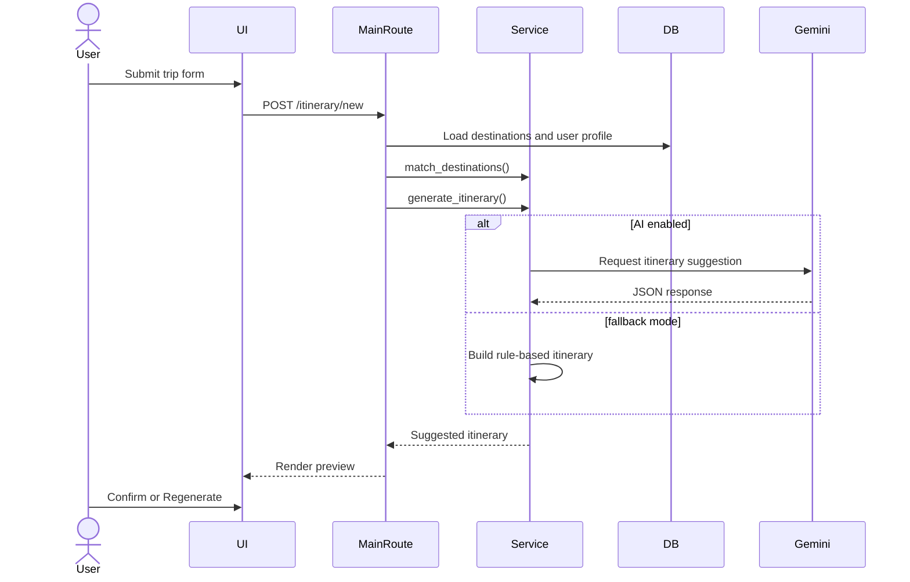
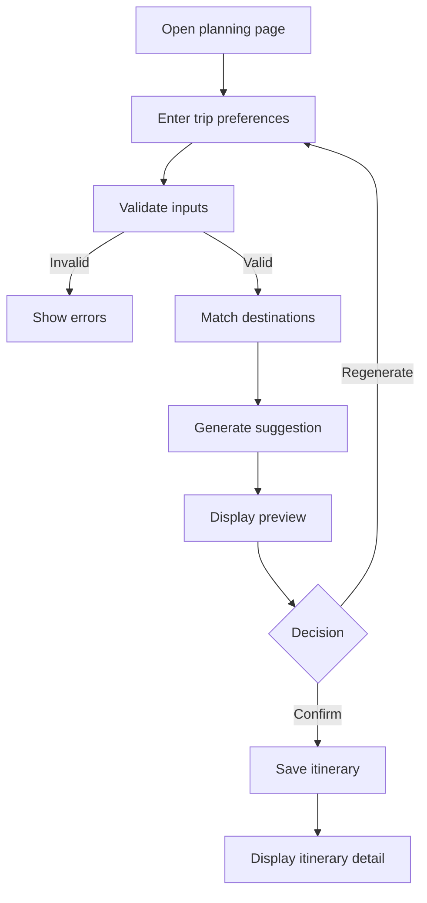

King Khalid University,  
Department of Information Systems, Applied College, Mahayil Asir  
Diploma Programme in Information Systems  
Applied Project  
**Wajhati Saudiya: Smart Domestic Tourism Planning System**  

Submitted By:  
[Student ID]  
[Student Name]  

Supervised By: [Supervisor Name]  

---------------------------------------------------------------------

## ABSTRACT

This system “Wajhati Saudiya” provides a unified platform for domestic tourism planning inside the Kingdom of Saudi Arabia. The proposed system is characterized by organized destination content, user account support, favorite management, destination reviews, interactive browsing, map-based exploration, and smart itinerary generation through both rule-based and optional AI-assisted recommendation logic. The system allows users to create and review a travel suggestion before confirming and saving it, which increases control and improves usability. The application also provides an administration panel for managing destinations, attractions, users, and AI recommendation settings. This project benefits from current technological development in web systems by offering a practical platform that simplifies trip planning and makes travel information easier to access and use.

## ACKNOWLEDGMENT

We want to thank everyone who made it possible for students like us to complete this project. We would like to express our deepest gratitude to Allah firstly, and then to our project supervisor for his valuable advice, guidance, patience, and continuous support throughout the development of the project and preparation of this report.  

We would also like to express our gratitude to our parents for their kind cooperation and encouragement, which helped us in finishing this project. A special thanks is extended to the faculty members in the college whom we met during our studies and from whom we gained the academic and technical knowledge that enabled us to reach this stage.

## COMMITTEE REPORT

We certify that we read this graduation project report as examining committee, examined the students’ project in its content and that in our opinion it is adequate as a report document for Diploma in Information Systems.  

Supervisor: …………………………, Signature ……………, Date: / /  
Examiner 1: ………………………, Signature ………………, Date: / /  
Examiner 2: ………………………, Signature ………………, Date: / /

## TABLE OF CONTENT

ABSTRACT  
ACKNOWLEDGMENT  
COMMITTEE REPORT  
TABLE OF CONTENT  

CHAPTER 1  
1.1 Introduction  
1.2 Previous Work  
1.3 Problem Statement  
1.4 Scope  
1.5 Objectives  
1.6 Advantages  
1.7 Disadvantages  
1.8 Software requirements  
1.9 HARDWARE REQUIREMENTS  
1.10 Software Methodology  
1.11 project plan  

CHAPTER 2  
2.1 Introduction  
2.2 Related work  
2.2.1 Similar Apps and websites  

CHAPTER 3  
3.1 Introduction  
3.2 Data Collection from Questionnaire  
3.3 REQUIREMENTS ELICITATION  
3.4 REQUIREMENTS SPECIFICATION  

CHAPTER 4  
4.1 Introduction  
4.2 Structural Static Models  
4.2.1 Class diagram  
4.3 Dynamic Models  
4.3.1 Sequence diagram  
4.3.2 Activity Diagram  

CHAPTER 5  
5.1 Data Modeling  
5.2 Database Entities and Attributes (Schema)  
5.3 Database Relationships Description  
5.4 Interfaces  

CHAPTER 6  
6.1 Database design  

CHAPTER 7  

APPENDIX (CODES)

---

# Chapter 1

## INTRODUCTION

### 1.1 Introduction

This system “Wajhati Saudiya” provides a unified platform for domestic tourism planning across destinations in Saudi Arabia. The proposed system is characterized by organized destination content, easy browsing, user accounts, review and favorite features, saved itineraries, map-based destination exploration, and itinerary generation through a smart recommendation process. The system helps the user discover destinations, review their details, and generate a practical travel plan based on budget, duration, trip type, interests, and optional profile information. The project saves time and effort through the management of destinations, activities, and trip planning in one web application. This comes as a result of the continuous technological developments that enrich society with digital tools and programs that simplify daily life and decision-making.

### 1.2 Previous Work

#### 1.2.1 Tourism destination platforms

Many tourism systems provide destination information, city guides, or attraction listings through websites and mobile applications. These systems are useful for presenting tourism information, but they do not always provide personalized itinerary generation, user review workflows, or integrated administration features in one platform.

#### 1.2.2 Route and planning systems

Some route and travel planning systems allow users to define preferences such as destination, time, and interest, then receive a suggested schedule. However, many of those systems depend on external services or large datasets and are not designed as lightweight academic web applications focused on local Saudi tourism content.

### 1.3 Problem Statement

Domestic tourism planning can be difficult because information about destinations is often fragmented and not presented in a structured, reusable, and personalized form. A traveler may need to search many pages or applications before deciding where to go, how much the trip will cost, and which places best match personal interests. If there is no organized and centralized planning system, the user wastes time and effort in manually comparing locations and building a schedule. The tourism planning service is therefore not working efficiently when destination information cannot be found easily, when user preferences are not considered, and when no clear travel suggestion can be produced from available data.

### 1.4 Scope

Because web applications have become widely used and accessible from different places and devices, this project was developed as a web-based system. This makes communication with the system easier, faster, and available from any location through an internet browser. The current project scope is limited to a Flask web application for local development and academic demonstration. The system supports browsing Saudi destinations, user authentication, favorites, reviews, saved itineraries, interactive map browsing, administration pages, and AI recommendation configuration. The scope does not include online booking, payment, commercial travel inventory, live routing optimization, or production deployment hardening.

### 1.5 Objectives

Enable the user to browse and search local Saudi tourism destinations.  
Allow users to create accounts and manage their travel activity.  
Generate itinerary suggestions based on budget, trip duration, trip type, interests, and profile information.  
Allow the user to review the suggested itinerary before confirming and saving it.  
Store saved itineraries and display them later when needed.  
Allow administrators to manage destination, attraction, user, and AI recommendation data.  
Provide selected system functions through API endpoints in addition to the normal web interface.

### 1.6 Advantages

The system is user-friendly because the graphical web interface allows the user to use the system easily. The application combines several features in one place, including browsing, favorites, reviews, map view, itinerary generation, and administration. It also supports both Arabic and English in major interface elements, which improves accessibility for different users. The system provides smart planning support while still allowing the user to confirm or regenerate the suggestion before it is stored.

### 1.7 Disadvantages

The system depends on the currently stored destination dataset, so the quality of suggestions is limited by available data. The AI service depends on external configuration and internet connectivity when enabled. The database design currently uses SQLite and automatic table creation, which is suitable for development but not ideal for large-scale deployment. The project is a prototype and not a commercial tourism platform.

### 1.8 Software requirements

The software programs and tools required to develop and run the system are described in Table (1-1).

**Table 1-1: Software requirements**

| Software Tool | Description |
|---|---|
| Python 3.12 | Main programming language used to develop the application |
| Flask | Web framework used for routing, request handling, and rendering pages |
| Flask-SQLAlchemy | Used to define models and communicate with the database |
| Flask-Login | Used for session-based authentication and access control |
| SQLite | Relational database used to store system data |
| Jinja2 | Used to render dynamic HTML templates |
| Tailwind CSS | Used to style the user interface |
| Leaflet | Used in the map page to display destination locations |
| Pytest / unittest | Used for automated testing |
| Gemini REST API | Optional external service for AI itinerary generation |

### 1.9 HARDWARE REQUIREMENTS

The hardware requirements of the system are explained in Table (1-2).

**Table 1-2: Hardware requirements**

| Hardware | Specifications |
|---|---|
| Processor | Intel Core i3 or equivalent processor |
| Random Access Memory | 4 GB RAM or more |
| Hard Disk | 1 GB free space for code, database, and dependencies |
| Display | Standard monitor with modern browser support |
| Network | Internet connection for CDN assets and optional AI service integration |

### 1.10 Software Methodology

Agile Methodology  

The project reflects an iterative development methodology similar to Agile. The system was developed in modules such as authentication, destination browsing, profile management, itinerary generation, administration, and API services. This methodology supports gradual improvement, easier testing, and frequent feature extension.  

The main phases visible from the implemented code are requirements identification, design of routes and models, coding, database integration, interface building, testing, and review. This methodology is appropriate because it supports continuous development and testing throughout the project lifecycle, rather than delaying all testing to the end.

### 1.11 project plan

The project plan can be summarized in the following stages:

1. Requirements and problem identification.  
2. Interface and database design.  
3. Development of authentication and destination modules.  
4. Development of itinerary generation and recommendation logic.  
5. Addition of administration and API modules.  
6. Testing and validation.  
7. Documentation and final report preparation.

---

# Chapter 2

## LITERATURE REVIEW

### 2.1 Introduction

In the previous chapter, we reviewed the project problem, aims and objectives, project scope, and methodology. In this chapter, we review work related to tourism platforms and itinerary planning systems. In addition, we look at apps and websites that are similar in concept to our project.

### 2.2 Related work

The purpose of this section is to highlight work done by others that is related to the current project. It may include systems that provide destination browsing, travel planning, review features, or recommendation-oriented user interaction. We discuss briefly digital systems that are technically related to the proposed work.

### 2.2.1 Similar Apps and websites

**Travel destination websites** provide destination information, attraction listings, and basic descriptive content. They are useful for exploration but may not generate personalized itineraries or preserve user preference data.  

**Trip planning applications** provide travel suggestion workflows based on selected criteria such as city, time, or budget. These are closer to the current project, but many are either general-purpose or built around broader commercial ecosystems.  

**Map-based travel platforms** allow the user to visualize places geographically. The Wajhati system includes this feature through its map page, but it combines it with additional modules such as reviews, favorites, saved itineraries, administration, and configurable AI integration.  

Therefore, the current project can be viewed as a combination of destination browsing, map-based exploration, trip planning, and account-based personalization in one web application.

---

# Chapter 3

## SYSTEM ANALYSIS

### 3.1 Introduction

System analysis is the stage in which the functions of the system, the users of the system, and the required data are identified. The codebase clearly shows three user contexts: the visitor, the registered user, and the administrator. The system also includes browser pages and API endpoints, which means that analysis must cover both human interaction and machine-readable services.

### 3.2 Data Collection from Questionnaire

No questionnaire processing module exists in the current source code. Therefore, in this project the data collection is implemented through direct system input forms and administrative data entry rather than through a formal questionnaire engine. User data is collected from registration forms, profile forms, review forms, and itinerary preference forms. Destination and attraction data are collected from admin pages. Additional demonstration data are inserted through startup seed logic.

### 3.3 REQUIREMENTS ELICITATION

#### Functional Requirements

**Visitor**

The visitor can open the home page.  
The visitor can browse destinations.  
The visitor can filter destinations by city and category.  
The visitor can view destination details.  
The visitor can use the interactive map page.  
The visitor can register a new account.  
The visitor can log in using email or username and password.

**User**

The user can update a preference profile.  
The user can add and remove favorites.  
The user can submit destination reviews.  
The user can generate itinerary suggestions.  
The user can receive recommendations even if no city is selected.  
The user can review the suggested itinerary before saving it.  
The user can confirm the suggestion or regenerate another one.  
The user can save confirmed itineraries.  
The user can display saved itineraries.  
The user can delete owned itineraries.

**Administrator**

The administrator can display the admin dashboard.  
The administrator can add destinations.  
The administrator can add attractions.  
The administrator can review users.  
The administrator can manage admin roles.  
The administrator can configure AI recommendation settings including model, API key, prompt, and enablement.

**API**

The system provides a health endpoint.  
The system provides a destinations endpoint.  
The system provides an itinerary generation endpoint.  
The system provides a destination reviews endpoint.

#### Non-Functional Requirements

The system should provide a bilingual interface in Arabic and English.  
The system should validate major inputs before processing them.  
The system should preserve data in a relational database.  
The system should restrict admin pages to administrative users only.  
The system should remain modular and maintainable.  
The system should provide automated tests for critical features.  
The system should fall back to rule-based itinerary generation when the AI service is not available.

### 3.4 REQUIREMENTS SPECIFICATION

**Use Case: Register**  
Actor: Visitor  
Description: The visitor enters name, email, and password. The system checks duplicate email, creates the user, and redirects to login.

**Use Case: Login**  
Actor: Visitor/User  
Description: The user enters email or username and password. The system validates the credentials and starts the user session.

**Use Case: Browse Destinations**  
Actor: Visitor/User  
Description: The actor opens the destinations page and optionally filters by city or category to view matching destinations.

**Use Case: Generate Itinerary**  
Actor: User  
Description: The user enters trip preferences. The system validates the input, matches destinations, generates a suggestion, and displays a preview.

**Use Case: Confirm Itinerary**  
Actor: User  
Description: The user confirms the generated suggestion. The system stores the itinerary and itinerary items in the database.

**Use Case: Manage AI Settings**  
Actor: Administrator  
Description: The admin updates AI provider settings and saves them for later use in itinerary generation.

---

# Chapter 4

## SYSTEM DESIGN

### 4.1 Introduction

The system design of Wajhati Saudiya is based on a layered Flask architecture. The main parts are the presentation layer using templates, the application layer using blueprints and route handlers, the service layer using recommendation logic, and the persistence layer using SQLAlchemy models with SQLite. This design makes the system easier to understand, test, and extend.

### 4.2 Structural Static Models

#### 4.2.1 Class diagram

**Figure 4.1 Class Diagram**

```text
User -> Itinerary
User -> Favorite
User -> Review
Destination -> Attraction
Destination -> Review
Itinerary -> ItineraryItem
Favorite -> User + Destination
Review -> User + Destination
AppSetting -> stores configurable system values
```

The `User` class stores account and personalization data. The `Destination` class stores tourism destination data. The `Attraction` class stores activities related to a destination. The `Favorite` and `Review` classes link the user with destinations. The `Itinerary` class stores the trip, while `ItineraryItem` stores each day-level suggestion. The `AppSetting` class stores configurable values, especially the AI settings.

### 4.3 Dynamic Models

#### 4.3.1 Sequence diagram

**Figure 4.2 Sequence Diagram for Itinerary Generation**



#### 4.3.2 Activity Diagram

**Figure 4.3 Activity Diagram for Itinerary Flow**



---

# Chapter 5

## DATABASE

### 5.1 Data Modeling

The project uses a relational database model implemented through SQLAlchemy classes. The data model supports users, destinations, attractions, reviews, favorites, itineraries, itinerary items, and configurable application settings. This model allows the system to connect content management, user interaction, and recommendation workflows through a structured database design.

### 5.2 Database Entities and Attributes (Schema)

| Entity | Attributes |
|---|---|
| User | id, name, email, password_hash, is_admin, preferred_language, age_range, gender, favorite_tags, created_at |
| Destination | id, name, city, category, description, estimated_cost, latitude, longitude, season, created_at |
| Attraction | id, destination_id, name, category, description, entry_cost, duration_hours, latitude, longitude |
| Favorite | id, user_id, destination_id, created_at |
| Review | id, user_id, destination_id, rating, comment, created_at |
| Itinerary | id, user_id, destination_city, trip_type, duration_days, budget, interests, estimated_total_cost, created_at |
| ItineraryItem | id, itinerary_id, day_number, title, notes, estimated_cost |
| AppSetting | id, key, value, updated_at |

### 5.3 Database Relationships Description

One user can have many itineraries.  
One user can have many favorites.  
One user can have many reviews.  
One destination can have many attractions.  
One destination can have many reviews.  
One itinerary can have many itinerary items.  
The favorite entity links a user and a destination.  
The review entity links a user and a destination.  
The application setting entity stores configurable system key-value pairs.

### 5.4 Interfaces

The database is accessed through the web pages, route handlers, recommendation service, seeding logic, and API endpoints. The main interfaces include the registration form, destination and attraction administration forms, review submission form, profile form, itinerary planning form, saved itinerary pages, and API serialization for destinations, reviews, and generated itineraries.

---

# Chapter 6

## DATABASE DESIGN

### 6.1 Database design

The database design is appropriate for the current system because it separates user identity, tourism content, user interaction, trip planning, and configuration into individual tables. This improves clarity and reduces duplication. For example, itinerary metadata are separated from itinerary items, which is better than storing all trip information in a single table. Similarly, favorites and reviews are separated because they represent different kinds of user interaction with destinations.  

The use of the `AppSetting` table is important because it allows the administrator to configure AI recommendation parameters through the interface instead of modifying source code directly. The current design is suitable for a diploma-level applied project, although a future version should include migration support and stronger handling of sensitive configuration values.

---

# Chapter 7

## USER INTERFACE

The system includes a complete user interface composed of a home page, login page, registration page, profile page, destinations page, destination detail page, itinerary planning page, itinerary detail page, saved itineraries page, map page, and administration pages.  

The home page introduces the platform and shows featured destinations and user-specific travel information when the user is logged in. The login and registration pages provide account access and creation. The destinations page provides browsing and filtering, while the destination detail page allows the user to read the description, view reviews, and add or remove favorites.  

The profile page allows the user to define metadata such as age range, gender, and favorite tags, which can later influence recommendation behavior. The itinerary planning page is one of the most important screens because it collects user preferences and shows the generated suggestion in preview mode. The preview screen includes buttons for confirmation and regeneration, which ensures that the user has control over the generated result before it is saved.  

The itinerary detail page displays the saved trip grouped by day, including item titles, notes, and estimated cost. The my itineraries page shows all trips previously saved by the user and allows deletion. The map page displays destination markers using Leaflet and supports city filtering.  

The administration interface contains dashboard statistics and links to manage destinations, attractions, users, and AI settings. These screens make the system suitable not only for end users but also for content and configuration administration.

---

# APPENDIX (CODES)

## Appendix A: Application Entry Point

```python
from wajhati import create_app

app = create_app()

if __name__ == "__main__":
    app.run(debug=True)
```

## Appendix B: Authentication Example

```python
@auth_bp.route("/login", methods=["GET", "POST"])
def login():
    if request.method == "POST":
        identifier = request.form.get("email", "").strip()
        password = request.form.get("password", "")
        normalized_identifier = identifier.lower()
        user = User.query.filter(
            or_(User.email == normalized_identifier, User.name == identifier)
        ).first()
```

## Appendix C: Itinerary Confirmation Flow

```python
if action == "confirm":
    generated = _parse_generated_itinerary(request.form.get("generated_itinerary"))
else:
    matched = match_destinations(...)
    generated = generate_itinerary(...)
    return render_template(
        "create_itinerary.html",
        preview_itinerary=generated,
        generated_itinerary_json=_serialize_generated_itinerary(generated),
    )
```

## Appendix D: AI Recommendation Settings

```python
def get_ai_settings():
    return {
        "enabled": AppSetting.get_value("ai_recommendations_enabled", "0") == "1",
        "provider": AppSetting.get_value("ai_recommendations_provider", AI_PROVIDER_GEMINI),
        "model": AppSetting.get_value("ai_recommendations_model", DEFAULT_GEMINI_MODEL),
        "api_key": AppSetting.get_value("ai_recommendations_api_key", "").strip(),
        "system_prompt": AppSetting.get_value("ai_recommendations_system_prompt", DEFAULT_AI_SYSTEM_PROMPT),
    }
```
